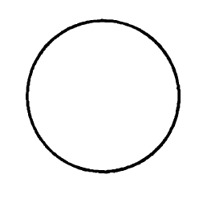
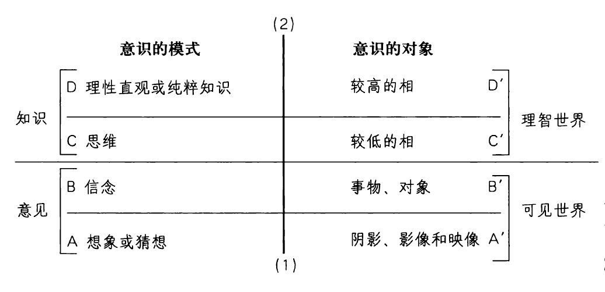

🟩第4章 柏拉图：寻求终极的真理与实在

柏拉图生平：从学生到大学校长

当苏格拉底被判处死刑的时候，他的学生柏拉图（Plato）还不到30岁。其导师由于政治原因导致的死亡或许是柏拉图生命中的转折点。他与苏格拉底有着深厚的友谊，因而，他接过了那位年长哲学家的挑战，直面那些艰深的问题，终其一生追求智慧。在审判苏格拉底的法庭上，柏拉图和三位朋友提出向法庭交一大笔罚金，以免除死刑。但令柏拉图沮丧的是，他们改变法庭想法的努力失败了，他的杰出导师的生命走向了悲剧的结局。毫无疑问，柏拉图的感受与他笔下斐多的感受是一样的：“我们的朋友的结局……就是这样，我认为，他是我们时代所有人当中最好的、最有智慧的、最正直的。”由于这些事件，许多问题萦绕着柏拉图：“一个不能忍受苏格拉底身处其间的社会是一种怎样的社会？如果哲学智慧要在人类事务中占据主导，那我们应该拥有的又是一种怎样的社会？”因此，他在其后的岁月里一直努力尝试着回答这些问题。

柏拉图并不是一开始就计划以哲学家为业。他于公元前428年或427年出生于雅典的一个贵族家庭，所受的教育和训练都是要让他成为一位政治领袖。然而，苏格拉底死后，他决定把所有的精力都奉献给哲学。一开始，他旅行了一段时间。有些人认为，他最远可能到过埃及。不论这是真是假，我们确切知道的是，他在公元前388年到了意大利西西里岛的叙拉古。他一回到雅典就创建了一所学校，它是西方世界的第一所大学。柏拉图的学校名叫“学园（the Academy）”，坐落于雅典城外用以纪念英雄阿卡德摩（Academus）的墓地。900年后，柏拉图学园这个机构依然在运作着，它的名声一直流传到今天，其标志就是，在高等教育里依然在使用着“学院”和“学术”这些术语。

柏拉图在余下的岁月里一直在学园授课、指导以及撰写哲学作品。《国家篇》就是他最著名的作品之一。他在这本书里论证了，只有具备哲学眼光的人成为领导者，或领导者具备哲学智慧，社会才能够是公正的。在公元前368年以及公元前361年，他两次重返叙拉古，应邀教导继承了王位的狄奥尼索斯二世，以实现上述目标。不幸的是，柏拉图的任务失败了，因为这个统治者太热心暴政，无心哲学。在第二次访问时，两人完全无法相处，柏拉图勉勉强强才死里逃生。回到学园后，他继续教学，直到公元前348年或者公元前347年突然、但平和地逝世。

柏拉图的任务：全面发展哲学

柏拉图追随其老师的步伐，对伦理问题有着强烈的兴趣。不过，苏格拉底的命运也教导他，只有社会本身得到了改造，好人才能够活下来。因此，政治哲学也是柏拉图作品的主要关切点。不过柏拉图讨论这些问题的脉络要比苏格拉底的广阔得多。如果善和正义像智者派宣称的那样，仅仅是约定的东西，那就没有必要花太多的时间思考它们。不过，柏拉图相信，在充分理解了实在本质的基础上，可以找到我们伦理和政治问题的答案。因此，他把很大一部分的哲学精力都花在了形而上学问题上。不过，我们要想在其他哲学问题上取得进展，必须首先为知识打下坚实的基础。此前的哲学家们就知识论问题有过简短的小规模争论，而柏拉图是第一个对这些问题进行全面探究的人。

知识论：理性对意见

要理解柏拉图的知识理论，我们首先得要理解他所拒斥的三种立场。首先，他考虑的是智者派的相对主义。智者派强调个人的或文化的意见，柏拉图与他们不同，他相信，我们的生活和社会都必须要建立在知识的基础上，并且，这一知识必须要是普遍的（对所有时代的所有人来说都是真的）。其次，他力图破坏我们对感官经验的信心。我们所需要的那种类型的知识必须是永恒的、不变的，这种知识我们在经验中是找不到的。最后，他论证说，知识不仅仅是真信念，因为，它必须是基于理性的洞见。

反驳相对主义

在《泰阿泰德篇》中，他批判性地考察了智者普罗泰戈拉的主张，“人是一切事物的尺度”。这是表达相对主义立场的一个非常具体的方式。这个立场初看起来有些道理。例如，同样一阵风对一个人来说可能是寒冷的，对另一个体热的人来说可能正相宜（Th 151e-152c）。[1]如果你说，它对你来说是寒冷的，那你的这个判断不可能错，我倘若坚持说你错了，我就非常粗野了。每个人关于风对他显得如何的意见都是同样正确的。当然，普罗泰戈拉并没有把他的主张局限于舒适的问题，而是把这同一类论证运用到了所有的判断，包括道德判断。不过，柏拉图发现，相对主义者的立场是有缺陷的。首先，这一立场反驳了它自身。在《泰阿泰德篇》（171a，b）里，柏拉图写下了苏格拉底和数学家塞奥多洛之间的交锋：

苏格拉底：从他那方面说，就像普罗泰戈拉承认每个人的意见都是真的那样，他也必须要承认，他的对手们的信念是真的，他们相信他错了。

塞奥多洛：当然。

苏格拉底：那就是说，如果他承认那些相信他错了的人的信念是真的，那么他就得承认自己的信念是假的？

塞奥多洛：必须如此。

换言之，相对主义者并不是真的相信，所有意见都是同样真的。相对主义者相信，他们自己是正确的，而他们的对手关于知识的意见则是错的。普罗泰戈拉打算教导人们他们需要知道的东西，他甚至指望他们为这一知识对他慷慨解囊。然而，一旦相对主义者宣称说，他们的意见要比别人的意见更好，他们就已经放弃了他们的相对主义了。

在这篇对话中，苏格拉底继而指出，每个人都认识到了智慧和无知、真信念和假信念之间的区别。假设你的医生相信你的腿断了，而你相信它没断。这是否意味着，你的医生的信念和你的信念都是同样真的？一瓶酒会酿成甜的还是不甜的，对此谁具有最佳的意见，葡萄园主还是一个长笛演奏者？一份乐谱会不会是一段悦耳的旋律，谁更适合告诉我们这个，一个音乐家还是一个体育教练？（Th 178c-e）柏拉图的观点是，并非所有的意见都具有同样的价值。

反驳感官经验

柏拉图反驳的第二个立场后来被称作经验主义。经验主义者主张，我们的一切知识都源于感官经验。然而，柏拉图提出了几个证明，为什么我们永远都不能从五种感官的数据中得出真正的知识。第一，感官知觉仅仅给予我们赫拉克利特所描述的不断流变的世界。在这个领域，我们永远都不能自信地说什么是真的，因为，它始终处于流变之中。因此，在一个时刻真的东西在后来的时刻将会成为假的。就在我说“这杯子里的咖啡是热的”时刻，它已经在逐渐冷却，很快，我的描述就不再是正确的了。此外，所有关于感官视觉的主张都是相对于知觉者而言的。我认为热的咖啡对你来说或许尝起来是温的。类似地，我们的知觉是相对于周围环境而言的。

例如，温咖啡和冰茶比起来似乎是热的，但和开水比起来却又似乎是凉的。在商店里看起来是黑色的衣服现在在太阳底下看起来就是深蓝色了。如果我们局限于感官经验，那么普罗泰戈拉的相对主义就会是避免不了的。我只能说，情况看起来是这样，事物是如此这般地向我呈现的，我不能说出任何确定地真的东西。因此，对柏拉图来说，由知觉而来的所谓知识就太过转瞬即逝，无法被认真对待了。

柏拉图对感官经验的第二个质疑来自他的如下信念：知识的对象必须是某种普遍的东西，我们可以在一种不变的描述或定义中把握它。不过，如果语言所指向的仅仅是物质世界里不断变化着的特殊事物，那么我们所使用的术语的含义也将会是处于流变之中的，语言就将会无法发挥作用。因此，我们是通过普遍的概念而获得理解的。为了弄清柏拉图在说什么，让我们做些思想实验。第一，你会把图4-1里的对象叫作什么？很可能，你会说它是个圆。然而，柏拉图说，这不对。更确切地说，它是表现圆的一个尝试。为什么它不是一个真正的圆？好吧，如果你透过一个高倍放大镜来看它，你会看到，那条线多少是锯齿状的。墨点与中心并不全都是等距的。此外，这条线有宽度，可以量出有多少分之一厘米。还有，这条线有高度，因为它是由一层墨水涂在纸上画就的。最后，墨水可能会褪色，这张纸也可能会被焚毁，上面印的图案就改变了或毁灭了。然而，构成了一个圆的那些点与中心的距离全都是完全相等的，它们既没有宽度也没有高度，也不能够被改变或毁灭。这幅图相当接近于一个圆的大概，但它不是一个真正的圆。关键在于，我们不能够看见真正的圆，我们只能用心灵在概念上认识它。这就是为什么数学家不需要实验室来做出发现的原因。他们使用理性而不是感官，去研究他们的对象。如果你看到一个数学家用板子剪出一个圆，然后用尺子量它，那你就会发现，这个人并不真的理解数学家是什么样的人。

_图4-1_

让我们再做一个思想实验。根据所展示的正义程度，比较一下世界上的不同国家。或者，在量和质上比较一下美国奴隶制时期和我们当今的法律与宪法里所体现的正义程度。你如何能够展开这样的比较？你能用眼睛看到正义吗？它是什么颜色的？它有多高？它有多重？很显然，这些问题只适用于物理事物，根据可观察的属性来描述正义，是没有意义的。我们能够看到人们的行动，可以说那些行动展示了正义或不正义。但严格说来，我们不能够看到正义本身。显微镜和望远镜帮助我们看到了物理世界的很多物体，我们裸眼是无法看到它们的。然而，不存在什么“正义望远镜”或“正义米尺”，以使得正义成为可见的东西。

此外，没有哪个国家是完全地正义的。我们在人类历史上从没有看到过任何一个完全正义的例子，我们看到的仅仅是人类努力接近它的脆弱尝试。因此，完全正义这个概念不可能来自我们的经验。各个国家体现出的正义程度各不相同。个别的国家可以变得更加正义，或者更加不正义。国家与所有其他特殊的事物一样，是不断变化着的。不过，在柏拉图看来，正义本身的标准却没有变化。只有标准是单一的、始终不变的，我们才能够衡量一国内部的道德变化。由于这些理由，柏拉图赞同赫拉克利特的观点：如果没有为只有理性才能带来的认知所渗透，眼睛和耳朵就只是可怜的见证。

柏拉图相信，如果正义不是某种固定不变的、超越了物理世界的东西，那智者派的说法就是对的，诸如正义这样的道德性质就只是嘴里发出的声音或喷出的一团气。我们可以把柏拉图的立场整理为如下论证：

（1）正义要么是某种实在的、客观的东西，要么就仅仅是一个词。

（2）如果第二个选项是真的，那么，我们的道德判断就没有任何价值。在希特勒和一个圣徒之间就不存在任何真正的区别，除了我们约定好了分别用在他们身上的发音有所区别。

（3）然而，命题2是荒谬的。在希特勒和一个圣徒之间存在区别。

（4）因此，正义是某种实在的、客观的东西。

（5）实在的东西要么是物理的东西，要么是非物理的东西。

（6）显然，正义不可能是物理的东西。

（7）因此，正义必定是某种实在的、客观的、非物理的东西。

> 想一想
> 
> 4.1 柏拉图主张，正义的本质是客观的、独立于我们有关它的主观想法的，请提出你自己支持或反对该观点的论证。此外，他还主张，正义是某种实在的东西，虽然它不是一种物理的东西，请提出你自己支持或反对该观点的论证。

知识不是真信念

最后，柏拉图坚持把知识和信念严格地区分开来。信念要么是真的，要么是假的，但知识必定始终是真的。那么，我们能够说，知识就是真信念吗？柏拉图不这么认为。例如，让我们假设，我相信，这个时刻美国总统在与加利福尼亚州州长打电话。然而，我的这个信念没有任何根据。我仅仅是随意瞎猜的。虽然如此，它有可能是个真信念，如果它碰巧符合实情的话。很显然，我们是不会愿意把这样幸运的猜测称作“知识”的。我们也可以想象，一个孩子记得毕达哥拉斯定理，并且知道如何应用它。但如果他不理解这个定理之所以为真的合理根据，那么在柏拉图看来，它就仅仅是一个二手的真信念。即便这个孩子记得此定理的证明，如果他没有完全地理解该证明的逻辑的话，他也依然不会有知识。知识必须基于某种理性的洞见。由于这个原因，柏拉图说：

真信念只要能够保持不变，那它们也是好东西，它们所做的也是好事，但它们不愿意长久保持不变，它们会从人的心灵中逃走，因而，除非用理性的说明把它们捆住（给出理性的说明），否则它们就没有什么价值……这就是知识比真信念更有价值的原因，知识有捆绑，而真信念则没有。[2]

普遍的相是知识的基础

柏拉图遵循着苏格拉底的方法，通过排除不充分的构想来获得对知识的正确理解。根据到目前为止的说法，柏拉图显然相信，真正的知识是：

1．客观的

2．感官无法把握的

3．普遍的

4．不变的

5．基于理性理解的

柏拉图严格区分了感官经验此时此地的领域和理性知识不变的领域，他进而表明，它们以一种特别的方式相互纠缠在一起。他说，感官经验的世界并不是完全流变或纯粹个别的。我们发现，特殊的事物归属于一系列稳定的、普遍的范畴之中。如果不是这样的话，我们就不可能辨认任何事物，也压根就不可能谈论它们。例如，汤姆、迪克、苏珊和简是各不相同的个体，但我们可以用人这个普遍的术语来指他们中的每一个。尽管他们有区别，但他们在有的方面是一样的。与每个通名（如“人”“狗”“正义”）相对应的，是一个普遍者（Universal），它是由那个范畴之中所有事物根本的、共同的属性构成的。＊圆形的对象（硬币、戒指、花冠、行星轨道）全都具有圆形这一普遍者。美的特殊对象（玫瑰、贝壳、人、日落、油画）全都具有美这一普遍者。特殊者会生成、变化、消亡，但普遍者则居于一个永恒的、不变的世界。玫瑰由一个花苞长成，成为一朵美丽的花，然后又褪色、变丑、凋谢。然而，美这个普遍者则永远都保持不变。

柏拉图使用了多个术语来指经验中的这些持存者。他称它们为“普遍者”，因为它们是特定范畴中所有特殊事物共有的东西。有时候，他也说“正义本身”（或“美本身”“善本身”）。柏拉图用这些术语是要表明，他是在讨论所探究的性质的最纯粹的

🔹_＊从这里开始，我将把“普遍者”“相”“正义”等术语用黑体字标出，柏拉图对它们的使用有着特别的含义。_

体现。例如，正义本身不同于我们在人类事务中经验到的正义的那些有缺陷的、有局限的版本。

柏拉图常常使用“理念（idea）”（比如“正义的理念”“善的理念”）这个术语来讨论知识的对象。因此，这些讨论所涉及的内容有时也被称为柏拉图的“理念论”。这一用词把握到了一种含义，即柏拉图是在指非物理的事物。例如，人的理念超越了组成了人类物种的血肉个体。然而，不幸的是，英语中的“idea”一词也指一个人心灵的主观内容。在该词的这个意义上，如果你失去了意识，你的观念也就不复存在了。然而，柏拉图式的理念这种实在是独立于认识它们的心灵而存在的。根据柏拉图的解释，即便不存在圆形的对象，即便没有人想到过圆形，圆形客观的几何学属性也依然存在，等待着被发现。幸运的是，柏拉图还用了另一个术语来表示理念，我们可以把它翻译为“相（Forms）”。由于这个术语没有前一个术语误导人的联想，因而从现在起，我们将把柏拉图的说明称作“相论”。请注意，某个事物的“相”并不一定是指它的外形。如果我们是在讨论三角形的相，那外形一定是它的一个必然的方面。但很显然，正义的相就与外形没有任何关系。

知识通过回忆而获得

在《美诺篇》中，一个叫美诺的年轻人向苏格拉底提出了有些智者所使用的一个悖论，以表明，对知识的寻求是不可能的。美诺是这么表述这个悖论的：

当你连它是什么都不知道的时候，你如何去寻找它呢？你会把一个你不知道的东西当作探索的对象吗？换个说法，即便你马上反对，你又如何知道，你找到的东西就是那个你不知道的东西呢？[3]

换言之，如果我们是在寻找正义的意义，那么我们要么认识它，要么不认识它。如果我们已经认识到了它是什么，那我们就不需要再寻找它，但如果我们没有认识到正义是什么，那当我们找到它的时候，我们将如何认出它？柏拉图给出的回答是，这个二难困境的两支都是真的；我们既认识普遍的相，又不认识它们。首先，我们认识它们，因为它们就印在我们的灵魂上。换言之，我们对于终极真的、实在的东西，对于固有的价值，有着天赋知识（innate knowledge）。柏拉图相信，在灵魂进入肉体之前，我们直接地熟悉那些相，但在进入物理世界时，我们忘记了这一知识。这解释了上述二难困境的第二支——为什么我们觉得自己并不具备这一知识。虽然如此，但关于相的这一知识依然在那里，等待着我们通过回忆这个过程找回。当柏拉图谈到灵魂的前世存在时，他用的是神话和故事，他认识到，我们对这些事态不可能具有细节性的科学知识。不过，要点在于，对生命究竟是什么获得一种理解，这更类似于回想起某物，而不是发现新的材料。我们全都有这样的经验：我们第一次开始清楚地理解某物，但我们意识到的是，我们其实已经对它具有了某种知识，只不过我们过去并没有完全地、有意识地觉察到它。柏拉图认为，正是这类经验表明了知识的本质。对于理性的心灵来说，特定的真理是可以获得的，是可以独立于感官经验而被认识到的。

我们该如何来触发对相的这一回忆呢？柏拉图的回答是，我们是通过苏格拉底开启的一种辩证质疑来做到这一点的。在《美诺篇》中，苏格拉底与一个没有受过教育的奴隶男孩对话，在理智助产士苏格拉底一系列提问的帮助下，后者开始认识到了一个几何学的真理。在《斐多篇》中，苏格拉底论证说，我们对于绝对的正义、美、善、平等等事物具有一个概念，虽然我们的眼睛从没有看到过它们中的任何一个。感官经验和苏格拉底的辩证质疑法不能给予我们有关相的知识。相反，它们提醒着我们那些我们朦胧地知道、但无法有意识地把握的东西。

柏拉图的分割线

充满讽刺意味的是，虽然柏拉图蔑视感官世界，但他用以阐明其知识理论的一些最富启发性的段落却使用了具体的形象。他最有名的象征之一就是其对分割线的说明。柏拉图让我们进行如下想象：

把一条线分成不等的两部分，一部分代表可见世界，另一部分代表理智世界；再把每一部分按同样的比例分成两部分，它们象征着相对而言的明晰性或模糊性程度。（R6.509d-e）

在其对分割线的描述中，柏拉图把知识的程度或层次关联于实在的层次。虽然我们在本节的兴趣点是柏拉图的知识理论，但要把它与他关于实在的信念区别开来，是不可能的。因此，柏拉图力图展示，知识论和形而上学是平行的。随着我们在意识的阶梯上攀升，我们的认知状态就越来越接近于真正的知识。类似地，相应于更高意识层级的对象也是更加完全地实在的。图4-2就表现了分割线。

从这个图看得很清楚，人的心灵沿着竖线从1上升到2，通过了意识的几个模式，这些模式分别对应着实在的不同层级。从完全的无知（A）到纯粹的知识（D）这个连续过程被分为两个大的认知状态，也就是意见和知识。它们分别对应着实在的两个主要层级，即可见世界（或物理世界）（A＇和B＇）以及理智世界（C＇和D＇）。不过，这些部分又被进一步分割了。意见的最低层级可以被称作想象或猜想（A）。这个认知状态对应着“实在”的边界，例如阴影、影像和映像、视错觉、梦以及幻想。把沙漠里的蜃景错当成了湖泊，这是处于认识和实在的这个阶段的一个典型例子。类似地，一个人满怀感情地关心电视肥皂剧里角色的生活，把他们当成了真人，这是处于认识和实在的这个阶段的另一个例子。不过，我们不仅可能被物理形象所欺骗，还可能被聪明的语词所创造的形象所欺骗。因此，有些人相信了一个智者派政治家的华丽辞藻，还有他

_图4-2 柏拉图的“分割线”图表_

关于正义是关于什么的错误形象，这些人就被困在了那条竖线的较低层级。他们把正义的一个扭曲了的阴影与真实的事物搞混淆了。

第二个层级（B）是常识的信念。在实在方面，它对应于自然对象以及文化对象领域。一个认识到了个别的马或实践着正义的特定国家，但没有把它们视为理想的马或完善的正义的不完善体现，此人就处于这一层级。这样的人可能具有真的意见，但他不具有知识。这是因为，他没有理解事物为何会如此的原因，他只看到了特殊的事物，而没有看到相。这里存在一个比例。马在水中的映像（A＇）与物理的马（B＇）的比例等于整个可见世界（A＇和B＇）与理智世界（C＇和D＇）的比例。

当我们到达了第三个层级（C）的时候，我们已经开始找到了自己进入知识领域的道路。它是朝着意识的更高领域的一个过渡阶段，代表了数学和特定科学里所运用的那类推理。认识的这个领域有两个特征。第一，心灵把可见世界的对象用作手段，以达到对理智世界的理解。例如，柏拉图说，学习几何学的学生使用图形以及画三角形来证明各种命题。但他画的可见的线实际上并不是他的知识的对象。他在研究的是三角形的纯粹的相。第二，这一层级的知识是片段式的，并且是基于被视为自明的预设之上的。这样的知识要想变得完善，最终就得要把它们从非预设的第一原则那里推导出来。

在最后的阶段（D），心灵飞跃了一切预设和感性的拐杖，抵达了对纯粹的相的理性直观。这些相是我们用以推导出一切次级的、特殊化的知识的终极原则。这个辩证过程的终点乃是对“整体的第一原则”的把握。它无须进一步的解释或证明，其他一切都依赖它。柏拉图称知识和实在的这一最终极源泉为“善”（R7.508e，518c）。我们只有通过类比才能够描述它。柏拉图说，把善设想为太阳。太阳使一切有生命事物的存在成为可能，使我们能够看见它们。类似地，善是一切事物存在及实在的源头，它就像太阳的光辉一样，使我们的心灵能够看见真理。这里发现的知识无法用语词表达，因为善是语词能够传达的特殊真理的超验源头。我们只能够遭遇它，“长期地接受它本身的教导，与之保持亲密的关系，终有一天，它就像突然迸发的火花在灵魂中产生，并立刻成为自我保持的东西”（L7.341c-d）。后来的基督教柏拉图主义者把柏拉图的善等同于上帝。不过，柏拉图的善是非人格的、理性的原则，是实在的基础，而不是一个仁慈的、与人同形同性的神，理解这一点非常重要。

形而上学：阴影与实在

相这种实在

柏拉图努力发挥苏格拉底的洞见，这驱使他追求它们的形而上学基础。柏拉图和苏格拉底都关注在仔细地构造和理性地推导出来的定义中把握普遍的概念。不过，苏格拉底对形而上学从来都不太感兴趣。因此，他从来都不太关注如下问题：这些普遍者或相有着哪种类型的实在。不过，柏拉图论证说，如果相是知识的真正对象，那么知识就必定是关于某个实在的东西的知识。因此，相必定是客观的、独立存在的实在。当数学家对圆的几何属性进行推理时，他在研究什么？他并不是在检查自己在经验中发现的圆环、戒指或轮子。相反，他是在用自己的心灵沉思圆本身这个永恒的相。圆的对象可能会变化或被毁灭，但数学家所研究的东西不可能被改变。

以此消除了变化问题。

如果相是实在的，那么它们存在于何处？这个问题是没有意义的，因为“何处”以及“何时”等问题只适用于时空中的对象。例如，你不能够问，乘法表存在于何处。诚然，我们在心灵中拥有它们，我们把它们写在黑板上。但如果我们的心灵忘记它们了，如果那个复本被毁坏了，乘法表里的真理将会依然如故。我们没有发明它们，我们只是发现它们。因此，它们的存在不依赖我们的心灵。一切科学和技艺都只有涉及相才达致其任务。生物学家研究青蛙，他对这只或那只青蛙本身不会感兴趣。相反，生物学家力求认识的是对所有青蛙来说普遍地真的东西。他力求理解的是青蛙的相的特性。类似地，木匠熟悉的是椅子的相、桌子的相，他力求用木料例示出这些相。

变化问题

此前哲学家们遗留下来没有解决的问题也促使柏拉图走向了形而上学。其中一个大问题就是变化问题。它就像是一个人鞋子里的小石子，一直刺激着希腊哲学，挥之不去。关于变化，存在着一个悖论。当你去拜访你从很小的时候就再没见过的一个亲戚时，他们或许会说，“哎呀，你变化真大呀！”但他们在说什么？很显然，他们在说，你和以前不一样了。不过，你与自己年轻时的区别不同于你与你姐姐的区别。在某种意义上，你是同一个人。你还是同一个人，但你又不是同一个人。赫拉克利特和巴门尼德分别提出了极端的方案，来解决变化悖论。赫拉克利特说，经验世界的一切都是变化着的，永久只是一种幻觉。巴门尼德及其埃利亚学派的追随者们则宣称，永久是根本性的，变化只是现象，虽然两者的立场截然相反，但他们都假定了一元论，都主张，实在根本上是一类事物。如果赫拉克利特的立场是正确的，那知识就不可能了，因为，世界上就没有什么东西是稳定的，以令我们能够认识（除了逻各斯）。但巴门尼德的解决方案也不能令人满意，因为，变化显然是生命的一个事实。柏拉图相信，他们都错了，但他们又都是对的。他们错在其一元论，因为，他们过于迅速地假定了，所有的实在都是一类事物。不过，他们又都是对的，他们分别描述了一幅完整图像的一半边。柏拉图在综合其前辈们的洞见这方面是个天才。他采纳了他们的洞见，但对它们做了修正，消除了它们的缺点。

柏拉图试图调和赫拉克利特和巴门尼德，他提出了形而上学二元论，指出存在着两类完全不同的实在。他提出，存在着一个不断流变的世界，同时，也存在着一个永恒的、不变的世界。流变的世界是我们在感官经验中遭遇的物理世界。因为它是不断流变着的，因而我们对它不可能具有理性的知识。永恒的、不变的世界是非物理的实在。它不处于空间和时间中。柏拉图有时候把它指为“理智世界”，因为，这种实在只能通过理性来认知。

> 想一想
> 
> 4.2 柏拉图说，有些事物比其他事物更加实在，你觉得这种说法有意义吗？为什么？

特殊者与相之间的关系

在这一点上，柏拉图面临着所有二元论都会面临的问题。一旦你把实在分为两个不同的领域，你如何理解它们之间的关系？对于柏拉图来说，这个宇宙不是一个民主的宇宙，因为，这两种实在并不是平等的。物理世界与相的世界比起来并不那么实在，前者要依赖后者这个更高的世界。超越了经验的实在造成了我们在经验世界中发现的所有秩序和实在。

“实在的程度”，这在我们听来怪怪的。毕竟，难道常识没有告诉我们，事物要么是实在的，要么不是实在的？甚至巴门尼德这位常识的伟大对手也会同意这一点。但在柏拉图看来，感官对象占据的是实在与非实在之间的灰色地带。或许，有些普通经验和日常对话可以帮助我们理解柏拉图的“实在的程度”这个概念。如果我们发现自己持有20美元的伪钞，那么，很显然有某个东西在我们的钱包里。就它是一张纸而言，它与任何纸张都一样地实在。然而，作为合法流通货币，它并不是一张实在的美元现钞。伪钞仅仅是对真钞的模仿。如果我们有珍爱的人的照片，那它乃是一种实在，因为它就摆在我们的桌台上，在我们的心中激起温暖的回忆。但再一次，不幸的是，它不是实在的人，它仅仅是他的再现。这张照片之所以令我们着迷，乃是在于它具有了我们所爱的人的部分实在。它直接来自那个人，具有他的形象。类似地，镜子里的映像或阴影也具有某种实在性，但它们仅仅是某个更加实在的事物的模糊形象。用柏拉图的话说，照片和映像分有着它们所再现的实在。图像越好，它对实在对象的分有也越完全，它对原初事物特征的再现也越完全。

到目前为止，我们已经比较了两类物理对象，一类源自另一类，是另一类的摹本。这些例子表明了柏拉图的如下观点：某些事物属于实在的较低层次，如果它的存在依赖另一些事物、是对那更高实在的形象的模仿的话。然而，由于这些例子受制于物理世界，因此它们并没有完全地把握住柏拉图的要点。为了更好地阐明他的立场，让我们来看一些不同于物理实在的例子，它们是非物理的、完善的实在。我有次无意中听到一位灰心学生的话，她想要注册一门课，却受到了一个冷酷无情、效率低下的大学行政人员的搪塞。她的评论是：“这是不实在的！”柏拉图会说，她这是在把她经验中的这个时空性的事件与事情应该有的状态相比较。她的心灵所认识的富于同情心的、关心人的大学行政人员是她用来比较她在经验着的当下的、有缺陷的制度的标准。比较的结果是，她的学校离实在的大学应该是的样子还差得太远，因此她把自己的学校描述为“不实在的”。我们习惯于把理想当作想象的对象，只存在于我们的白日梦中。但在柏拉图看来，一所理想的真正服务于学生的大学，乃是一所实在的大学。我们所知的大学在多大程度上是实在的大学，这取决于它们在多大程度上接近于这一更高的实在。

让我们来看第二个例子。我们常用“非人的”这个词来描述诸如阿道夫·希特勒这样的暴君。现在，一个非常呆板的生物学家可能会回应说：“哦，不，你错了——希特勒是人。他有两个肺、一个四腔的心脏以及一套正常的染色体。”但这位生物学家没把握到要点。说希特勒是非人的，这与我们在进行解剖时所发现的东西没有任何关系。对柏拉图来说，成为一个完全的人，这基本上不依赖一个人的生理特性，而主要依赖一个人的非生理特性，比如，此人灵魂的状态、理性的程度以及此人的价值。

我们可以把希特勒与著名的人道主义者比尔·沃尔什（Bill Walsh）博士做个比较。沃尔什是美国的一位心脏病学家，他于20世纪60年代退出了一个利润丰厚的医疗活动，转而建立了一个名叫“希望工程（Project HOPE）”的医疗救助组织。他利用人们的捐款、捐物以及志愿者的帮助，把一艘旧军舰改造成了一艘环行世界的医疗船（SS HOPE），为有需要的人带去医学治疗和医务训练。根据柏拉图的哲学，我们可以说，沃尔什是一个更加实在的人，因为他具有典范性的道德品质。与沃尔什比起来，希特勒是非人的。虽然沃尔什是一位伟大的人道主义者，但他只是人之所是的特定体现。在柏拉图看来，任何尘世的、物理的存在（无论是人还是别的东西）都没有达到其相的那种完全的实在，因为，物理的东西始终是有限的、有缺陷的、变化着的。因此，我们可以说，希特勒仅仅是人之所是的阴影，而诸如比尔·沃尔什这样的人则犹如一张非常清晰的照片。后者依然不是完全的实在本身，而只是非常近似于它。

现在，我们可以把特殊者与其相之间的关系总结如下。第一，相是特殊事物存在的原因，这就类似于一座雕像导致了它的阴影。第二，物理对象相似于它们的相，这就类似于一个人的照片相似于此人。第三，特殊的对象分有了它们的相。比较一下图4-3中的三个图形。很显然，与其他两幅图比起来，最右边的那幅图更完全地分有了圆的相。我们可以把中间的那幅图描述为“一定程度上的圆”，因为它与圆有几分相似。不过，左边那幅图就很不像理想的圆了。事实上，它不像任何可辨认的相，以至我们很难描述它是什么。类似地，如果我们根据其对人的相的分有程度来把人分等，那么阿道夫·希特勒就会是处于左边的位置，普通人基本上处于中间的位置，而圣人则代表着对相的完全分有。第四，正如此前的例子所展示的，相代表了评价的标准，我们用之评价特殊者是卓越的还是有缺陷的。工程师通过将之与理想的球体做比较，以此来衡量滚珠轴承；饲养员通过将之与理想的马做比较，以此来判断他们马厩里的马匹。最后，相使得特殊的东西成为可理解的。试着来描述你的一位密友。无论他们有多独一无二，你都一定会采用一系列普遍的性质来描述他们（例如，“高的”“聪明的”“女的”“健壮的”）。没有相，我们就无法思考、言说，无法理解任何东西。

洞穴寓言

柏拉图在洞穴寓言里描述了他的知识理论，这则寓言是西方文学史上最动人的故事之一。（在你们读柏拉图自己讲述的洞穴寓言时，请参照图44的那幅图。）故事在苏格拉底与他的朋友格劳孔之间的对话中展开。在你读这一选段的时候，请考虑以下问题的答案：

·阴影代表什么？

_图4-3_

·什么是我们社会里的“阴影”？什么是你生活中的“阴影”？

·根据这个故事，什么是启蒙？

·当那个逃离的囚徒返回洞穴的时候，在何种意义上，他与他的朋友们一样都不理解阴影？在何种意义上，他比他的朋友们更加理解阴影？

·那个启蒙了的囚徒生活中的事件在哪些方面与历史上苏格拉底生活中的事件相似？

·概括一下你认为柏拉图在该寓言中想要阐明的哲学观点。

选自柏拉图《国家篇》[4]

我说，接下来让我们把受过教育和缺乏教育的人的本质比作下述情形。请你想象有这么一个地洞，一条长长的通道通向地面，和洞穴等宽的光线可以照进洞底。一些人从小就住在这个洞里，但他们的脖子和腿脚都被捆绑着，不能走动，也不能扭过头来，只能向前看着洞穴的后壁。让我们再想象他们背后远处较高的地方有一些东西在燃烧，发出火光。火光和这些被囚禁的人之间筑有一道矮墙，沿着矮墙还有一条路，就好像演木偶戏的时候，演员在自己和观众之间设有一道屏障，演员们把木偶举到这道屏障上面去表演。

我明白。

那么你瞧，有一些人高举着各种东西从矮墙后面走过，这些东西是用木头、石头或其他材料制成的假人

_图4-4 这幅柏拉图的洞穴寓言图表现了一个被束缚的囚徒，他唯一的实在就是（A）阴影，它们无非是（B）事物的复制品所投下的。在左上角，有一条狭窄陡峭的甬道通到洞外的地上世界。如果该囚徒沿着这条路前行，他会遭遇到（C）真实事物的世界以及（D）太阳。图4-2描绘了这些实在层级与意识层级的对应关系。_

和假兽，再假定这些人有些在说话，有些不吭声。

他说，你这个想象倒很新颖，真是一些奇特的囚徒。我说，他们也是和我们一样的人。你先说说看，除了火光投射到他们对面洞壁上的阴影外，他们还能看到自己或同伴吗？

他说，如果他们的脖子一辈子都动不了，那么他们怎么能够看到别的东西呢？

还有那些在他们后面被人举着过去的东西，除了这些东西的阴影，囚徒们还能看到什么吗？

肯定不能。那么如果囚徒们能彼此交谈，你难道不认为他们会断定自己所看到的阴影就是真实的物体吗？

必然如此。

如果有一个过路人发出声音，引起囚徒对面洞壁的回声，你难道不认为囚徒们会断定这个声音是他们对面的洞壁上移动着的阴影发出的吗？

他说，我以宙斯的名义发誓，他们一定会这样想。

那么这样的囚徒从各方面都会认为实在无非就是这些人造物体的阴影。

他说，必然如此。那么请你考虑一下，如果某一天突然有什么事发生，使他们能够解除禁锢，矫正错误，那会是一种什么样的情景。假定有一个人被松了绑，他挣扎着站了起来，转动着脖子环顾四周，开始走动，而且抬头看到了那堆火。在这样做的时候，他一定很痛苦，并且由于眼花缭乱而无法看清他原来只能看见其阴影的实物。这时候如果有人告诉他，说他过去看到的东西全部都是虚假的，是对他的一种欺骗，而现在他接近了实在，转向比较真实的东西，看到比较真实的东西，那么你认为他听了这话会怎么回答呢？如果再有人把那些从矮墙上经过的东西一样样指给他看，并且逼着他回答这是什么，在这种时候，你难道不认为他会不知所措，并且认为他以前看到的东西比现在指给他看的东西更加真实吗？

他说，对，他会这么想。

如果强迫他看那火光，那么他的眼睛会感到疼痛，他会转身逃走，回到他能看得清的事物中去，并且认为这些事物确实比指给他看的那些事物更加清晰、更加精确，难道不会吗？

他说，他会这样做。

我说，要是再有人硬拉着他走上那条陡峭崎岖的坡道，直到把他拉出洞穴，见到了外面的阳光，你难道不认为他会很恼火地觉得这样被迫行走很痛苦？等他来到阳光下，他会觉得两眼直冒金星，根本无法看见任何一个现在被我们称作真实事物的东西。

他说，是的，他不可能马上就看见。

那么，我想，要有一个逐渐适应的过程，他才能看见洞外高处的事物。首先最容易看见的是阴影，其次是那些人和其他事物在水中的倒影，再次是这些事物本身，经过这样一个适应过程，他会继续观察天象和天空本身，他会感到在夜里观察月光和星光比在白天观察太阳和阳光要容易些。

那当然了。

经过这样一番适应，我认为他最后终于能观察太阳本身，看到太阳的真相了，不是通过水中的倒影或影像来看，也不借助于其他媒介，而是直接观察处在原位的太阳本身。

他说，必定如此。

这时候，他会做出推论，认为正是太阳造成了四季交替和年岁周期，并主宰着可见世界的所有事物，太阳也是他们过去曾经看到过的一切事物的原因。

他说，这很明显，他接下去就会做出这样的推论。

如果在这种时候他回想起自己原先居住的洞穴，想起那时候的智力水平和一同遭到禁锢的同伴，那么他会为自己的变化感到庆幸，也会对自己的同伴感到遗憾，你难道不这样认为吗？

他确实会这么想。如果洞穴中的囚徒之间也有某种荣誉和表扬，那些敏于识别影像、能记住影像出现的通常次序、而且最能准确预言后续影像的人会受到奖励，那么你认为这个已经逃离洞穴的人还会再热衷于取得这种奖励吗？他还会嫉妒那些受到囚徒们的尊重并成为领袖的人，与他们争夺那里的权力和地位吗？或者说，他会像荷马所说的那样，宁愿活在世上做一个穷人的奴隶，一个没有家园的人，受苦受难，也不愿再和囚徒有共同的看法，过他们那样的生活，是吗？

他说，是的，我想他会宁愿吃苦也不愿再过囚徒的生活。

我说，再请你考虑一下这种情况，如果他又下到洞中，再坐回他原来的位置，由于突然离开阳光而进入洞穴，他的眼睛难道不会因为黑暗而什么也看不见吗？

他一定会这样。

如果这个时候那些终生监禁的囚徒要和他一道评价洞中的阴影，而这个时候他的视力还很模糊，还来不及适应黑暗，因为重新习惯黑暗也需要一段不短的时间，那么他难道不会召来讥笑吗？那些囚徒难道不会说他上去走了一趟以后就把眼睛弄坏了，因此连产生上去的念头都是不值得的吗？要是那些囚徒有可能抓住这个想要解救他们，把他们带出洞穴的人，他们难道不会杀了他吗？

他说，他们一定会这样做。

亲爱的格劳孔，我们必须把这番想象整个地用到前面讲过的事情上去，这个囚徒居住的地方就好比可见世界，而洞中的火光就好比太阳的力量。如果你假设从洞穴中上到地面并且看到那里的事物就是灵魂上升到理智世界，那么你没有误解我的解释，因为这正是你想要听的。至于这个解释本身对不对，那只有神知道。但不管怎么说，我在梦境中感到善的相乃是理智世界中最后看到的东西，也是最难看到的东西，一旦善的相被我们看到了，它一定会向我们指出下述结论：它确实就是一切正义的、美好的事物的原因，它在可见世界中产生了光，是光的创造者，而它本身在理智世界里就是真理和理性的真正源泉，凡是能在私人生活或公共生活中合乎理性地行事的人，一定看见过善的相。

他说，就我能理解的范围来说，我同意你的看法。

我说，那么来吧，和我一起进一步思考，而且你看到下面这种情况也别感到惊奇。那些已经达到这一高度的人不愿意做那些凡人的琐事，他们的灵魂一直有一种向上飞升的冲动，渴望在高处飞翔。如果我们可以做此想象，那么这样说我认为是适宜的。

没错，可以这么说。

我说，再说，如果有人从这种神圣的凝视转回到苦难的人间，以猥琐可笑的面貌出现，当他两眼昏花，还不习惯黑暗环境时，就被迫在法庭或在别的什么地方与人争论正义的影子或产生影子的影像，而他的对手却从未见过正义本身，那么你会感到这一切都很奇怪吗？

他说，不，一点也不奇怪。

我说，但是聪明人都记得，眼睛会有两种不同的暂时失明，由两种原因引起：一种是由亮处到了暗处，另一种是由暗处到了亮处。聪明人相信灵魂也有同样的情况，所以在看到某个灵魂发生眩晕而看不清时，他不会不假思索地嘲笑它，而会考察一下这种情况发生的原因，弄清灵魂的视力产生眩晕是由于离开比较光明的世界进入不习惯的黑暗，还是由于离开了无知的黑暗进入了比较光明的世界。然后他会认为一种经验与生活道路是幸福的，另一种经验与生活道路是可悲的；如果他想要讥笑，那么应当受到讥笑的人是从光明下降到黑暗的人，而不是从黑暗上升到光明的人。

他说，你说的很有理。

如果这样说是正确的，那么我们对这些事情的看法必定是，教育实际上并不像有些人在他们的职业中所宣称的那个样子。他们声称自己能把真正的知识灌输到原先并不拥有知识的灵魂里去，就好像他们能把视力塞进瞎子的眼睛似的。

他说，他们确实这样说过。

我说，但是我们现在的论证表明，灵魂的这种内在力量是我们每个人用来理解事物的器官，确实可以比作灵魂的眼睛，但若整个身子不转过来，眼睛是无法离开黑暗转向光明的。同理，这个思想的器官必须和整个灵魂一道转离这个变化的世界，就好像舞台上会旋转的布景，直到灵魂能够忍受直视最根本、最明亮的存在。而这就是我们说的善。

是的。

我说，关于这件事情也许有一门技艺，能最快、最有效地实现灵魂的转向或转换。它不是要在灵魂中创造视力，而是假定灵魂自身有视力，只不过原来没能正确地把握方向，没有看它应该看的地方。这门技艺就是要促成这种转变。

他说，对，很像是这么回事。

柏拉图对这个寓言还做了几点补充。第一，在形而上学方面，这个故事表现了柏拉图的层级实在理论。阴影是木偶的不完善再现，而这些木偶本身又仅仅是实在的动物、树木、花草等的摹本。因此，洞穴世界代表着物理世界，这个世界是由不同层级的摹本和影像构成的。地上的世界代表着相的领域，地下世界的事物仅仅是它们不完善的再现。最后，太阳代表着善，那赋予其他所有事物以生命和可理解性的最高的相。在知识论方面，这个故事表现了，关于阴影的知识积累得再多，也不会产生理解。要产生理解，就必须有一个新的视角，一种对真正实在的更高见解。

只有爬出洞穴的人才是能够真正地理解阴影是什么的人，同样地，有智慧的人才在心灵上超越了物理世界，理解了那些使得一切事物得以被理解的相。该故事里的那个人具有关于更高实在的知识，后来他又返回洞穴解救其他人，这个人代表的显然是苏格拉底（或者一位有着正确哲学见解的人）。他被洞穴居住者们误解了，他们以为他疯了，因为他已经习惯了另一个世界。虽然如此，他还是觉得有义务去努力解救其他人，即便为此付出他自己的生命。

4.3 在《国家篇》中，柏拉图的洞穴寓言是由苏格拉底这个人物讲述的。当苏格拉底描绘洞穴中的那群人时，他的朋友格劳孔说，他们是“奇怪的囚徒”。苏格拉底给了个令人大吃一惊的回答，他们“就像我们自己一样”。你认为，苏格拉底为什么要把我们比作这些囚徒？你认为，这一比照在何种程度上是准确的？

道德理论

反对相对主义

柏拉图对道德的讨论与他哲学的其他许多部分一样，都是在与智者派——他钟爱的老师苏格拉底的对手——的对比中展开的。回想一下，智者派教导说，我们的道德规则的基础要么是主观的个人意见，要么是社会的约定。然而，如果道德仅此而已，那道德价值将会被社会上最有说服力的人所任意地决定。在最糟的情况下，社会上最有权力的人将决定该社会的伦理价值。由于在智者派看来，除了约定，不存在什么更高的道德标准，因此，评价或者批评特定社会的道德就是不可能的。因而，当纳粹政权屠杀无辜的大人、小孩时，我们无法发现纳粹政权的错误，因为这仅仅反映了那个特定时期社会的价值和法律。我们也不能说，像济贫扶危的特蕾莎修女这样的人道主义者在道德上要高于希特勒。根据智者派的观点，我们只能说，这两类人在道德上是平等的，他们都在真诚地追求着各自的主观道德规范，都得到了各自社会的赞成。

当然，柏拉图会指出，这些推论表明，道德相对主义和主观主义存在着一些非常深入的错误。柏拉图的一般主张是，伦理学是一门像数学那样客观的科学。在数学里，我们探究圆形、三角形、相等这些非物理的相。类似地，在伦理学里，我们关注的是正义的相、善的相这样的东西。这或许看起来像是一个非常巨大的飞跃。就圆的客观属性达成一致，这似乎相对来说要容易些。但就算柏拉图本人也承认，令人们在道德的善的定义上达成一致，这是非常困难的。无疑，柏拉图会回应说，一致同意并不是真理的标准。科学史清楚地表明，大多数人错了，这并非不常有的事情。虽然如此，由于数学与科学问题本身并没有冲击我们的伦理选择，因此人们更容易觉察到这些领域的真理。然而，在道德这方面，我们的生理嗜好、非理性欲望以及错误的价值这个阴影的世界，都在持续不断地遮蔽我们的愿景，诱使我们偏离真理。因此，我们在伦理问题上达成一致的情况要少得多，不过，这并不证明，不存在是非之别。

柏拉图坚持认为，如果不存在客观的、伦理的相，那智者派就是对的，所有的道德术语都仅仅只是声响，只是嘴里喷出的一股气，并不指向任何实在的东西。在这种情况下，人的生活就好比漂浮于大洋中，却又没有任何导航图，没有指南针，没有指路星，没有船舵，没有动力。我们在生活中将没有任何方向感，将会被我们非理性欲望的巨浪拍打着随波逐流，被社会中权力和信条的任意风气鼓吹着随风摇摆。

4.4 你会如何回答这个问题：“为什么要做个道德的人？”比较一下你自己的回答和你的五位朋友的回答。你认为谁的答案最好？读完接下来的两节之后，比较一下你们的回答与格劳孔和柏拉图的回答。在何种程度上，你的回答（或者你朋友的回答）与格劳孔犬儒式的回答是一致或不一致的？

为什么要做个道德的人？

柏拉图道德理论的很大篇幅都是讨论正义的。对于柏拉图来说，这是一个非常广义的概念。它包括了我们对正义这个词的大部分理解。因此，它指社会及其事务的一种公平、合适、正确的安排。在这个意义上，我们可以说，一个社会的法律、一桩审判或者一份商业协议是正义的。但在柏拉图的哲学里，这个术语还指一个人内心的品质，他有着一颗秩序良好的灵魂。在这个意义上，正义的人就是真正道德的人。正义的（或者秩序良好的）个人与正义的（或者秩序良好的）社会这两者是类似的，这一点对柏拉图来说非常重要。我们在下文讨论他的政治哲学时将会看到，他相信，道德理论的原则与政治理论的原则是一样的。

柏拉图的《国家篇》全面地讨论了正义。柏拉图首先倾听了他怀疑主义、犬儒主义的同辈人的声音。他们质疑道，我们干嘛要关心正义？因此，如下问题就被提了出来：“为什么要做个道德上善的人？”换言之，做个道德上善的人，其重要性何在？为什么我们要偏爱正义的生活，而不是愉悦的、漠不关心的自私生活？为了给讨论奠定基础，格劳孔（这篇对话里的角色之一）区分了三类善的事物。第一，有些事物是善的，这是由于其自身的原因，而非其带来的后果。简单的快乐就属此类，比如，欣赏日落。第二，有些事物我们认为它们是善的，这既是由于其自身的原因，也是由于其带来的后果，比如，知识和健康。第三，有些事物我们认为它们是负担，仅仅由于其所带来的后果，我们才看重它们。比如，没人喜欢看牙医，但有副健康的牙齿这个好处值得我们忍受疼痛。正义（道德的善）属于上述哪一类呢？格劳孔指出，绝大多数人会把它归为第三类。它们“本身是令人讨厌的、令人不快的，但为了好名声，我们又不得不去做它们”（R2.358a）。不过苏格拉底主张，正义属于第二类。它是最高的一类善，“任何想要获得幸福的人都必须看重它，既由于其自身的原因，也由于其带来的后果”。

格劳孔为了让自己的观点更有力，讲了一个魔戒的故事。这个故事说的是，一个名叫裘格斯的牧羊人发现了一枚戒指，它赋予了他一种魔法般的力量，使他可以随意隐身。格劳孔问，拥有这样力量的人，如果他们知道了，自己永远都不会被逮住，永远都不会被指认出来，那谁会有道德力量去抵制偷盗、杀戮、通奸或其他不道德恶行的诱惑？为了扩展这一思想实验，格劳孔接着让我们想象两个人。一个人是完全不正义的、邪恶的，另一个人是完全正义的。不过，那个邪恶的人（非常聪明）成功地欺骗了他的社会，做着我们所能想到的最肮脏的恶行，却获得了无瑕的美誉。相反，社会完全误解了那个善人。虽然他是完全善的，但他的社会错误地把邪恶的声誉强加到他头上，由此而迫害他、折磨他。在上述情况下，有什么理由要做个正义的人呢？做个邪恶的人不是更好吗？这样还可以受到时人的羡慕和尊敬，得到社会的各种好处。我们可以进一步扩展格劳孔的问题，进一步问，“如果不存在来世或天堂，以奖励我们的善行，那有什么理由要做个正义的人呢？”这些考虑难道没有清楚地表明了，做个好人的唯一理由，正义所具有的唯一价值，仅仅在于它所带来的好名声和外在利益（此生的或者来生的）？格劳孔在总结其发言的时候，向苏格拉底提出了如下的挑战：

你不要仅仅满足于证明，正义高于不正义，而要根据它们对其拥有者造成的内在影响来解释，一个怎么就是善的，另一个怎么就是恶的，无论诸神与凡人是否觉察到它们。（R2.367e）

这些问题涉及正义生活的价值，它们在《国家篇》里很早就被提出来了，柏拉图用这本书的很大一部分篇幅来回应格劳孔的挑战。柏拉图认为，为了阐明做个正义的人为何是值得追求的目标，有必要首先说明人性。在说明的时候，他的伦理学进路是典型的希腊进路。他没有一开始就举出一系列该做的和不该做的事情。相反，他考察了，我们是哪种造物，由此提出了我们道德上的善，以及它为什么是我们生活中最重要的追求。

道德与人性

由其相论可以看得很清楚，对柏拉图来说，宇宙不是随机事物和过程的混沌大杂烩。相反，它在根本上具有一种内在的、有目的的、合理的结构。根据柏拉图的看法，我们可以根据相来理解自然中的一切事物，相决定了事物的功能。因此，我们要理解任何一类事物，都必须要理解它完善的目的：它努力达致的卓越的标准。因此，如下说法并不为过，我们是从对人心的正确理解而得出道德原则的。

对于柏拉图来说，人的根本内核在于他的“psyche”。这个词通常被译为“灵魂”。不过，我们必须要小心，不要把过多的宗教内容带入这个术语。当我们看到灵魂这个词的时候，我们最好把它理解为是在指“自我”。柏拉图说，如果我们考察自己内在的经验，就会发现，灵魂并不是完全统一的。我们会发现内在的冲突，多股力量在我们内心相互斗争着。这意味着，灵魂当中有几种要素或能力在发挥着影响。虽然柏拉图说到了灵魂的不同“部分”，但我们不应该像思考引擎的诸部分那样思考灵魂的这些“部分”。相反，我们可以把它们思考为欲望的不同类型，或者行动的不同原则，抑或心理驱动力的不同类型。

为了阐明这些区分，柏拉图让我们想象一个口渴的人，他极度渴望痛饮，但又拼命克制（或许是因为他知道，水受到了污染）。这表明，至少两种相冲突的力量在这个人身上发挥着影响。第一种驱动力是人的嗜好。它们与我们的生理需求和欲望相关，比如，对食物、饮水和性的欲望。嗜好驱使我们追求生理的满足和物质的获取。不过，灵魂中还存在反思性的、理性的部分，它们有时否决了嗜好的驱使。这个要素也有欲望，但它们是理性的欲望。它是热爱真理、渴望理解的源泉。这两种力量之间的斗争似乎就足以解释人的行为。不过，柏拉图发现了灵魂中的第三种要素。这就是我们的“精神”部分。这里的精神这个术语没有任何的宗教意味。它的含义就是我们说一匹精神的马时的含义。这是灵魂中充满意志的、有力的高级能力。精神的部分表现于愤怒、义愤、雄心、勇气、骄傲、魄力等方面。精神与激情或情绪有关。它不同于其他两种驱动力，因为，我们既可能被愤怒驱动，也可能被道德热情驱动，而它们都不是生理性的驱动力，也不是反思理性的产物。精神是一种动机力量，但它的方向却是得自其他两种能力。它既可能追随嗜好的命令，也可能追随理性的命令。

嗜好是我们的欲望中最低的、最危险的。它们在我们心中说，“我要，我要”，丝毫不顾及后果。比如，即便在特定情况下，放纵自己追求性欲，会变得非常有害、非常不理性，但我们依然会感到性欲越来越强。不过，如果我们的理性没有占据掌控地位，那么，精神自尊的欲望以及它的骄傲或许会使它与嗜好共谋，使我们陷入不幸的处境。相反，我的嗜好部分或许会渴望暴食餐后甜点，而我的理性（灵魂的最高部分）则告诉我，这样不好。在此番挣扎之间，我内心的第三种声音可能会用下面这句话表达我对自己的厌恶、嫌弃：“我怎么能吃成一只猪呢？”这就是精神的部分，中介性的要素，增强理性的拉力。

在《斐德若篇》中，柏拉图用一个动人的形象把握住了他的心理学的动态结构。他描绘了，一个人驾着一辆由两匹马拉着的战车（P246a-b）。驾车人是灵魂的理性要素，他得要持续不断地控制嗜好和精神要素。一匹马（精神要素）渴望服从。它是“荣誉的爱好者，但又节制而谦逊；它很懂事，不需要鞭策，只需要吆喝就可驾驭”。而另一匹马（嗜好）则渴望掌控。它不断地尝试逃跑，把战车拉离轨道，搞得战车最后四分五裂。它是“一个身材畸形，长相乱七八糟的造物……骄横自负；浓毛覆耳，不闻声响，鞭打棒刺都难以驾驭”（P253d-254e）。只有当理性紧紧地控制着缰绳的时候，另两种要素才会被引导着把那个人拉向合适的方向。

解释了人的心理之后，柏拉图进而把它应用于道德问题。对于柏拉图来说，存在四种基本的道德德性：智慧、勇敢、节制以及正义。每一种都基于灵魂诸要素的不同状况。如果理性支配一个人，指引着灵魂的其他部分，那这个人就具有智慧这一德性。理性就如同军事指挥官或者管弦乐队指挥，它理解全景，帮助其他部分扮演好它们合适的角色。理性又如同父母或医生，知道什么是真正有利于它的掌管的。

如果精神的部分服从理性的决策，把它的能量、雄心和魄力用于正当的目标，那么，一个人就展示了勇敢这种德性。健康的精神遵从理性的命令，忽略痛苦和愉悦的羁绊。有了勇敢这种德性，精神的要素只有在做正当事情时才有荣誉感，它只害怕真正可怕的事情，它会勇敢地面对真理和善的一切敌人。它不会把自己的激情浪费于琐碎的争执，它只会对道德上可耻的事情怒火中烧。

如果嗜好受到了控制，它们追求愉悦的欲望受到了节制，从而服从于另两种更高的元素，那这个人就具备了节制或自制这种德性。请注意，虽然柏拉图倾向于贬低身体的重要性，但他并不认为，彻底地否定身体需要的禁欲主义是理想的状态。比如，如果一个人学习哲学史过于着迷，以至对身体睡觉和吃饭的需要也充耳不闻，那么这绝不是智慧。因此，节制并不意味着对身体需要和欲望的完全否定，而是一种平衡感和自我掌控感。

最后，正义又在哪里发挥作用呢？它是首要的德性，当一个人心中所有其他要素都达到了正确的平衡时，正义就出现了。正义的人具有智慧、勇敢、节制，在他心中每个要素都扮演着自己恰当的角色，获得其恰当的地位。在《国家篇》的后文中，柏拉图用了另一个类比来阐明一个协调的或正义的灵魂的价值。他想象，在每个人心中都有一个代表着理性声音的小人。每个人心中还有一头狮子（精神的部分），以及一只狂野的的多头怪兽（嗜好）。说不道德有好处，没有理由做正当的事情，就等于是在说：

喂养和强化那多头怪兽以及一切属于狮子的东西，却让那个人饿至十分虚弱，使另外两个可以对他为所欲为……另一方面，宣称行正义是有利的，这也就是在断言，我们的言语和行动应该趋向于让我们内在的那个人能够完全掌控整个人，让他管好那个多头怪兽，驯服它的野性，就像园丁培育其珍爱的植物、铲除野草一样。他还应该把狮子变成自己的盟友，一视同仁地照顾好大家，应该使各个部分和睦相处，从而促进它们的成长。（R9.588e-589b）

对话中的苏格拉底补充道，一个善行“倾向于使我们本性中的兽性部分臣服于我们本性中的人性部分——或者更确切地说，神性部分”。相反，恶行则“使我们的人性部分受到兽性部分的奴役”(R 9.589c-d)。

虽然一门心思追求愉悦乃是沉迷于嗜好，我们应该弃之而追求正义，但柏拉图相信，当我们达到了道德的善时，最高的愉悦和幸福也会伴随而来。一个具有智慧和正义的人知道生理的愉悦，允诺它们恰当的地位。这样一个人也知道荣耀和名望带来的愉悦，在恰当的程度上享受它们。不过，在所有的愉悦当中，“最甜蜜的那种愉悦将属于灵魂中我们用以获得理解和知识的部分，这部分占据支配地位的人将享有最快乐的生活”（R9.583a）。

在之前的章节中，柏拉图借苏格拉底的口澄清了人类心理的本质，以及正义和不正义对我们内在自我的影响。正义构成了灵魂的健康和幸福。就像生理上的健康那样，正义是这样一种状态，在此状态中，人的所有要素处于平衡之中，处于正当的秩序之中。相反，邪恶就像灵魂的肿瘤。它是控制了整个人的一种内在的异常、畸变、缺陷或致命的疾病。对话中的有个角色把柏拉图的道德哲学概括如下：

人们认为，当身体的构造遭到折磨、毁坏的时候，世上的任何奢侈、财富和权力都不能令生活值得过；我们是否会相信，当我们赖以生活的那个原则受到扰乱、破坏的时候，只要我们能够如愿地行事，并且实际地意愿着任何事情，但却无意于摆脱邪恶和过错、无意于赢得正义和德性，则我们的生活依然是值得过的？（R 4.445a-b）

起初，“为什么要做正义的人或道德上善的人？”这个问题似乎是一个严峻的问题。但在苏格拉底摆出各种意见之后，它就如同是在问：“为什么要做我生活的主人而不是奴隶？为什么不让我内心的野兽和野蛮的欲望蹂躏我？为什么要与实在处于正确的关系之中？为什么要健康而不要疾病？”当有关道德之价值的问题是以这些方式提出来的时候，我们只可能像苏格拉底那样回答说，“这是个荒谬的问题”。

政治理论

社会中的三分

从柏拉图的道德哲学很容易过渡到他的政治理论。事实上，这两个话题在《国家篇》中是交织在一起的。我们把它们分开，仅仅是为了便于探究。当苏格拉底面临如何解释正义生活的本质这一困难时，他提议转而讨论正义社会，因为社会就类似一个“更大规模的”个人（R2.368d-e）。换言之，心理学的原则就是政治科学的原则。个人的灵魂是社会结构的缩微版，而社会也可以被视为投射放大了的个人。不过，这两者之间的关系不只是有着相同的结构。柏拉图相信，离开了社会，个人不可能过上好生活或成就为人。此外，只有有权力的人是好的，是根据哲学理性而生活的，好的社会才是可能的。好人和好社会互相依赖。这与基督教思想不同，后者通常认为，道德乃是个人灵魂走向上帝的孤单旅程。柏拉图非常反感个人主义，这一点与我们现代很不一样。他的社会里容不下隐士、顽强的个人主义者或者特立独行的人。对于柏拉图来说，国家就像是个有机体，每个部分的生命都在于与整体的关系。当毒药在身体中散布时，或者当器官与身体的其他部分割裂时，器官（如心脏）是不可能健康的。类似地，在人类事务中，所有人都是有机地相互关联并与整个社会相关联的。我们是同呼吸、共命运的。

对于柏拉图来说，运转最好的国家乃是建立在劳动分工的基础上的。我去花时间自己做鞋子，这是很愚蠢的，因为那些有经验的工人要比我更会做鞋子。不过，柏拉图把这个显而易见的观点扩展成了一种全面的政治哲学，这种政治哲学猛烈批评了民主。对他来说，政治是一门科学，应该留给不乏技巧、技能和科学的专家。让我们来看个柏拉图的医疗类比，如果你想要知道自己是否需要做心内直视手术，你不会诉诸你的朋友、你的银行顾问、你的汽车修理工等人的民主投票。相反，你会寻求明智的医生，他们才是这个问题上的专家。类似地，当要来制定治理城邦的政策和法律时，民主的大多数是最不大可能做出明智决定的人。如果我们关心身体的健康，我们会服从专家的建议。因而，当我们关心国家的健康时，类似地，我们应该寻求那些具有必要的治理智慧的人。这些专家一定洞察善恶，一定具有真知灼见。正如一位领航员一定通晓天文，能够利用星星引导航船穿越大海，我们的政治领袖通过对相和善的洞见，也一定能够引导城邦这艘航船。这些政治领航员除了是具有哲学智慧的人，还能是谁呢？

除非哲学家在他们的国家中成为国王，或者那些现在所谓的国王和统治者受到足够的激励，真正地渴望智慧；也就是说，除非政治权力与哲学相结合……否则，国家……就永不得安宁，我相信人类也不能幸免于难，我们所设想的这个国家也不可能得见天日，得以施行。（R5.473）

如果说个人灵魂中的正义在于，此人心中所有要素的均衡和谐，皆归理性统治，那么国家中的正义则在于，国家具有与个人灵魂一样的结构。因此，相应于个人灵魂中的三个要素，社会上也有三种人。每种人都在国家中扮演着恰当的角色。第一种人是生产者。他们提供了生活必需品以及一切物质的和经济的产品和服务。这种人包括农民、鞋匠、木匠及广大的劳动者，还包括店主、进口商、银行家。第二种人起初叫做护卫者。他们关心作为一个整体的社会的福祉，保护它不受内外敌人的侵害。最终，那些被训练成为护卫者的人由于各自能力的不同，将会进一步分为两个群体。一个群体叫做辅助者。他们就相当于我们的警察和军队人员。另一个群体则相当于联邦探员和行政人员，维护和执行领导者的政策。第三个也是最高的群体依然保留着护卫者这个名称，其成员是国家最高的领导者。他们是拣选出来的一群人，具有杰出的智能和哲学智慧。他们的工作就是制定社会的政策和法律。由于生产者关注于物质的获得及生理的舒适，因而他们就对应于灵魂的欲望部分。辅助者具有雄心壮志，勇武坚定，渴望荣誉。他们展示出了灵魂的激情要素。而护卫者或领导者当然就代表了理性。个人灵魂的结构与国家的结构就是这样完整对应的。

现在，我们将更具体地考察社会里的每种角色。有一种很有诱惑力的假设是，最低的阶层，劳动者，就相当于马克思主义的无产阶级，他们遭受着底层阶级常常遭受的种种压迫和剥夺。不过，柏拉图的阶级结构不同于我们所有通常的阶级划分思想。请注意，柏拉图社会中的较低阶层不仅包括了工人，还包括了店主、医生、商业人士以及银行家。换言之，它包括了我们社会中会认为是中产阶级和上流社会的那些人。

充满反讽意味的是，对于柏拉图来说，最低阶层的人们享有最多的自由和经济收获。他们在法律的范围内可以过着如愿的生活。他们可以与自己心仪的对象结婚，可以拥有财产，可以获得各种形式的个人满足和享受，只要社会尚未过于贫困分化。此外，社会中的掌权者和领导者的角色也不是根据其家庭出生、社会地位或性别而定的。柏拉图认为，一个机修工的女儿完全可能非常幸运地具备足够的智能和天资，成为一个领导者。反过来，一个领导者的儿子则可能最适合做一个渔夫。柏拉图也认识到，优秀的女性与优秀的男性一样有资格成为领导者。这个想法在他的时代是非常激进的，因为，女性在希腊社会并不怎么被看重，她们扮演的主要是家庭的角色。但柏拉图认识到，领导所需的智能和技能与性别无关。因此，柏拉图的社会实施的是能人政制（该社会唯才是举）。他的能人政制中的社会流动性之大，超出了古往今来绝大多数的社会。虽然如此，但正如一个优秀的长笛演奏家的儿子很可能继承了自然的音乐能力那样，每个社会阶层的后代也可能继承了其父母的技巧和能力，因而在国家中扮演着与其父母一样的角色。

最低的阶层享有最大的自由和物质的舒适；而两个较高的阶层（辅助者和护卫者）则过着非常有条理的、简朴的生活。所有阶层的儿童都受到了严格的测试和观察，那些有着优秀能力和天资的儿童被拣选出来。柏拉图会喜欢我们时代发展出来的一系列智能测试和心理诊断工具，因为这些工具对他的社会计划来说是至关重要的。

柏拉图的《国家篇》是乌托邦文学的伟大经典之一。他的理想主义愿景启发了很多人，但大多数人都会同意格劳孔的抱怨：世界上任何一个地方都找不到这样一个理想的社会。对此，柏拉图笔下的苏格拉底回答说：

不……但或许在天上有这样一个国家的模型，愿意的人可以凝视它，可以在自己的心中发现它。

至于它现在在哪里存在，或者将来会不会存在，这些都没关系；因为，他只有在这个国家里才能参与政治。（R9.592）

理想国家的堕落

柏拉图充分意识到，这个理想的社会是一个非常脆弱的成就。事实上，他估算了会导致它分裂的各种力量。国家可能会从理智的贵族政制（这是他的理想）堕落为荣誉政制。如果领导者热爱荣誉和雄心，而不是社会的善，就会出现这样的堕落。因此，精神的要素就会胜过理性的部分。这样的领导者将会偏离理智，将会更加关心战争的荣耀，而不是和平。对荣誉的欲望很容易就可能堕落为对财富的欲望。政府现在将会变成寡头政制或富豪政制，在这种政制中，富有的少数人掌握着权力。随着领导者变得越来越富有，社会的其他人将会变得越来越贫困，统一的国家将会分裂为两大群体，有着相互对立的利益。一旦追逐财富的激情不受约束，理想国家所必须的自制就将堕落。最后，没有权力的穷人们的不满将会达到一个转折点，领导者将被推翻，民主政制将被建立起来。

柏拉图对民主政制的看法很暗淡，因为，在这样的国家中，“自由和随意的演说充斥一切地方；任何人都被允许做他想做的事情”（R8.557b）。与那些最有能力的人领导的国家不同，民主的共和国“将会提倡尊敬任何只要宣称自己是人民之友的人”（R 8.558b）。在柏拉图看来，所有形式的政府都倾向于按照自己的形象来塑造其公民。民主的政府出于平等创造出一个偶像，它没能认识到人们能力之间的区别，这样一来，它将激励一种个人生活立场，在此立场中，人们会相信，“每一种嗜好都是同样地善的，所有人都必须拥有同等的权利”（R 8.516c）。

柏拉图相信，民主无论是作为政治体系，还是作为灵魂的组织原则，都是不稳定的，因为，如果我们同等地对待每一种利益和欲望，那么，这些利益和欲望之间就将会为抢夺支配地位而争斗不休。随着不同的团体为各自的利益而游说不休，领导者所注意的将是声音最大的团体，他将牺牲富人以取悦大众。随着人们相互之间的紧张程度不断上升，他们将会团结在承诺支持他们利益的领导者周围，他们将会赋予他权力。而这个领导者为了巩固其权力，将会镇压一切可能挑战他的人：勇敢的人、自豪的人、聪明的人以及富有的人。很快，国家将会堕落为专制主义或僭主政制。人们为了满足自己对金钱和愉悦的贪婪，会为自己选出一个无原则的领导者，而这个领导者的唯一目标就是权力。类似地，民主的个人为他的一切激情都给予了自由的空间，而不是从好到坏给它们排序，这样的个人将会发现，自己成了某一个主导性激情的牺牲品。民主无论是作为政治理想还是作为个性类型，都将导致政治的和心理的奴役。

柏拉图的宇宙论：意图与偶然

柏拉图相信，一个社会除非存在秩序，否则它不可能存在，同样地，宇宙倘若没有支配着它的秩序原则，也不可能存在。他在《斐莱布篇》中提到，天体有规律的运动是一个“神奇的、控制着的智能”的证据。[5]由于这个原因，柏拉图否定了原子主义者的如下理论，即世界仅仅是运动着的粒子偶然碰撞的产物。但更合理的解释是什么呢？他在《蒂迈欧篇》中提供了自己的答案，这本书在随后的时代产生了巨大的影响。在展开他的理论之前，柏拉图（和今天的物理学家们一样）承认，要对宇宙的起源给出一个连贯的、精确的说明，这是非常困难的。他说，我们最多只能建构起一个高度可能的理论或“似真的的故事”。

柏拉图从如下前提出发：“一切生成的或被创造的事物一定都是有某种原因而必然地创造出来的”（Tm 28a）。由于宇宙是如此广大、复杂，因此它的原因必定是无限地有力的、有智慧的。这个最高的原因被指为神或德穆革（Demiurge，意思是“工匠”）。不过，与犹太教-基督教的说明不同，柏拉图的神不是全能的，他不是从虚无中创造出这个宇宙的。＊相反，他更像是一个人类工匠，按照蓝图，用已有的材料创造出一个事物。德穆革使用的原材料是彻底缺乏相的、混沌的，而“蓝图”则是由永恒的相构成的。德穆革就像一个雕塑家削刻一堆黏土那样，把相加于空间性“材料”这个可塑的模型，后者被称作接受器。＊＊为什么德穆革想要给混沌带去秩序？柏拉图解释说：

他是善的，善者永远都不会妒忌任何东西。没有妒忌，他就想一切事物都尽可能地像他自己那样。(Tm 29e-30a)

这位神圣工匠的动机与哲学家的动机是一样的，哲学家对相的热爱推动着他把相加于政体。因此，哲学家们通过把他们自己灵魂的秩序和卓越扩展到世界之中，模仿着神。[6]

由于德穆革把自己的一些本质给予了宇宙，因此，柏拉图把被创造的宇宙说成一个“有生命的造物”。由于它是一个有机的整体，而不是处于运动中的物质的大杂烩，因此，宇宙是和谐的，它所有的元素都协同合作。此外，它是由可见的形体和不可见的灵魂构成的，这既导致了它的物质本质，也导致了它的有意图本质。宇宙灵魂居于永恒的相及德穆革的领域与变化着、消逝着的物理世界之间。德穆革并没有直接创造世界里的一切事物，而是播撒了种子，容许宇宙灵魂创造性的、理性的力量开展创造的任务。

这个故事的一个显著特征是，柏拉图是根据一个弥漫于宇宙的有意图的秩序来解释该宇宙的。根据一个有意图的或目的导向的秩序而做出的解释，就是一种目的论解释（teleological explanation）。如果我问，“为什么你坐在那里？”你的回答无须说到你的骨骼和肌肉——它们使得你能够坐着——的生理学。相反，我想知道的是你坐在那里的目的或意图。类似地，柏拉图认为，仅仅指出其物质元素，以此来解释宇宙是不充分的。[7]世界中的秩序展示出了一种意图，它指向一个世界幕后的心灵。＊＊＊

我们在世界中发现的不同程度的美、善以及秩序乃是相和德穆革活动的产物。柏拉图设定了原材料（接受器）——世界就是由它塑造而来的——里边一种偶然性元素，用它来解释世界之中无序的出现。柏拉图称这种混沌的力量为“必然性”或“多变的原因”（Tm 47e，48a）。对于柏拉图来说，“必然性”与逻辑无关，因为它是心灵或合理性的反面。它是无意

🔹_＊对于这个古希腊的哲学家来说，事物能够来自虚无，这一思想是不可理解的。_

🔹_＊＊柏拉图是相信，世界始于一个现实的创造事件，还是相信，对世界的创造过程是一个一直在持续的永恒过程，对此，学者们众说纷纭。_

🔹_＊＊＊亚里士多德追随柏拉图的范例，详细阐述了对宇宙的一种目的论的（有意图的）说明。类似地，托马斯·阿奎那（13世纪）把宇宙的目的论性质作为对上帝的论证之一。_

图的、随机的原因。因此，柏拉图虽然指责原子主义者忽视了宇宙中呈现出来的意图或智能，但他还是承认，有些事物就是通过盲目的偶然性而发生的。我们所认识的世界是通过德穆革的理性力量与原材料非理性的、无规律的性质之间的斗争或妥协而产生的。德穆革的心灵“说服了必然性把更大一部分的被造物带入完善之中”，“通过使必然性服从于理性，这个宇宙就被创造了出来”（Tm48a）。

世界的物质方面基本上是非理性的，这个命题有三点含义。第一，物质拒斥秩序的注入，这使得物理宇宙在形而上学上不可能是彻底完善的，即便存在着如上帝一般的德穆革。第二，物理世界中存在着偶然性或随机性成分，这阻碍了我们能够像理解数学对象那样完全地理解物理世界。第三，由于只有美、善和秩序来自相，因此，物质固有的非理性，以及它对神圣秩序持续不断的偏离，乃是一切邪恶（人之中的邪恶以及自然中的邪恶）的源头。

评价与意义

虽然柏拉图的几乎所有哲学主张都受到了批判性的考察，但最受关注的还是他的相论。由于这个理论是他有关知识、伦理和政治等观点的核心，因此有必要进一步详细考察。这个理论见证了柏拉图作为一个哲学家的伟大，因为，他预见到了对其相论的绝大多数反对意见。他在《巴门尼德＊篇》的对话中讨论了三个重要的问题。第一个问题涉及的是，

🔹_＊历史上的巴门尼德从没有遭遇柏拉图的理论。在这篇对话里，该角色只是用来向苏格拉底提出这些问题。_

“是否一切事物都有其相？”柏拉图讨论了美的相、正义的相、善的相以及其他高尚概念的相，但对话中的巴门尼德问，是否存在头发的相、泥土的相、污物的相以及那些令人恶心的事物的相。由于这些事物存在于物理世界之中，具有一定的属性，可以被讨论，因此似乎可以推断，我们之所以理解它们，仅仅是因为它们所体现的那些相。但承认了这一点，将会损害如下思想，相代表着完善的理想。无疑，不存在什么关于令人恶心事物的卓越标准。第二个问题涉及的是相与特殊者之间的关系。人的相这一个相是如何使自身分布于众多特殊个体的？相是否如同蛋糕那样分布于特殊者之中？由于一个相无法被打碎成为小块，因此上述回答是不成立的。整个的相就寓于每一个特殊者之中吗？这会否定相的超验性，而这一点对柏拉图来说又非常重要。对话中的苏格拉底回答说，阳光只是一种单一的光，但它笼罩、光耀一切事物，自身却没有消失。巴门尼德回以一个相似的类比，一张帆盖住一群人。他指出，严格说来，盖住每个人的乃是帆的一小片。因此，这个类比把我们带回了那个成问题的立场，即每个人都仅仅分有了人的相的一部分。

第三个问题叫作“第三人论证”。根据柏拉图的哲学，我们把哈里和罗伯特都视作男人，因为他们都分享了同样的相。但如果人的相代表的是哈里、罗伯特以及其他所有男人之间共同的东西（第一层），那什么可以解释他们与这一普遍的人的相（第二层）之间的相似性？我们将不得不设定一个人的超级的相（第三个人），以解释他们与第一个相之间共同的东西。显然，这个过程将会一直持续下去，因此，根本就没有什么得到了解释。

已经有人指出，柏拉图的整个问题在于，把相的领域与特殊事物的物理领域彻底地分离。一旦设置了这个二元论，就很难沟通我们生活的这个世界与超验的相的世界之间的鸿沟。此外，柏拉图令相超然于此时此地，他似乎贬低了我们个人世俗存在的价值。个别事物仅仅在它们体现了普遍的、抽象的相这一点上才是有价值的。让情况更糟的是，柏拉图的来世减少了自然科学的价值。正如我们所理解的，科学研究物理自然。但对柏拉图来说，世界的物理方面是杂乱的、变化着的、不可理解的。我们只有沉思永恒的相，才会获得知识。柏拉图的学生亚里士多德后来讨论了这些问题，他力图吸收其老师理论中有价值的内容，又避免其困难。

尽管有些问题柏拉图始终没有解决，但他的相论依然是思想史上最深刻、高明的思想之一。由于这个理由，哲学家、历史学家阿尔弗雷德·诺斯·怀特海说，“对欧洲哲学最安全的一般性刻画是，它是由对柏拉图的一系列脚注构成的”。[8]虽然这说得或许有点过了，但的确，倘若不理解柏拉图，就不可能理解西方理智史。我们可以把哲学家分为两派，一派认为柏拉图的理论充满了启发，另一派则认为它充满了谬误。无论如何，世世代代的哲学家们都不可避免地发现，有必要与柏拉图的思想达成某种协议。

> 当代联系4：柏拉图
> 
> 我们很难概括柏拉图持续不断的影响。但有几点很明显。第一，柏拉图的世界观始终吸引着一些人，这些人相信，还有比眼见之物更实在的东西。由于这个原因，柏拉图对宗教思想家们有着特别的影响力，这些思想家心仪他的如下观念：
> 
> 存在着不同程度的实在，存在着一种我们应该达致的更高实在。类似地，柏拉图论证了，人绝不只在于他的身体，人乃在于其非物质的灵魂，这个观点显然影响了宗教对人的理解。此外，他的洞穴寓言乃是世界文学里最经典的故事之一。基督教思想家们认为，这个寓言阐明了灵魂逃离这个“阴影世界”的挣扎。另一些人则认为，它深刻阐明的无非是启蒙和理解的诉求。
> 
> 第二，就柏拉图的相来说，许多数学家都把自己的任务看作努力发现关于独立自存的数学实在的真理。即便我们不承认相是形而上学地实在的，他的如下思想依然可圈可点：诸如人、教师或朋友这样的概念不仅仅是描述性的范畴，它们还代表了个体在不同程度上例示或没有例示的理想。
> 
> 最后，柏拉图关于理想社会的观点在许多世纪中都激发了政治哲学领域的争论。国家应该如同柏拉图所设想的那样，在精心规划的社会中扮演主要的角色，以使得善能够得到最大化，还是应该扮演较小的角色，把个体自由作为法宝？

理解题

1．柏拉图是如何反驳相对主义的？

2．对于知识基于感官经验这个观点，柏拉图提出了哪些质疑？

3．为什么柏拉图会说，画个圆是不可能的？

4．为什么知识不止是真信念？

5．请概括柏拉图对真正的知识的要求。

6．在柏拉图看来，什么是普遍者或相？

7．为什么他认为必定存在着这样的相？

8．在柏拉图看来，什么是天赋知识？我们是如何获得它的？

9．画一下柏拉图的分割线。解释一下意识的不同模式，以及它们是如何与意识的不同对象相关联的。

10．柏拉图体系中的善是什么？它与世界以及知识的关系是什么？

11．为什么柏拉图相信相是实在的，而不仅仅是我们头脑中的观念？

12．柏拉图是如何解释变化的？

13．什么是形而上学二元论？

14．柏拉图解释相与特殊事物之间关系的方式有哪些？

15．柏拉图说，存在着不同程度的知识，他这么说是什么意思？

16．解释一下柏拉图在洞穴寓言中提出的各种观点。

17．什么是道德相对主义？为什么柏拉图要拒斥它？

18．格劳孔关于道德之本质的观点是什么？

19．灵魂有哪些部分？它们分别具有什么功能？

20．假定柏拉图关于人类心理状态的观点是正确的，这告诉我们该如何才能活得好？

21．苏格拉底和柏拉图对于“为什么要做个道德的人”这个问题的回答是什么？

22．社会中的三分是什么？它们与柏拉图的人性理论有什么关联？

23．在柏拉图看来，理想的社会是什么样的？

24．什么样的变化会导致理想国家的衰败？

25．为什么柏拉图要反对民主？

26．在柏拉图的宇宙观中，德穆革是什么？它的功能是什么？它与犹太教-基督教的上帝有什么相似之处和不同之处？

27．什么是一个目的论解释？

28．柏拉图的相论存在哪些问题？

思考题

1．请思考柏拉图的洞穴寓言，我们社会中的阴影是什么？你什么时候发现，有些你以为很重要的东西其实只是阴影？是什么导致了你发现这一点？

2．请对格劳孔的道德观做出支持性的或反驳性的论证。

3．你是否认为，对于为什么要做个道德的人这个问题，苏格拉底和柏拉图给出了令人满意的理由？为什么？

4．你愿意居住在柏拉图的理想社会里吗？为什么愿意，或者为什么不愿意？

5．柏拉图对我们今天的文化是否会感到高兴？为什么？

6．柏拉图关于世界以及人类生活的观点在哪些方面类似于你所熟悉的传统宗教观点，在哪些方面又区别于你所熟悉的传统宗教观点？

注释

[1]除非特别说明，否则本章援引柏拉图作品时的缩写如下：

L 《书信》，L.A.波斯特（L.A.Post）译，载于《柏拉图对话集》，伊迪思·汉密尔顿和亨廷顿·凯恩斯编（New York： Bollingen Foundation，Pantheon Books，1961）。文中标注的是书信的序号以及节号。

P 《斐德若篇》，R.哈克福思（R.Hackforth）译， 载于《柏拉图对话集》。文中标注的是节号。

R 《国家篇》，F.M.康福德（F.M.Conford）译（London：Oxford University Press，1941）。文中标注的是卷号和节号。

Th 《泰阿泰德篇》，F.M.康福德（F.M.Conford） 译，载于《柏拉图对话集》。文中标注的是节号。

Tm 《蒂迈欧篇》，本杰明·乔伊特（BenjaminJowett）译，载于《柏拉图对话集》。文中标注的是节号。

[2]柏拉图，《美诺篇》98a，G．M．A．格鲁伯（G．M．A．Grube）译，载于《五篇对话：欧绪弗洛篇、申辩篇、克里托篇、美诺篇、斐多篇》（Five Dialogues：Euthyphro, Apology, Crito, Meno, Phaedo, Indianapolis: Hackett，1981），第86页。

[3]柏拉图，《美诺篇》80d，W．K．C．格思里（W．K．C．Guthrie）译，载于《柏拉图对话集》，第363页。

[4]柏拉图，《国家篇》514a-518d，本杰明·乔伊特（Benjamin Jowett）译，载于《柏拉图对话集》，第三版修订版，第5卷（New York：Oxford University Press， 1892）。为了更具可读性，我对这篇19世纪的经典译文做了些微改动。

[5]柏拉图，《斐莱布篇》，28d-e，R．哈克福思（R．Hackforth）译，载于《柏拉图对话集》，第1106页。

[6]特伦斯·欧文（Terence Irwin），《古典思想 第一卷：西方哲学史》（Classical Thought， Vol． 1： A History of Western Philosophy, Oxford: Oxford University Press, 1989），第112页。

[7]《斐多篇》，98c-e。

[8]怀特海，《过程与实在：宇宙论研究》（Process andReality:An Essay in Cosmology, New York: Harper Torchbooks, Harper＆ Brothers，1957），第63页。