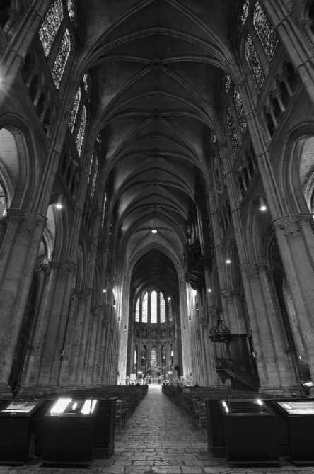
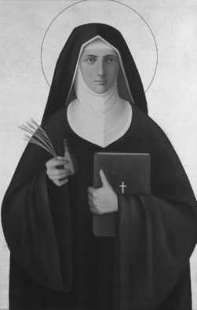

🟩第10章 11世纪和12世纪的哲学与神学

中世纪的兴盛

到1000年左右，作为中世纪早期特征的无政府状态和蛮族的连续入侵都告一段落。在接下来的世纪里，西欧的政治、社会和经济建制达到了稳定和连贯，持续了差不多500年。这些世纪里发展出的机构、建筑、音乐、文学和习俗，形成了人们将之与中世纪相联系的形象集合。从1000年到12世纪末这段时期，中世纪文明达到了它成就的顶点。由于这个原因，这个时期通常被称为“中世纪盛期”。

哥特式教堂的兴起是这个时代新精神的象征。早期的教堂建筑方法产生了粗矮、厚重、凡俗的结构，像是保护神圣的内部不受外部世俗干扰的石头堡垒。相反，新的工程技术使得房顶能耸入前所未闻的高度，并在大片地方用鲜亮的彩色玻璃代替了石墙。这产生了建筑几乎没有重量、悬浮在天空的幻觉，给了教堂一种魔幻、神秘的气质。中心的尖拱设计不仅使得竖向线条更加优雅，而且几乎像是一双手捧着祈祷者。

哥特式建筑可以看作这个时代哲学努力的象征。

每座建筑的基本结构都根据几何学和物理学坚实而普遍的法则。但在这些边界内有探索各种设计的自由。外部射入的光芒透过染色玻璃匠人创造的色彩鲜明的复杂图案照耀着建筑内的庄严礼拜。类似的，中世纪思想在基督教启示的坚固结构内展开，同时人类理性通过柏拉图和亚里士多德哲学模式的过滤流入基督教思想。

哥特式教堂华丽高耸的设计，是通过协调安排和消除建筑内部对立的张力达到的。世俗的石材和美的感官吸引力指向它们的外部，将人的眼睛和心灵引向天空。类似地，这个时代的哲学使用逻辑工具消解信仰与理性的张力。这一点的完成，是通过把它们放入它们在那将理智引向上帝的宏伟概念结构中的恰当位置。

中世纪理智能量爆发的一个主要原因是大学的兴起。在罗马覆灭后的混乱世纪中，知识和学问有从欧洲消失的危险。是修道院保存了西欧的理智文化。它们是珍贵手稿的储藏库，并为神职人员提供教育——他们是唯一认为需要教育的人。8世纪，查理曼复活了对学问和艺术的兴趣。其结果是，教堂学校开始在城镇发展以满足对教育不断增长的兴

RadiusImages/Alamy Limited

_沙特尔大教堂，完成于1220年。中世纪大教堂的建筑师使用石头和染色玻璃创造出一种超越感，令眼睛和心灵升入精神王国。类似地，中世纪哲学从观念的建筑砖块中创造出恢宏的概念结构，将理智引向上帝。_

趣。中世纪大学从这些学校和意大利地方学校中成长起来。13世纪，大学在巴黎、博洛尼亚、那不勒斯、蒙彼利埃、牛津和剑桥繁荣起来，这里只列举了很少一部分。到1500年，大学的数量超过了80所，其中许多今天还存在。我们仍然保留着许多起源于中世纪大学的学术传统，如穿学院袍，授予各种学位和论文答辩等。

大学运动对中世纪哲学的重要性在于，大学把学者群体集中起来，他们保存了过去的伟大思想并通过分析对重要文本的论证和就当时重要的理智问题进行辩论来推进知识的发展。作为他们教育的一部分，学生被期望就不同问题采取立场并面对他们的同侪和教授的质疑为自己答辩。教师也面临同样的压力，因为教师逃避回答困难的问题会被罚款，或让他的学生流失给竞争者。传统和正统依然占据最高统治地位，但这种对质疑、争议、论证、辩论的强调有助于产生某种意义上的理智严谨性，和比以往更大的对新选项的开放性。

虽然饥饿、疾病、暴力、无知依旧是中世纪生活无法逃避的现实，但这些世纪并不缺乏情感和理智的补偿。生活有了连贯性、目的和秩序。中世纪的人们有真挚的信仰和以教皇为首的教会。存在着一个政治体系（封建制）和一个支配性的经济体系（庄园农业）。存在着一个确定的社会结构，由平民、教士和贵族组成，每个人都行使着他特有的功能。地球处于宇宙的中心，被天幕所笼罩，这让人们有一种归属于令人安慰的事物结构的感觉。虽然哲学家感到有探索未知理智水域的自由，但他们并不像在没有星光的夜晚漂泊的水手那样没有方向感，因为他们有作为指路明灯的启示和传统来指引他们的理智之旅。生活中的每一事件都被神所规定，每个人，不论在社会地位和理智上多么卑微，都可能渴望上天的回报。由此，教会提供了一个统一和完备的宇宙图景，每个人都被置于其中。

经院哲学的兴起

经院哲学的性质

经院哲学（scholasticism）是给予这个时期欧洲的重要理智运动的名称。它的成员被称为经院学者或经院哲学家。最初，“经院的”这个术语适用于任何在查理曼最早于8世纪建立的学校中学习和教学的人。最终，经院哲学变成指整合信仰和理性的理智计划。虽然少数神学家怀疑哲学理性，但经院哲学家乐观的理性主义支配了中世纪的思想。

将所有经院哲学家统一起来的共同目的是协调教会的教义和哲学思辨的成果。他们的哲学受他们的信仰指导，而他们的信仰则靠他们的哲学来解释。对于经院哲学，如彼得·达米安（Peter Damian，1007-1072）对它的表达，神学是“科学的女王”，而哲学是她的婢女。在经院哲学家的思想中，信仰指导理性，为它设定议程，给它主要的提纲和重大的真理，让哲学可以围绕它们建立体系。接着，希腊哲学为他们装备阐明、解释和为《圣经》的真理提供理性支持的工具。在基督教的前几个世纪，教父们忙着努力表述和系统化信仰的条目。然而，到了经院哲学兴起的时代，内容固定的明确教义已经存在，并且有一个组织起来的教会系统保卫这些明确的教义。因此，教会的教义提供了不受争议的框架，哲学必须在其中找到它的位置。不过，在这些边界之内，学者的心灵可以自由徜徉，得出启示真理的可供选择的解释和意蕴。经院哲学运动内部出现相竞争的哲学立场表明，神学并不授与哲学家所有的答案。

经院哲学的方法是辩证法，一种从亚里士多德著作改编而来的论证形式。它是一种争辩和讨论的形式，首先，一个问题被设计成问句的形式，如“上帝的存在是自明的吗？”接着，着手提出赞成或反对不同回答的论证。最后，达成某种决议，或者在竞争立场之间找到一种平衡，或者捍卫其中一个立场的正确性而拒斥另外的立场。

经院哲学家对用理性的力量达到真理有充分的自信，但总是把这与依赖公认的权威相平衡。这些权威是《圣经》、教父（特别是奥古斯丁）和波爱修的逻辑注解。在后来的世纪中，亚里士多德完整著作的发现和他的那些阿拉伯评注者为思想提供了另外的资源。彼得·阿伯拉尔对共相问题的处理，戏剧性地展现了中世纪思想家围绕权威文本进行哲学研究的方式。他在《波菲利集注》中讨论了这个问题，这本书实际上是他对波爱修对波菲利对亚里士多德的逻辑论著的评注的评注的评注！

虽然经院哲学家在寻求得出他们的信仰的哲学意涵上是统一的，但具体如何得出这个图景却引发了席卷各个修道院和大学的争论。他们特别关注三个问题：（1）共相问题，（2）信仰和理性的关系问题，和（3）意志与理智的关系问题。

关于共相的争论

中世纪期间一个突出的哲学争论是共相问题。显然，这一问题产生于希腊哲学中，缘于柏拉图、亚里士多德和其他人立场的对立。然而，中世纪思想家认为，这个问题承载着神学意蕴。共相是某种可以为许多特殊事物共有的东西。因此，共相是我们关于世界的言说和思维中的重要元素。然而，当我们试图弄清共相的形而上学地位时，问题却产生了，因为可以问这样的问题，共相与实在有什么关系？对于中世纪学者，引发这个问题的是波爱修翻译的波菲利的《亚里士多德＜范畴篇＞引论》。波菲利问了三个关于共相的问题：

1．共相是

（a）独立地存在于实在中

还是

（b）只存在于理解中

2．如果它们存在于实在中，它们是

（a）有形的

还是

（b）无形的

3．它们是

（a）与可感对象相分离

还是

（b）不与可感对象相分离

关于他自己在这些问题上的立场，波菲利回答说：“我拒绝说……这种问题是最为崇高的事物，要求非常大量的辛勤探索。”[1]然而，他对这个问题的困难程度的警告根本没有阻止中世纪学者，因为他们相信，对它的回答牵涉到许多重要的神学争端。

要理解中世纪思想家面对的问题，请考虑一下“苏格拉底是人”这个陈述。当我使用“苏格拉底”这个名称时，我指称什么是非常清楚的，但当我使用普遍词项“人”时，我指称什么？我可能指称人性这个相或本质（像柏拉图想的那样），或者我可能只是发出了一个指称个体集合的声音。我也可能指称我心中的一个可以用于苏格拉底的观念或概念。在第一种情形下，共相具有一种独立于思考它的心灵的实在性；在第二种情形下，它作为我们语言中的一个声音仅仅具有言辞性的存在；而对于第三种理论，它将作为心中的一个精神结构而存在。

极端实在论是很多早期中世纪思想家采取的立场。“实在论”这个术语来自这个事实：他们相信共相是存在于世界中的实在事物。因此，根据波菲利列出的选项，他们赞同（1a）共相存在于实在中，（2a）它们是无形的。最广泛的版本继续赞同柏拉图的论点，（3a）共相与展现它们的特殊事物相分离。例如，约翰·司各脱·爱留根纳接受了新柏拉图主义的说法，认为相作为上帝与物理世界的中介而存在。类似地，圣安瑟尔谟坚持与柏拉图非常接近的观点，虽然他在神学上比爱留根纳更加正统。大多数人，如香浦的威廉（William of Champeaux，1070-1121） 认为，没有必要提出共相独立于个体事物而存在。而且，他相信，相同的共相存在于一个种的每一个个体中。例如，鲍勃、德斯蒙德、萨布丽娜和凯西都包含着人性的全部本质。个体之间的差异（他们的肤色、高度等）只是他们本质人性的细小变异。

导致实在论立场的因素有很多。第一，存在认识论动机。因为11世纪的思想家都把亚里士多德的逻辑作为他们推理的基础，所以他们假设推理是通过展示共相的关系来进行的。因而，如果共相不命名实在事物，那么我们就是做关于虚构物的推理，从而我们就没有知识。他们设想理性和实在之间一定是一一对应的。神学争议问题也有关系。实在论希望使原罪教义能被理解。＊极端实在论者、神学家图尔奈的奥多（Odo of Tournai，死于1113年）认为，人性由一种我们所有人都分有的单一性质或普遍本质构成。当最初的男人和女人犯了罪，这种本质就被污染了。既然我们都分有这种相同的本质，这种污染也就传递给了每一代人。一个进一步的考虑是，三位一体学说似乎要求实在论。圣父、圣子和圣灵怎么可能是三个位格，却是一个神？答案是，神圣的本质是单一、普遍的实体，展现于三个特殊的位格中。

尽管有这些神学考虑，但实在论存在着一个问`

🔹_＊这个教义说，当最初的人类（亚当和夏娃）违逆了上帝，罪和它的后果就成了人类状况的一个内在部分。_

题。它主张个别的人分有普遍的人性，这意味着人性包括在哺乳动物的共相中，它又是动物共相的一部分。最后（为了遵循这种立场的逻辑），一切事物都包含在最广泛的共相之中，即存在自身，一切事物共有的实体。但是，如果存在等同于上帝，那么所有事物都是上帝的一部分，上帝与世界之间的区分就倒塌了。这种泛神论在爱留根纳那里很明显。然而，这个时代的大多数思想家没有注意到他们立场的这一极端意蕴。不幸的是，除了《蒂迈欧篇》外，这些早期思想家没有柏拉图的任何著作，并且直到13世纪，他们都不知道任何亚里士多德对柏拉图的批评。因此，他们没有注意到，他们立场的许多缺陷，在比当前的这场争论早14个世纪之前，就被发现了。

唯名论（nominalism）是这场争议中采取的另一个极端立场。根据唯名论（来自拉丁语“nomina”，表示“名称”），共相只不过是名称，只有个体是实在的。对于唯名论者，除了红苹果、红色的日落或红色的日出这样的特殊事物之外，没有“红”这样的东西存在。这种观点最极端的版本可能是由洛色林（Roscelin，约1050-1120）表述的，他是法国的一个逻辑教师。他被教会谴责为异端，所以我们对他和他的观点知之不多。（很少允许异端的著述保留下来以将他们自己的故事告诉历史。）显然，他教导说，在心灵之外，除了殊相，没有任何东西存在，并且共相并不指称任何独立的实在，而只是用以标明特殊事物群组的名称或“有声气息（flatusvocis）”。洛色林无疑注意到“我爱人性，它是一个我无法抗拒的人”这个陈述是荒谬的。对于唯名论者来说，不存在“人性”这样的东西。它只是一个缩写符号，我们用以代表马尔科姆、卡伦、安德烈亚、乔治和这个存在的人的列表中的其他个体。这个理论中的哲学问题是，它似乎把共相变成了任意的和主观的。如果除了指派给它们相同的标签外，没有任何东西让这些个体成员属于同一范畴，那么我们根据什么把“人”这个名称给予一个殊相集合？除了世界上的事物好像被划分为自然种类这一常识性的反对意见外，大多数中世纪思想家都相信，他们的神学蕴含着一个实在的客观秩序，一个唯名论者似乎否定的秩序。而且，唯名论者似乎瓦解了原罪这个观念。如果所有人都是独特的，并与亚当分离，那么他的道德堕落怎么影响我们？至于三位一体，洛色林逻辑一致地做出结论说，如果不存在共同的神圣本质，圣父、圣子和圣灵就是三个神。“三位一体”这个词只是声音，指称这些个体的集合。他的三神论导致他在1092年被索松主教会议谴责。由于面临被教会开除的可能，洛色林放弃了他的立场。

概念论（conceptualism）是一种在前两个极端之间寻求妥协的立场。这个立场是由彼得·阿伯拉尔（1079-1142）引入的，阿伯拉尔在洛色林和香浦的威廉门下学习，并且发现他们两个的极端立场都有弱点。阿伯拉尔论证说，实在论蕴含着共相可能具有相互不一致的性质。例如，既然普遍的动物性既存在于苏格拉底，也存在于一头驴子，动物这个实体就既是理性的，也是非理性的。而且，两个个别的人，例如苏格拉底站在一个地方，柏拉图站在另一个地方，他们怎么可能像实在论似乎要求的那样，真的有人性这一相同实体？阿伯拉尔也揭露了极端实在论中隐含的泛神论。回应他的学说的这些批评时，威廉修正了他的立场，但不足以让阿伯拉尔满意。阿伯拉尔也攻击唯名论。由于接受了亚里士多德的定义，共相能够述谓许多事物，他论证说，共相不可能只是词，因为词只是物理的声音，而一个物理的东西不可能述谓另一个东西。

为了避免这些问题，阿伯拉尔解释说，一个普遍语词自身只是一个声音，但它从它指向一个普遍概念这一事实中获得了它的能力。概念是语词的逻辑内容、意义或意思。他说，借助于普遍观念，心灵“构想许多事物的共同而含混的表象……当我听到人，我心中浮现出某个形象，它以这样的方式与诸个别的人相联系，即它是所有人的共同形象，但不精确地符合任何人”。[2]通过提出共相是模糊含混的图像，他使得它们类似于一种抽象的视觉图像，这种图像是在这样的情况下获得的，即你半眯着眼睛使得你能分辨出你面前有个人，但因为形象不清晰而不能识别他。

如果我们接受阿伯拉尔的说法，共相不过是心灵中的一般概念，那么它们只是精神构造，在实在中没有任何位置。有些评论者给他的立场贴上了温和唯名论的标签。然而，他继续说，普遍概念的获得是通过抽象出若干个体共有的特征。因此，共相指称事物的客观特征，但不是与事物相分离的独立实在。例如，苏格拉底和柏拉图，就他们都是人而言，他们是相同的，但这种同一建立的基础不是某种心灵之外的单一实在（像极端实在论者认为的那样），也不是我们把相同的声音用于每个人（像唯名论者认为的那样），而是根据他们有相同的性质因而可以把相同的精神概念用于每个人这一事实。

共相可以和个体分开考虑，但它们不是真正分离的。因此，苏格拉底的人性和柏拉图的人性是两个东西，但他们的客观相似性是“人”这个普遍概念的基础。通过表明某人可以否认在一个种的所有成员中存在一个同一的本质，但并不否认共相的客观性，阿伯拉尔瓦解了极端实在论的吸引力。他思想中强调客观相似性的抽象的这个方面，指向了一种温和实在论，这个立场得到了后来的思想家更全面的发展。

温和实在论成了中世纪后期最受欢迎的共相问题解决方法。＊阿伯拉尔摸索着通向它的道路，但当亚里士多德的完整著作重新引入西方思想后，这个立场被阿奎那这样的思想家表述得更加清楚。基本上，这个立场主张普遍观念是由心灵形成，但是以外部实在的客观特征为基础。发现对立立场的综合是典型的经院哲学方案。和极端实在论者一样，温和实在论者教导说，共相作为上帝心中的原型先于事物（ante rem）。和亚里士多德一样，他们说，共相作为使个体事物相似的性质存在于事物中（inrem）。和亚里士多德与概念论者一样，他们教导说，共相作为从个体的相似性中抽象出来的心中的概念后于事物（post rem）。最后，和唯名论者一样，把个体看作实在的终极单位是他们的共同立场。

信仰与理性之争

划分中世纪思想家的第二个问题是曾经困扰教父们的问题：我们如何理解知识的两个来源——信仰和理性——之间的关系？中世纪期间，至少出现了针对这个问题的五种进路。第一，有人完全信任理性，让他们的理智引导信仰。早期思想家中采取这一立场的是约翰·司各脱·爱留根纳、洛色林和

🔹_＊并不是所有学者都以相同的方式在立场之间划界，他们也不以相同的方式使用这个术语，这个事实使得关于共相的讨论复杂化了。一个特定哲学家的立场有时并不清楚，这个事实造成了进一步的混乱。这解释了为什么不同的哲学家称阿伯拉尔是一个温和的唯名论者、概念论者或温和的实在论者。_

阿伯拉尔。后两人因他们的立场陷入了麻烦，他们的神学著作都受到谴责。第二，另一些人试图通过给予信仰优先性让钟摆摆离理性。随着1000年左右引入的僧侣生活改革，虔诚的复苏使某些人把理性视为威胁。彼得·达米安（1007-1072）是这一运动的最强音之一。他警告要注意“伪知识分子的盲目蛮干”，“他们研究虚假的问题”，并且擅自用他们对孱弱的逻辑和“基于语词意义的论证”[3]的信任取消上帝的权能。类似地，克莱尔沃的圣伯纳德（St．Bernard of Clairvaux，1091-1153），一个神秘主义者和道德改革者，认为哲学是无用的，并且对轻信的人是危险的。因此，他发起了阿伯拉尔的异端审判。与试图使信仰符合理性相反，伯纳德说：“虽然我不理解，但我通过信仰把握了我不能用心灵掌握的东西。”[4]第三，某些人，如圣安瑟尔谟，更加温和并寻求妥协。安瑟尔谟相信，理性不可能自治，因为信仰必须领导，理性必须追随。同时，在对理性的信任上，他比任何其他基督教哲学家都走得更远，因为他实际上认为他可以演绎地证明所有他先前通过信仰相信的主要基督教教义。虽然他对理性有极大的信心，但他非常清楚地说，它只能在正统的范围内运作：

任何基督徒都不应当争论天主教会心中相信并且口中承认的真理。而是总是毫不质疑地坚持相同的信仰，热爱它并按它生活，他应当……尽其所能为它寻找理由。[5]

第四，13世纪的圣托马斯·阿奎那寻求信仰与理性的综合。他非常严格地区分了神学和哲学的范围。托马斯相信，我们有限的心灵不可能感知某些神学教义的合理性。因此，许多安瑟尔谟试图证明的教义，托马斯认为是只能通过启示来知晓和依靠信仰来接受的奥秘。然而，托马斯主张理性在它自己的边界内完全称职，并且信仰的考虑不需要进入哲学论证。最后，托马斯相信二者的范围部分重合，信徒靠信仰持有的教义（例如上帝存在）可以被自然理性证明。第五，托马斯之后，理性支持信仰的能力不那么受信赖了。一系列哲学家日益压缩理性的范围，越来越拉远了它和信仰的关系。布拉班特的西格尔，阿奎那的同时代人，主张双重真理学说，该学说主张，对于一个问题，哲学可以给出一个回答，神学给出另外的回答。相反，邓·司各脱（Duns Scotus，约1266-1308）保留了信仰和理性的和谐，但几乎不允许二者重叠。14世纪的奥卡姆的威廉更加极端。他分离了信仰和理性以保护信仰的真理不受人类理性的审查。由于主张我们关于世界的知识只产生或然判断，他不认为可以确定地证明《圣经》中的上帝的存在。而且，通过主张逻辑不能告诉我们实在，只能是关于我们断言实在的命题的形式，奥卡姆把逻辑与实在相分离。最后，14世纪神秘主义的强劲复苏为信仰和理性的分离火上浇油，神秘主义把关于上帝的知识分派给宗教体验，置于理性的命题知识的藩篱之外。

> 想一想
> 
> 10.1 在这个时期，信仰和理性的问题遭遇了大量的争论。为什么有些思想家反对努力发现信仰的理性基础？如果你是中世纪经院哲学家，你如何回应那些以信仰之名拒斥理性的人？

意志与理智的关系

另一个经院哲学的争议有关意志和理智。人人都同意，有些种类的人类行为是善的，而另一些不是。问题是，这些事物善的基础是什么？一种立场主张，上帝的理智先于他的意志做出决定。这些哲学家相信，柏拉图的共相栖居于上帝的心灵。由于知道他自己的心灵，上帝的理智意识到那些客观上善的性质，他的意志遵循这一理念创造世界。类似地，被上帝辨别为善的行为就是他的意志命令我们去施行的行为。这种立场遵循或极端或温和的实在论，因为它说善是一种客观性质。由于明显的理由，这种立场有时被称为理智主义（intellectualism）。这种立场的一个实践意蕴是，既然上帝的理智认识到这是善的，我们的心灵（他的理智的微缩版）同样可以认识到什么是善的，因此伦理学以理性为基础是可能的。这导致了斯多亚学派的自然法理论在中世纪的复活，它主张可以通过考察人的本性发现道德原则。

第二种立场被称为意志主义（voluntarism）。它的拥护者主张，神圣的意志先于理智。按照这种解释，上帝至高无上的意志自由地选择什么被看作善的或恶的。意志主义者反对说，理智主义者的立场侵害了上帝的自由和权力，因为它暗示上帝的自由受指定的模式束缚。极端的意志主义者把这一立场的逻辑贯彻到底，主张撒谎和通奸也可以在道德上是善的，如果上帝愿意这样的话。遵守承诺不一定是善的，就像上帝不一定创造鳄鱼一样。然而，在他选择创造的世界中，上帝的确创造了鳄鱼，并且他的确意欲承诺被遵守。显然，在这一立场中，孤立无助的人类理性不能分辨什么是道德上善的，因为这一结果是上帝自由和至高无上的决定造成的。伦理学必然地必须以某种上帝道德选择的启示为基础。这有时被称为“神圣命令”伦理学理论。意志主义者倾向于唯名论，因为他们相信，道德上的善不是一种永恒的共相，而是上帝自由地授予某些行为的名称。既然我们的理性不能辨别什么是道德上善的，我们的意志必须仅仅遵循由上帝的命令所揭示的被创造的道德秩序。

> 想一想
> 
> 10.2 理智主义和意志主义之间的争论复活了苏格拉底在《欧绪弗洛篇》中问的一个问题。苏格拉底问，神爱善的行为是因为这些行为是善的，还是因为神爱它们所以这些行为是善的？中世纪的人们在基督教的一神论背景中也问同样的问题。理智主义会选哪一个选项？意志主义会赞同哪一个选项？这个问题的这两种表述有什么区别？每种立场有什么意蕴，有什么长处和弱点？

这些关于意志和理智的冲突立场，也适用于经院哲学家如何理解创世。理智主义者主张，上帝理智中的相先于创造。虽然他们并不都赞同严格的逻辑决定论，但他们的确相信世界的概貌是由它与理性的符合决定的。因此，我们的理性是发现世界秩序的最好工具。但是对于像邓·司各脱和奥卡姆这样的意志主义者，世界根本是偶然的。如果上帝愿意，他可以造出和当前的世界完全不同的世界，因为他的意志优先于他的理智。在提出这个观点时，他们的动机首先是宗教动机。他们想保护上帝的至高无上和自由，使得必须更多依赖启示，而给予理性较小的权威。但是，由于强调世界的偶然性，他们使得，在我们理解世界的努力中，观察比思辨推理更重要。最终，这一重点的转换，对促成近代科学的兴起起到了重要作用。

以这些关键问题作为背景，本章的其余部分将概览圣安瑟尔谟和阿伯拉尔的思想以及中世纪伊斯兰和犹太哲学家中的重要人物。安瑟尔谟展示了如何应用柏拉图理性主义和实在论来证明上帝存在。阿伯拉尔则展示了平衡信仰和理性的努力并介绍了道德意志主义的早期版本。接下来，当涉及亚里士多德哲学对他们传统信仰的冲击时，我们用代表性的伊斯兰和犹太哲学家，再次考察信仰和理性的问题。欧洲对亚里士多德的再发现是本章的最后一个题目。

圣安瑟尔谟

安瑟尔谟（Anselm，1033-1109）生于意大利贵族家庭。他违反他父亲的意愿，决定在位于贝克的诺曼镇的本笃会修道院成为一名僧侣。最终成为修道院院长。虽然他不认为自己有管理天赋，但别人不这样认为，他后来受召成为坎特伯雷大主教。他向往重返安静的隐修生活，但是，尽管不情愿，他还是忠实地在这个职位上服务直到他去世。因为英国和罗马之间的政治紧张，他在这个职务上的16年争论不断。针对连续两任国王，他主张教皇的权威高于王权。安瑟尔谟于1109年76岁时去世，并于1494年被封为圣徒。

他的哲学目标是提供决定性的论证来理性地证明他凭信仰接受的基督教教义。和奥古斯丁一样，他相信信仰先于理解。“我并不是为了信仰而寻求理解，而是为了理解而信仰。”安瑟尔谟在他的《宣讲》第一章中说。[6]虽然他极为虔诚，但他也是一个自信的理性主义者。因而，他相信所有推理都应该遵循演绎的方法，并且这一方法会导向所有基本的真理。在安瑟尔谟的时代，什么能通过理性知道，什么要求启示，其间的边界还没有划清。其他哲学家已经试图证明上帝存在这样的教义。然而，安瑟尔谟对理性主义的热情引导他相信他也可以给像三位一体和道成肉身这样的教义为真提供“必然的理由”。后来的神学家认识到这样的问题超出了理性的能力，只能通过信仰和启示来建立。

他最著名的论证——确保他在哲学史上永远有一席之地的论证——是上帝存在的本体论论证（ontological argument），见于他的《宣讲》。＊安瑟尔谟说，在推论上帝存在的许多次尝试之后，这个论证在灵光一闪中“自己出现”在他心中，因此他认为这是对祈祷的回应。这个证明依赖这样的观念，即上帝是一个比一切可设想的是者都伟大的是者。他将这个论证直指《诗篇》14章中“说在他心里没有上帝”的“愚人”。安瑟尔谟指出，愚人可以理解上帝的定义，因为否定上帝要求你理解你所否定的东西。因而，上帝至少作为一个观念存在于心灵或理解中。问题是，上帝是否在心灵之外也存在？安瑟尔谟的论证试图表明否定这一点是不可理解的。他的论证可以表述如下：

（1）在我的理解中有一个上帝的观念。

（2）这个上帝的观念是一个可以设想的最伟大者的观念。

（3）存在于现实中的是者比只存在于理解中的是者更伟大。

（4）如果上帝（可以设想最伟大的是者）只存在于理解中，那么就可以设想一个更伟大的是者，即一个也存在于现实中的是者。

（5）但前提（4）是矛盾的，因为它说我可以设

🔹_＊本体论这个词来自希腊语，字面的意思是“关于是的科学”。因此，这个论证试图从他之所是的概念证明上帝的存在。这个论证最早是由18世纪的德国哲学家康德贴上这个标签的。_

想一个比可设想的最伟大的是者更伟大的是者。

（6）所以，如果我有一个可设想的最伟大的是者的观念，那么这样一个是者必定既存在于我的理解中也存在于现实中。

（7）因而，上帝存在于现实中。

这个论证的基础是柏拉图在对分割线的解释中描述的实在观。换言之，这个证明假设了某个事物的完满性越大，具有的实在性就越多。如果我们可以设想一种最完满的是者，我们必然将设想具有最大程度实在性的是者。安瑟尔谟的批评者，包括他的同时代人和现代人，坚持存在不是与知识、能力或善这样的属性处于同一位阶的属性。我们可以设想在各个方面完满的是者，但那个是者存在与否，并不是我们关于它的完美性设想的一部分。

安瑟尔谟在《宣讲》第三章提供了这个论证的另一个版本。他并不清楚这是一个完全不同的论证，因为他只是视它为对第一个版本的阐述。然而，今天大多数哲学家认为他偶然地发现了一个完全不同的、可能更强大的论证路线。这个论证开头的两个前提与前一个论证相同。但随后采取了不同的轨迹。它不是同样地谈论存在，而是聚焦于必然存在这个属性。一个不可能不存在的是者就是一个必然的是者。这个版本的证明论证说，必然存在必须归于任何完满性达到最大程度的是者。这是安瑟尔谟的第二个论证的表述。

（1）我有一个上帝的观念。

（2）这个上帝的观念是一个可以设想的最伟大者的观念。

（3）一个不可能不存在的是者比可能不存在的是者更伟大。

（4）因此，如果可以合理地设想最伟大的可能是者不存在，那么他不是最伟大的可能是者。

（5）但前提（4）是个矛盾。

（6）不可能合理地设想最伟大的可能是者不存在。

（7）因而，上帝必然存在。

作为前提（3）基础的原则是，最伟大的可能是者不可能开始存在和停止存在，因为两种情况下，必须有另外比他更伟大者使他成为存在或停止存在。例如，帝国大厦碰巧存在，但它同样可能不存在。外太空可能有生命，但也可能没有——这全赖于是否有产生它的条件。所以最伟大的可能是者是其存在不依赖其他任何东西的是者，这意味着他必须是一个不是碰巧存在而是必然存在的是者。它蕴含着如果上帝存在，他必然存在。但安瑟尔谟的要点是“如果”这个词不能用于上帝的存在，因为一旦我们说“如果上帝存在……”我们就在暗示他（像帝国大厦一样）可以设想可能不存在。我们在陈述一个矛盾判断：上帝是一个可能不存在的是者，但（根据定义）上帝是不可能不存在的是者。这个论证试图迫使我们在两个选项之间选择：（1）上帝存在（并且他不可能不存在），或者（2）上帝的概念完全没有意义。因此，我们必须要么接受结论，要么拒斥第一个前提。某些20世纪的哲学家（称为逻辑实证主义者）的确主张上帝概念就像“圆的方”一样不可理解。＊然而，安瑟尔谟似乎很清楚，有神论者和无神论者都完全可以构想一个上帝这样的完满是者。既然我们可以设想这样的是者，我们不能设想他的存

🔹_＊见第31章对逻辑实证主义者的介绍。_

在像和外太空有生命的可能性一样是一个开放问题。

一个叫高尼罗（Gaunilo）的僧侣，安瑟尔谟的同时代人，在一篇题为“为愚人辩”的文章中对本体论论证提出了许多异议。他质疑了从可设想的最伟大者的存在推到想象这样一个是者存在于实在中的做法。“想象一个最伟大的海岛不也一样容易吗？”高尼罗问。如果是这样，按安瑟尔谟的逻辑，我们必须下结论说，这样一个海岛真的存在？这个批评的要点是，安瑟尔谟的推理将使我们合理地证明种类广泛的事物实际存在（完满的画，完满的牛排，完满的骑士），只要我们能想象它们是它们的种里最伟大的可能成员。概括来说，安瑟尔谟的回应是，一个比任何可能的岛都完满的岛，仍然不是一个“无法设想有比他更伟大者的是者”。因为即使最优秀的岛按其本性也是一个有着物理区域的有限是者。因此，如果它存在于一个区域A，那么它不可能存在于区域B。既然我们可以设想它不存在于B，我们也可以设想它根本不存在。由此，他提出，完满和必然存在是只能归于上帝的属性。

高尼罗也攻击了两个论证的前提（1）和（2）。我们真的能充分地设想一个比他更伟大者不可设想的是者吗？我们理解的事物，我们理解它们是因为我们有它们的经验或与它们相似之物的经验。然而，最伟大者是独一无二的，那么理解只能模糊地抓住这些词的意义。安瑟尔谟回答说，我们可以就两个事物优秀程度的不同来比较它们。由此我们可以把我们关于某个相对善的是者的观念外推到第n级，并设想绝对善的事物。用当代的例子，我们可以看到社会改革者甘地在道德上高于罗马暴君尼禄。然而，我们可以想象某个人有甘地所有的德性但没有他的任何人类缺陷。通过相同的进程，心灵可以继续下去直到我们设想出一个是者，他有达到最高程度的一切德性，而根本没有任何缺陷。由此，我们人类理智可以形成最伟大的可能是者的概念。

安瑟尔谟之后，本体论论证在哲学史上继续有人钦佩，有人批评。在近代，理性主义者笛卡尔、斯宾诺莎和莱布尼茨都为他们自己版本的论证辩护。更具有经验导向的哲学家，如中世纪哲学家阿奎那和奥卡姆，18世纪的康德都尖锐地批评了这个论证，即使他们站在有神论一方。虽然很多人不认为它有说服力，但哲学家不能对这个论证置之不理。作为这位11世纪僧侣伟大才智的证据，他的论证在今天仍有生命力，并被使用20世纪逻辑的复杂技术加以争论。

> 想一想
> 
> 10.3 是否可能单凭理性来论证关于实在本性的结论？如果不可能，你怎么论证理性不能告诉我们实在本性的说法？假设我告诉你，我在我的口袋里有一个圆的方。你不会相信我，因为圆的方不可能存在。但是，按照类比，如果理性能告诉我们某物不可能存在，理性能告诉我们某物不可能不存在吗？安瑟尔谟会说是的，你怎么认为？

彼得·阿伯拉尔

彼得·阿伯拉尔（Peter Abelard，1079-1142） 生于法国南特附近的一个贵族家庭。他在沙特尔和巴黎兴起的新哲学和神学学校学习。虽然作为特别杰出的学生受到欣赏，但是作为一个乖戾傲慢的学者而闻名。完成课程之后，他经常自己继续教这门课来与他原来的老师竞争。这种活动明显地显示出他的个性，那不是大多数人觉得惹人喜欢的个性。然而，他肯定还是有某些人性魅力，因为当他35岁时，他与爱洛伊丝，巴黎圣母院一位管事年轻的甥女，陷入了一场激情洋溢的恋爱。她怀孕了，他们谋划秘密结婚。因为这些原因，他的舅舅对她的情人大为恼怒，用阿伯拉尔自己的话说，她的家人惩罚了他，方式是“切掉了我身体的用来做让他们痛苦的事的那些部分”。他引退到巴黎郊外的圣丹尼斯修道院，在那里他成了一名僧侣，而爱洛伊丝去女修道院做了一名修女。他的生活继续被争议缠绕，因为他的书《论神圣的三位一体和政体》于1121年在索松主教会议上被谴责和焚烧。20年后，约1141年，他因他的《神学引论》被召到桑斯会议上并被指控为异端。阿伯拉尔死于1142年，当爱洛伊丝22年后去世时，被葬在他旁边。

阿伯拉尔被认为是用亚里士多德的辩证法澄清神学命题的先锋。这种论证形式成为经院哲学讨论的特色风格。这种技艺被展示在他最著名的书中，该书写于1121到1122年，题目是“是与否（Sic etNon）”。在这部著作中，他列出了教父们给出了对立观点的150余个神学问题。与他的批评者相反，其目的不是为了产生怀疑，而是挑战他学生的心灵，让他们通过努力解决这些矛盾来磨炼他们的理智。他在前言中说，“由怀疑我们走向追问，由追问我们感知真理”。阿伯拉尔论证的辩证法形式后来被阿奎那使用，但是做了修正，阿奎那总是用自己对对立命题的判断做结论。阿伯拉尔触犯了传统，因为他总是把神学看作激烈辩论和追问的机会，而不是虔诚的沉思和接受。虽然他在神学上的大胆使他好像很叛逆，但他在1141年受到谴责后写信给爱洛伊丝：“如果必须否定保罗，那么我不想做一个哲学家。如果必须和基督分离，那么我不想做亚里士多德。”[7]

在他对道德问题的讨论中，阿伯拉尔对经院道德神学的方向有重要影响。他反对他的时代的律法主义倾向，即道德上的善被看作只是外在地符合上帝的法律，罪被定义为事实上违反法律，不论行为者是否知道他的行为是错误的。“上帝考虑的不是做了什么，而是以什么精神做；行为者的功德与荣耀不在于行事而在于意图。”因此，罪是对上帝的轻蔑，表现为我们有意做我们明知错误的事。但是，如果我们带着真诚的良心做我们相信正确的事，我们可能错了，但我们没有罪。作为对他立场的神学支持，他引用耶稣关于他迫害者的话，“父啊，宽恕他们，因为他们不知道他们做了什么”。阿伯拉尔的目的不是宽恕道德上的头脑简单和天真无知，而是强调道德上善的人是有善的意志的人，他做出坚决的努力去认识什么是善，并按他发现的最佳见解去行动。当然，有充分德性的行为，不仅源于做正确事情的意图，而且源于客观上正确的行为，要么因为它符合自然的道德法则，要么符合上帝的特殊指令。

阿伯拉尔预演了14世纪意志主义的立场，他提出，上帝的道德指令没有必然性。因为这个原因，上帝在《圣经》历史上的不同时代规定不同的道德。自由选择对作为立法者的上帝是基本的，就像自由选择对人作为守法者是必不可少的。但是，不论神圣法则的实质内容是什么，人们总是有相同的遵循它的刻板义务。

> 想一想
> 
> 10.4 在何种程度上你赞同阿伯拉尔的观点，即道德和意志与意图的关系与它和外部行为的关系一样大？

阿伯拉尔并不追随任何明显的哲学流派，但他对他的时代有巨大影响。如我们前面提到的，他最重要的贡献是他对共相之争的解决。在其中，他对精神概念如何形成和语言如何起作用的研究做出了贡献。虽然直到后来人们才获得关于亚里士多德的多数著作，但阿伯拉尔预演了后来以这些文本为基础做出的哲学变革。因此，他被看作经院哲学发展的一个重要贡献者。

哲学中的女性：宾根的希尔德嘉德（Hildegard of Bingen，1098-1179）

宾根的希尔德嘉德是一个特别有天赋（和能力）的12世纪的修女。她的著作内容涉及神学、伦理学、宇宙学、哲学、科学和医学等领域。她还是位作曲家，她的音乐作品的演奏还能在今天的CD上听到。虽然她的修辞传达了一种谦逊和顺服的精神（正如人们对一个妇女和修女的期待），她的行为却展示了那个时代的女性中少有的无畏、坚忍和钢铁意志。

希尔德嘉德1098年生于德国贝默斯海姆，莱茵河流域的一个自治市。她是一个贵族和他妻子的第十个孩子。他的父母决定把她献给上帝，在15岁左右，她接受了本笃会的誓约，开始了她的修女生活。1136年，她被任命为女修道院的院长。希尔德嘉德一直忙于写作、作曲以及修建、维持两个女修道院，忠告（并且有时顶撞）国王、皇帝、教皇和主教们，来往于四个公开的巡回演讲，并致力于广泛的通信（她的400封信被保留了下来）。她平静地死于1179年。虽然在她获封圣徒的过程中，最初有些官僚作风问题作梗，她最终得到了这个身份。

希尔德嘉德被认为是世界史上最伟大的神秘主义者之一。3岁时，希尔德嘉德开始有神秘的灵视，她后来称之为“现世灵光的反映”。她的书里有三本是描述和解释她神秘的宗教灵视的。在这个时期，在某些人看来，神秘主义是对过度的以理性主义方式走向上帝的一种反动。神秘主义者主张上帝是通过受感觉而不是理性支配的直接经验遭遇来认识的。中世纪神秘主义的主题将在第12章末尾再次谈到。希尔德嘉德的宗教神秘主义与第23章讨论的19世纪浪漫主义也有许多重要相似之处。希尔德嘉德著作最引人注意的特征之一是她对人类的性的讨论。其中大部分都发生在她的一本科学著作《病因与治疗》（Causae et Curae）中。奇怪的是，她给了我们两种不同甚至矛盾的解释。有时，她关于性的著作非常实证而没有任何意义的道德判断。它们充满了关于性欲、性交、受孕、生孩子和妇科医学的临床学、机械学和生物学细节，虽然大部分都表达在非常丰富的诗意隐喻中。她著作的这种非常坦率的特征，有时达到色情的程度，让后来古板的

ZvonimirAtletic´/Alamy Limited

_宾根的希尔德嘉德（1098-1179），一个本笃会修女，因她的神秘主义著作而引人注意，还有她的作曲和神学、伦理学、宇宙学、科学和医学著作。_

批评者质疑她是否有圣徒资格，而另一些人质疑这些文本的真实性。以下段落展示了（不精确的）医学细节和诗意风格的结合，也展示了希尔德嘉德讨论性的直白方式，这对一个12世纪的童贞修女来说，是令人震惊的。

当一个女人与男人做爱时，她头脑中的热感，伴随着性愉悦，传递着对这种伴随动作的愉悦的喜好并召唤男人喷射精子。当精子进入了它的位置，从她的头脑中逐渐退去的强烈的热，把精子引向自己并抓住它，女人的性器官很快收缩，在月经来潮期间已经张开的所有部分现在关闭了，与强壮的男人在掌中握住某种东西的方式相同。[8]

在这个段落中以及其他许多段落中，她自然和正面地谈论女人（或男人）体验到的快乐（“性愉悦”）。这可能对我们不算什么。然而，至少在奥古斯丁之后，性快乐等同于罪恶的肉欲已经是一个标准看法。

然而，这一实证的、常常是自然主义的关于性的看法，却与更负面的、悲观主义的段落矛盾，其中，所有受造物都被看作被有罪的堕落所玷污，一种主要表现在我们性生活中的堕落。他说，人类“恶意地在欲火中播种”而不伴随生子愿望的性是“一种魔鬼行为”。[9]终于，她接受了她的传统中的一般观点，终生童贞是灵性的最高层次（大概是因为没有被性的污点和干扰所败坏）。

和她对性的解释一样，希尔德嘉德关于医学和心理学的著作呈现出难以调和的两种观点。作为一个关心病因和治疗的中世纪作家，她把人类当作受物理原因支配的物理实体。单独来看，这种观点会导向我们现在称为唯物主义（materialism）和决定论的立场。然而，这些立场与她把自由意志归于人从而使他们有道德责任的愿望存在张力。

在希尔德嘉德那里，这种紧张的一个例子见于她的一个观点，她认为，如果父母在怀孕时互相珍爱，孩子将有优秀的品格。如果父母之一缺乏爱，那么孩子将软弱而没有德性。如果父母都不享有对方的爱，孩子将会继承他们的怨恨。[10]正如这个解释显示的，希尔德嘉德认为，个性特征和道德品格可以是因果律的结果。但是，如果我的品格有无德性是我不能控制的原因（在我孕育期间我父母关系的状态）的结果，那么我能为我的品格及其结果负道德责任吗？科学地解释人和想要保留人的自由意志之间的张力是一个在近代时期强势兴起的争端，并且这场争斗一直持续到我们的时代。虽然她的大部分科学和世界观受到12世纪观点的限制，希尔德嘉德在寻求人类行为和心理现象的自然原因方面是非常现代的。

看待希尔德嘉德的方式有很多种，没有哪种单独的方式本身对她是恰当的。对哲学史的目的而言，她是努力既坚持传统宗教世界观又接受关于自然和人的科学观点的早期例子。这个任务将提上许多近代哲学家的议程，因为近代科学的兴起给传统的人的观念带来了很多挑战。

伊斯兰哲学家

保存亚里士多德的遗产

在西方基督教世界只有柏拉图和亚里士多德著作的残片的时候，伊斯兰和犹太哲学家却享受着希腊哲学的财富并用它们丰富着他们的思辨。因此，阿拉伯哲学成了把亚里士多德的完整著作和稍后把柏拉图的完整著作送到西方的主要运载工具之一。中世纪后期的基督教经院哲学家，要么通过采用他们对亚里士多德的解释，要么通过反对他们所说的异端，而受到穆斯林哲学家的影响。类似地，12世纪的犹太思想家将他们研究亚里士多德的成果传递给了西方。因此，讲中世纪哲学不能不提及这个时期的伊斯兰和犹太思想家。

伊斯兰教的兴起

伊斯兰的意思是（对上帝意志的）“服从”，它是传播最广和最强大的一神论宗教之一。它的基础是先知穆罕默德在若干年的过程中获得的启示。虽然他认为他的启示与旧约和新约的启示一致，但他还认为他的教义高于它们的教义。他的教义记载在伊斯兰教的圣书《古兰经》中，并且他的追随者被称为穆斯林，意思是“真信徒”。他的教义的影响势不可挡，在他于公元632年去世后的一个世纪内，他的追随者把伊斯兰教传播到从印度经北非到西班牙的几乎所有有人烟的地方。

伊斯兰兴起前的世纪里，基督教派别以及异端教派在美索不达米亚、波斯和叙利亚保存了希腊哲学和科学的研究并保护和翻译了古代希腊文本。800年左右，当穆斯林学者开始把这些希腊著作翻译为阿拉伯语并撰写关于它们的评注时，伊斯兰教就诞育了伊斯兰哲学传统。阿拉伯哲学家有一个与基督教经院哲学家相似的议程，但在世界的这个部分，他们的任务是调和亚里士多德和《古兰经》。伊斯兰哲学的历史遵循着与基督教哲学相同的模式。在两种情形下，都逐渐形成了基于受启示的经卷（《古兰经》和《圣经》）的正统传统。在两个传统中，都有哲学家赞同希腊哲学并为了让他们的信仰符合理性而自由地解经。然而，在两个传统中都有严格正统的捍卫者怀疑哲学对信仰的传统理解的影响。就像基督教中世纪经院哲学家受新柏拉图主义影响，部分是由于错误地认同了伪狄奥尼索斯的文本，同样的混淆也发生在阿拉伯世界中。例如，普罗提诺的《九章集》的一部分被以“亚里士多德神学”的名义翻译出来。类似地，取自雅典新柏拉图主义者普罗克鲁斯著作的《原因之书》被归于亚里士多德。这些文本错误在伊斯兰哲学家中帮助推动了对亚里士多德的新柏拉图主义解释。伊斯兰哲学家分为两个群体，较早的东方群体在巴格达，而较晚的西方群体以西班牙为中心。

阿维森纳

阿维森纳（Avicenna，伊本·西纳的拉丁化名字；980-1037）是最重要的伊斯兰哲学家之一。他出生于波斯，是个神童，还是一个孩子时，他就学习了所有的学科和伟大的文学作品。16岁时，他就有了足够的知识去做了一名医生。阿维森纳过着忙碌的行医生活并作为政府高官出仕，同时仍然找时间追求他的学问。即使在频繁旅行时，他也写了160本书，涉及范围广博的题目。

阿维森纳告诉我们，他读了亚里士多德的《形而上学》40遍后记住了它，但是直到读了阿尔法拉比（死于950年）之后才理解它，阿尔法拉比是穆斯林中亚里士多德主义传统的奠基人。他的体系基于阿尔法拉比的思想和对亚里士多德的新柏拉图主义解读。在发展他的形而上学时，阿维森纳（和安瑟尔谟一样）主张上帝的本质必然蕴含他的存在。然而，对于宇宙中的任何其他受造物，它们的本质和它们的存在是两个不同的事情。例如，独角兽的本质是一个一只角的像马一样的动物。然而，从对它属性的描述中，我们不能确定独角兽存在与否。可是，如果所有的受造物自身都只是可能的是者，有些受造物怎么可能实际存在？显然，它们的存在只能是某个另外的存在着的是者造成的。但是这些原因自身是依赖的是者，因而原因系列不可能无限进行下去。必定有某个必然的是者在最开始促成了单纯的可能性变为现实性。这个必然的是者当然就是上帝。这种关于必然和可能的推理方式既影响了犹太思想家，也同样影响了基督教思想家，特别是迈蒙尼德和圣托马斯。

然而，从这个相当正统的起点出发，阿维森纳推到了一个非常有争议的结论。既然上帝是必然的而且没有开端，因而阿维森纳认为上帝的所有属性也是必然和没有开端的，包括上帝作为创世者的地位。阿维森纳发展了世界和其中的万物出于必然而由上帝发散出的理论，这暴露了新柏拉图主义对他的影响。因此，上帝并非自由地创造世界，因为神圣的创造性是他的本质的必然特征。而且，如果上帝和他的属性都是永恒的，那么他对世界的创造一定亘古以来就发生了。因此，世界是永恒的，虽然亘古以来它都依赖上帝并由上帝发散出来。虽然没有受造物自身必然存在，每个受造物都是世界体系的必然特征，而世界体系不可能不是它实际的样子。因而每个事物都是逻辑上被决定的原因链条的一部分。阿维森纳著述的很多部分都在12世纪被翻译为拉丁文，它们提供的逻辑严格的体系给许多基督教思想家留下了深刻印象。

安萨里

安萨里（Al-Ghazali，1058-1111）是一位波斯哲学家，他可以被认为对应着基督教世界里害怕希腊哲学会败坏他们信仰的纯洁性的那些声音。在他名为“从错误中解脱”的自传里，他抱怨哲学运动的问题是“无信仰的缺陷影响着他们所有人”。他最有影响的书是《哲学家的毁灭》。＊他在其中带着原教旨主义者的激情和成熟逻辑学家的严谨理智，提出了反对阿维森纳和其他与之类似者的理据。他宣称，哲学家与《古兰经》矛盾，并且相互矛盾和自相矛盾。他认为，逻辑是一个有用的工具，只要它不使得我们自大。然而，在形而上学中，逻辑不能证明任何事，而且试图这么做将导致无信仰的泛滥。他相信，哲学著作不应落入公众之手，因为“就像游泳差的人应当远离滑溜的河岸，所以，大多数人应该避免阅读这种书”。[11]

安萨里哲学中最有趣的部分涉及他对因果性的分析。阿维森纳的论点，因果链条依据理性的必然性从上帝的本性中流出，烦扰着安萨里。阿维森纳观点的一个后果是，不可能有奇迹。奇迹是上帝造成某事发生，偏离事件的正常进程。但是，如果因果体系是理性必然的整体，那么，根据阿维森纳的逻辑，即使上帝也不能改变这个无法逃避的模式。

🔹_＊这本书有时译为《哲学家的矛盾》。_

既然正统的穆斯林神学教导说存在奇迹，那么安萨里必须瓦解导致否定奇迹的这种因果观念。

简言之，他论证说，逻辑和经验都不能建立所谓原因和结果之间的必然联系。他用（X）用火苗接触一条棉线和（Y）棉线燃烧为例。的确，如果火接触棉线棉线却不燃烧，这会违反我们的预期。然而，虽然X但不Y的出现与我们过去的经验相冲突，但并不与逻辑法则相矛盾。而且，上千次观察到火苗接触棉线跟随着棉线燃烧，只能告诉我们这两个事件在过去同时发生。这些观察并不能告诉我们下一次这两个事件在逻辑上必然一起发生。根据安萨里的观点，除了上帝之外没有其他原因。因而，“自然法则”不是原因，而只是描述上帝通常让这些事情发生的方式。然而，上帝可以让任何事件被他愿意的另一个事件所伴随。由此可得，对于上帝，偏离通常事件序列的奇迹在逻辑上是可能的。

安萨里关于因果性的论证与尼古拉·马勒伯朗士（1638-1715）和大卫·休谟（1711-1776）的论证相似。马勒伯朗士像安萨里一样，用这种论证支持他的神学。然而，休谟对神圣的因果性不感兴趣。相反，他用对因果性的类似分析来支持因果判断没有逻辑基础的怀疑论结论。

> 想一想
> 
> 10.5 你认为安萨里关于因果性的论证可靠吗？为什么？他的因果观有某些什么样的意蕴？以何种方式一个人可以接受他的论证而仍然做一个科学家？

阿威洛伊

科尔多瓦的阿威洛伊（Averroës，伊本·路西德；1126-1198）是西班牙最杰出的穆斯林哲学家。他来自一个显赫的法官家庭并且自己作为法官供职多年。他作为物理学家、天文学家和哲学家也成就突出。他以他对亚里士多德的三个系列评注而最为知名。这些作品的影响如此巨大，以至中世纪基督教经院哲学家直接称他为“评注者”。

他在一本名为“毁灭的毁灭”的著作中逐点反驳了安萨里的《哲学家的毁灭》作为对它的回应。在其他著作中，他捍卫了亚里士多德代表人类理智顶峰的论点，并且论证说亚里士多德的哲学与《古兰经》不冲突。他指出，《古兰经》把世界呈现为上帝的手工艺品，并且断言这让我们通过研究世界、亚里士多德的逻辑和物理学来证明与展示上帝的存在和本性，形而上学给我们提供了这种展示的工具，而且，阿威洛伊还引用亚里士多德对不动的推动者的论证作为例子。

他调和神学和哲学最著名的策略是他的所谓双重真理论。他这样推理，《古兰经》是大众写的，他们没有强大的理智能力。由于这个原因，它以一种寓言式风格写成，诉诸于缺少教育者的情感和想象。因而，哲学家必须剥掉表层意义来发现真正的或“内在的意义”。虽然哲学推理的结论似乎与宗教传统相冲突，但这只是与经卷的表面意义的冲突。在最终的分析中，真理不可能与真理相冲突，所以最好的哲学与《古兰经》的隐藏意义一致。

阿威洛伊的立场被13世纪反对他以及钦佩他的基督徒严重误解了。他们错误地认为，阿威洛伊在说，某个命题X可以在哲学中字面上为真，而它的矛盾命题，非X，可以在宗教中字面上为真。新建立的巴黎大学的教师，在采用阿威洛伊对亚里士多德的解释时，似乎热情地赞同这种错误解释。这个群体被称为“拉丁阿威洛伊主义者”，以布拉班特的西格尔（约1240-1284）为首。为了信奉许多与教会教义相反的亚里士多德学说，他们倾向于把哲学和神学放置在分离的空间里，而不尝试把它们联系起来。与这一极端的双重真理论相反，阿威洛伊实际上说，真理可以在不同层次上以不同方式表达，在宗教上是隐喻式的，在哲学上则是在字面意义上表达。撇开这种强加给他的误解，关于阿威洛伊，具有革命性的内容是，这种解释方法意味着神学把它的权威让渡给哲学：哲学家决定应该如何解释启示来使它与哲学理性一致。

阿威洛伊与传统主义者的争吵导致了他的失宠，他的书在信奉伊斯兰教的西班牙被焚烧。为了防止异端的进一步爆发，开始了对希腊哲学的总体压制。阿威洛伊死后14年，西班牙的伊斯兰文化自身遭遇了覆灭。1212年，基督教武装在纳瓦斯德托洛萨（Las Navas de Tolsa）打败了穆斯林军队，结束了穆斯林对西班牙的占领。在这个世纪结束前，除了直到1492年依旧属于穆斯林的格拉纳达地区外，基督徒征服了整个西班牙。当西方基督教世界扩展到穆斯林西班牙，阿威洛伊的著作传入欧洲大学。到1250年，他的亚里士多德评注的拉丁文译本开始在基督教世界引起注意。阿威洛伊对基督教思想的影响是双重的。一方面，他对亚里士多德的解释清除了某些被早期评注者添加的新柏拉图主义的歪曲。他对亚里士多德文本的洞见如此受基督教学者的尊重，以至像前面提到的那样，他被后来的中世纪哲学家称为“评注者”。另一方面，他哲学中的异端因素——如他的决定论，他的世界永恒的主张，和他对人格不朽的明显拒斥-造成了对任何融合亚里士多德和基督教思想的努力的怀疑。虽然托马斯·阿奎那似乎从他的伊斯兰先行者中学到了很多，但他也花了长期的努力来证明亚里士多德的思想并不导致阿威洛伊的异端学说。然而，由于他们与亚里士多德的共同联系，在阿奎那的许多批评者心中，他被阿威洛伊污染了。

> 想一想
> 
> 10.6 伊斯兰哲学家争论的哪些问题与基督教思想中产生的那些问题相同？

犹太教哲学家

与伊斯兰思想家一样，犹太教哲学家关心把他们的结论和对他们信仰的正统解释相调和。对于犹太教哲学家，这意味着发展以旧约、犹太法典和对《圣经》前五卷的大量评注为基础的哲学体系。最伟大的犹太教哲学家是摩西·迈蒙尼德（MosesMaimonides，1135-1204），他生于西班牙的科尔多瓦。他确信信仰和理性之间的和谐。他说，他的《迷途指津》是写给研习过哲学而又对如何将它与信仰相调和感到迷惑的人的。迈蒙尼德教导说，如果无懈可击的哲学证明和旧约的陈述之间存在明显的冲突，我们应该以隐喻的方式解经。虽然他相信亚里士多德达到了人类知识的最高点，但他认识到亚里士多德对永恒世界的信念和启示之间有真正的冲突，因为《圣经》明白宣示世界有开端。迈蒙尼德的解决方式是表明亚里士多德的论证不是结论性的，不需要接受。尽管他试图在偷用亚里士多德的洞见时保持对犹太法典的信仰，他却被犹太教学者确认为异端。他的纯神学著作被作为权威接受，但他的哲学著作受到谴责，并且直到19世纪都被犹太教学者忽视。

由于受到迫害，欧洲犹太社区变得与主流社会隔绝。这有利于它们保守的宗教领袖，他们希望清除科学团体和世俗影响。在许多个世纪里，犹太教和伊斯兰教都只允许保留神秘主义作为补充启示的知识源泉。因此，1200年后，只有基督教世界可以利用亚里士多德的洞见来发展完备的理智体系。然而，由于他在构建圣经式亚里士多德哲学上的开创性工作，迈蒙尼德极大地影响了基督教学者，特别是阿奎那。

亚里士多德在欧洲的再发现

在12世纪的后半期，一个新世界向欧洲思想家敞开了。关于数学、天文学、医学的希腊著作，以及，最为重要的，亚里士多德的完整著作，第一次成为可以获得的。而且，某些亚里士多德的希腊评注以及阿拉伯和犹太教哲学家的著作被翻译为拉丁文并变得为人所知。在1210年到1225年间，几乎亚里士多德的所有著作都已被从阿拉伯语翻译过来，并在基督教世界掀起波澜。教会带着巨大的怀疑与亚里士多德哲学相遇，这主要是因为阿拉伯人给它增加的泛神论内容。世界的必然性和永恒性以及创造者和受造者之间区别的模糊，对于西方基督教来说是不可接受的学说。1215年，巴黎大学的公告宣布禁止研究亚里士多德的《物理学》和《形而上学》。然而，这被证明无效，因为学者继续研究这些著作并撰写评注。到这个世纪的后期，西方的学者们开始从希腊原文翻译主要的著作。结果，亚里士多德的真正形象开始浮现，摆脱了泛神论的歪曲。到1254年，《物理学》和《形而上学》被认为非常重要，以至它们被列入巴黎大学的课程。学者们开始用哲学术语设计他们的问题，如本质与存在的区分，必然是者和偶然是者之间的差异，以及亚里士多德的抽象理论。随着新哲学模式的流入，这个问题现在不得不问，这些来自异教徒的希腊、伊斯兰和犹太教的非基督教哲学体系，它们能转化为基督教思想，还是基督教世界应该避开它们？这个问题为13世纪设定了议程，托马斯·阿奎那将给予一个创造历史的回答。

> 当代联系10：11世纪和12世纪
> 
> 尽管某些中世纪的争论可能好像是冷僻和古怪的，但它们可能以许多方式与当代相关联。首先，共相实在论和唯名论的问题仍然活跃于当代的论争中。有人说，实在划分为自然的种类，它们不依赖我们如何思考它们。他们倾向于同意柏拉图的观点，认为我们像有经验的屠夫一样“按实在的接缝来分割它”。然而，当代的唯名论者认为，实在更像可以延展的黏土，我们划分它的方式是我们文化影响下的语言和概念范畴的功能。
> 
> 第二，信仰和理性之争在今天肯定依然活跃。当前关于信仰和理性的争论常常聚焦于宗教与科学的关系。中世纪关于信仰和理性的各种观点都可以在今天的标题下找到。有人认为，宗教和科学完全相容。其他人认为它们不冲突，因为它们问的问题不同。（这是一种阿威洛伊双重真理论的升级版。）另一些人认为，宗教和科学的某些部分是冲突的，不是西风压倒东风，就是东风压倒西风。创世论和科学的争论是其中的一个例子。
> 
> 第三，理智主义抗衡意志主义的伦理争论，
> 
> 在今天以伦理学中的神圣命令理论的名义被讨论。大多数神学家相信上帝与道德之间有某种关系，但至于意志主义的神圣命令理论是否正确地捕捉了这一点，则意见不一。
> 
> 第四，安瑟尔谟的本体论证明继续被哲学家争论着。很可能大部分哲学家（包括宗教哲学家）都怀疑这个论证是否有效。然而，每年都有新的哲学文章出现，试图解决这个争议。
> 
> 最后，安萨里的因果理论有特别的现代回应。某些宗教哲学家同意科学发现的自然法则只是记录了通常在自然中发现的相关性。在这个意义上，奇迹不是不可能，因为它们是一般规则的例外。在18世纪，大卫·休谟得出了怀疑主义的结论，我们永远不能说X导致Y必然是真的，而只能说在过去，事件X总是被事件Y跟随。与此相似，当代科学哲学家，虽然没有安萨里的宗教议题，但他们都同意，为自然法则的观念提供理性基础是有问题的。

理解题

1．哪些因素造成了11世纪和12世纪的重返哲学？

2．经院哲学的目标是什么？

3．什么是中世纪时期的共相问题？神学考量以何种方式进入这个争论？

4．在共相问题上采取的不同立场是什么？每个立场的倡导者是谁？

5．在这个时期，在信仰与理性的问题上采取的各种立场有哪些？与每个立场相联系的人物是谁？

6．在这个时期，意志与理性关系的问题是什么？这个争论中的两个主要立场是什么？

7．什么是安瑟尔谟的本体论论证？两个版本有什么差异？

8．高尼罗试图怎样反驳安瑟尔谟的论证？

9．阿伯拉尔哲学的关键特征是什么？

10．中世纪伊斯兰哲学中的争论在何种方式上相似于基督教中的争论？

11．阿维森纳试图怎样论证上帝的存在？

12．为什么阿维森纳相信创造世界的方式是理性必然的？

13．安萨里的哲学观是什么？

14．安萨里对因果性的分析如何为奇迹的可能性提供了论证？

15．根据阿威洛伊的观点，亚里士多德哲学和伊斯兰信仰的关系是什么？

16．阿威洛伊如何利用他的双重真理论调和信仰与理性？

17．谁是最伟大的犹太教哲学家？他是怎样努力调和信仰和理性的？

18．在12世纪的后期，亚里士多德哲学在基督教欧洲重新被发现。这一发展的一些后果是什么？

思考题

1．关于信仰和理性的关系，彼得·达米安和克莱尔沃的圣伯纳德认为信仰和理性是对立的，而托马斯·阿奎那认为理性可以补充信仰。请你扮演一位中世纪基督教思想家，并且为其中一个立场构造一个辩护。

2．在中世纪，关于意志与理智的两个立场是理智主义和意志主义。在这些思想家的神学假设下，每种观点的捍卫者是怎样论证他们的立场的？反对者指出了每种立场的什么问题？

3．你认为安瑟尔谟的本体论论证是否有效？你认为哪个前提最有争议？写一篇短论捍卫或批评这个前提。

4．你认为安萨里的因果分析如何？写一篇对他观点的简短辩护或批评。

注释

[1]波爱修，《波菲利的＜引论＞评注》（Comentary onPorphyry＇s Introduction），理查德·麦基翁（Richard McKeon）译，载于《中世纪哲学家选集》（Selectionsfrom Medieval Philosophers），第1卷，理查德·麦基翁编（New York：Scribner＇s，1929），第91页。

[2]《波菲利集注》（The Glosses of Peter Abelard on Porphyry）， 载于《中世纪哲学家选集》，第1卷，理查德·麦基翁编（New York：Scribner＇s，1929），第240页。

[3]《论神的全能》（On Divine Omnipotence）（书信2.17）， 欧文·J.布卢姆（Owen J.Blum）译，载于《中世纪哲学：从奥古斯丁到库萨的尼古拉》，约翰·F.威普尔和艾伦·B.沃尔特编（New York：Macmillan，Free Press，1969），第150-151页。

[4]《布道词76》，引自A．C．麦吉弗特（A．C．McGiffert）， 《基督教思想史》（A History of Christian Thought），第2卷（New York：Scribner＇s，1933），第226页。

[5]《论三位一体的信仰》（De Fide Trinitatis），引自麦吉弗特，《基督教思想史》，第186页。

[6]《宣讲》（Proslogium），第1章，S．N．迪恩（S．N．Deane） 译，载于《圣安瑟尔谟基本著作》（Saint Anselm：Basic Writings, La Salle, IL: Open Court, 1962)。

[7]《书信集》（Epistola）17，引自阿曼德·A．莫勒（Armand A.Maurer），《中世纪哲学》（Medieval Philosophy，New York： Random House，1962），第59-60页。

[8]引自彼得·德朗克（Peter Dronke），《中世纪女性作家》(Women Writers of the Middle Ages, Cambrige: Cambrige University Press，1984），第175页。

[9]引自芭芭拉·纽曼（Barbara Newman），《智慧的姐妹：圣希尔德嘉德的女性神学》（Sister of Wisdom：St. Hildegard's Theology of the Feminine, Berkeley: University of California Press，1987），第125页。

[10]纽曼，《智慧的姐妹》，第141页。

[11]《从错误中解脱》（Deliverance from Error）3.2，引自詹姆斯·N.乔丹（James N.Jordan），《西方哲学：从古代到中世纪》（Western Philosophy：From Antiquity to the Middle Ages，New York： Macmillan，1987），第350页。