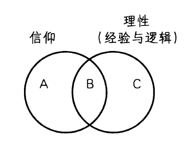

🟩第12章 中世纪综合的解体

在从1300年到1500年期间，中世纪思想的强大洪流应接不暇地改变流向，使之分裂为独立的小溪，各自寻找自己的新方向。这些哲学改变是我们在此要关心的；这些改变的发生与这个时代影响欧洲人各个领域生活的社会、经济和政治变革不无关系。到13世纪，教皇的精神威望和政治权力都衰落了。一系列玷污教会理想的追名逐利的教皇和枢机主教令许多信众反感。教会过多的财富和特权在某些人中唤起改革的愿望，而在另一些人中，则唤起从建制化的教会退回到个人虔诚的想法。英国的约翰·威克里夫和波西米亚的约翰·胡斯对教会的批评提供了宗教改革的最早预警。而且，从1378年到1415年，精神权威和政治忠诚的混乱导致了东西教会大分裂，那时有两个相互竞争的教皇，阿维尼翁的法国教皇和罗马的意大利教皇。

教会不仅要对付权威危机和精神幻灭，而且还要对付政治风向的转变。若干世纪以来，教会已经成为强大的国际组织，在世俗国家弱小的背景下繁荣昌盛。然而，教会内部的纷争有利于政治国家权力的崛起。当欧洲变得富有，世俗王国变得相对于罗马教廷更加自治。亚里士多德《政治学》的重新发现，推动了这样的观点，即国家是一个其正当性基于道德和理性的自然实体，而不是从上帝和教皇那里获得其权威的机构。然而，世俗王国也不乏混乱。英法百年战争激起了理性主义精神。而且，这个时代的特征是经济和社会动荡，并且农民起义在英国和法国不断爆发。然而，除了这些问题，到15世纪的后半期，出现了对王权的强调，以英国、法国和西班牙的强大君主制为顶点，它们在接下来几个世纪的西欧生活中扮演主要角色。这些国家并未断绝与教会的关系，但它们对它的依赖性大大降低了。这些因素加上其他因素威胁到了中世纪事物模式严谨的稳定性。被视为理所当然的等级、权威和统一是支配人们的精神、理智和政治生活达若干世纪的理念。然而，发展到这一时期，中世纪的这三根支柱开始崩塌。

当争议和变化出现在更大的社会中，许多有影响的14世纪哲学家开始偏离经院哲学的某些本质原则。这标志着经院哲学衰落的开始。虽然他们破坏了经院哲学体系的基础，但这些思想家这么做是出于真诚的基督教信仰的立场。他们确信，让信仰摆脱哲学的纠缠会更利于信仰。他们思想的驱动力是对上帝万能的极力强调。他们的宗教信条主张，上帝的行为是完全自由的，超出了理性分析和解释的能力。

预告一下本章的内容，对上帝绝对权力的强调，导致了很多极端的后果。首先是反理性主义。阿奎那相信，全能的上帝可以做任何逻辑上可能的事。然而，后来的批评者主张，可能的领域比阿奎那想象的要大。因此，理性无力决定世界实际是怎样的和必须是怎样的。为了限制理性，某些思想家采取了经验主义的形式，而另一些思想家则采取了神秘主义的形式。这个时期的第二个特征是唯名论，共相受到猜疑，而个体具体的实在则不受猜疑。第三，对自然神学的信心消退了。哲学家们论证说，理性不能像阿奎那认为的那样确定地证明上帝存在和人的灵魂不朽这样的教义。他们主张，这些教义只能基于启示与信仰认识和肯定。第四，意志主义成为伦理学的中心主题。这一立场主张，意志优先于理智。如果上帝的理智不限制他的意志，那么他在宣示什么是道德上的善方面是完全自由的。这意味着人类理性不能决定什么是道德上的善。因此，道德义务不是遵循理性指导的问题，而是服从上帝的至高命令。第五，这个世纪的观念提供了自然科学的新进路。如果没有理性形式指导上帝对世界的创造，那么这个世界是完全偶然的。形而上学思辨中利用的人类理性不能告诉我们世界是什么样的。只有观察能告诉我们上帝造就的是何种世界。正如艾蒂安·吉尔森（Etienne Gilson）对这个时代哲学的描述：

短暂的蜜月之后（人们几乎会说，在婚宴结束之前），神学和哲学认为，它们看到它们的婚姻是一个错误。在等待即将到来的离婚判决的同时，它们开始分割它们的动产，并警告他人不得干预。[1]

这场离婚的依据是由约翰·邓·司各脱、奥卡姆的威廉和神秘主义者埃克哈特大师提出的。

约翰·邓·司各脱

精细的苏格兰哲学家

关于约翰·邓·司各脱的生平，被确知的很少。他在约1266年出生于苏格兰。＊他年轻时加入了弗

＊司各脱的意思是“苏格兰人”。在司各脱的时代，不同于4个世纪前的约翰·司各脱·爱留根纳，只有苏格兰居民，而不是爱尔兰人，被称为苏格兰人。

朗西斯修会，并继续在牛津和巴黎学习，展现了心灵的敏锐和数学的天资。他在牛津、巴黎和科隆讲学写作度过了一生。在最后一个城市只工作了一年，他就在1308年刚刚四十出头时去世了。司各脱著作的真实性很有争议。某些著作显然是真的，然而其他一些曾经归于他的著作现在知道不是真的，还有一些手稿学者们意见不一。邓·司各脱的著作很难读，因为他不是一个清晰的作者。然而，大多数人同意，他的著作之所以难读，不仅由于他缺乏写作技巧，而且同样由于他理智上具有的挑战性和论证的精细。实际上，他的同时代人称他为“精细博士（Doctor Subtilis）”。他有很多追随者，称为“Dunsmen”或“dunces”。他们是文艺复兴时期的人文主义者中伤的首要对象，这些人文主义者视他们和他们的经院哲学为启蒙和理智进步的障碍。结果，“dunce”这个名称的意思变为傻瓜和无知的人。

知识论：限制理性

在这个简要概述中，我们将忽略司各脱认识论过度复杂的细节，只注意他与托马斯·阿奎那在理性与信仰问题上的不同。司各脱同意阿奎那的观点，认为信仰真理和理性真理之间不可能有冲突，并且他用哲学推理来捍卫他的理论。但邓·司各脱对理性范围的限制超过了阿奎那。他的数学研究让他有了一个关于真正的演绎证明的模式，比较起来，阿奎那在自然神学中的大量论证都有些不足。司各脱同意阿奎那的观点，认为三位一体不可能用理性证明，他还从理性讨论和证明中排除了这样的题目，如上帝的本性有多少个方面，以及神意和灵魂不朽。他主张在这些问题上只有信仰能给我们确定性。与托马斯主义立场相反，＊对于司各脱，哲学和神学是两种完全不同的探究类型。哲学是一个理论学科，而神学中寻求的知识，他说，“应该被描述为实践的”。[2]司各脱给理性的范围施加限制的努力，是解体信仰和理性的经院哲学综合的第一步。后来的思想家会在限制理性上更加激进。

形而上学：偏离经院哲学

共相与个性

在共相问题上，司各脱避开了所有的传统回答。与实在论者相反，他主张只有个体是实在的，但与唯名论者相反，他相信共相的确有某种客观实在性。虽然这好像让他和阿奎那一致，但是他们的差别在于，什么把一个种的一个个体与其他个体相区分。阿奎那认为，一定是苏格拉底和柏拉图各自的质料把他们区分开，因为他们都是相同人性形式的个例。然而，司各脱论证说，既然质料只是一束不确定的潜能，那么它不可能定义苏格拉底的具体个性。如此不确定的东西也不可能是知识的对象。如果托马斯主义的回答失败了，那么司各脱认为我们如何能有个体的知识呢？既然司各脱保留了我们只能认识形式这一亚里士多德主义假设，如果我们终究能认识具体的个体，那么一定有一个形式构成了每个个体事物。寓存于普遍本性（任何殊相的本质或什么）之中的是个体本性（它的这个）。表示这种个体化区分的拉丁术语是“haecceitas”。就像存在着人性形式，因而也存在苏格拉底独有的形式和柏拉图独有的形式，它们是每个人独有但完全可知的特征。离开“柏拉图性”（作为我们对柏拉图的独特形式的称呼）就不存在“人”的形式，但它可以在形式方面有区别。虽然这种把希腊的共相概念和对个体性的更大关注相结合的努力有些复杂，但邓·司各脱对个体性的强调开始了偏离中世纪思想家的世界观的第一步。

＊托马斯主义这个词来自“托马斯·阿奎那”这个名字。

自然神学

关于上帝存在的论证，司各脱似乎同意阿奎那的观点，认为这样的证明必须以我们关于世界的经验为基础。然而，他质疑大多数托马斯主义证明的绝对确实性。例如，他说，来自运动的论证表明，必定存在一个第一推动者。然而，任何来自物理世界的证明不能超出物理世界。因此，这个论证把我们限制在运动的世界而不能给我们一个作为其他一切事物之原因的必然的神圣是者。但司各脱在关于动力因与可能性、必然性论证的重构版本中的确发现有某种价值。最后，不同于阿奎那，他的确认为安瑟尔谟的本体论论证有价值，但认为它需要被增加一个陈述必然是者是可能的前提作为修正。然而，他认为对于这种是者的可能性我们能给予的唯一证据是某种“有说服力的考虑”。通过这么做，他把它修改为一个经验的和概然的论证。总之，邓·司各脱认为有神论论证比阿奎那假设的要弱，因为它们往往只是概然性论证而不是严格的演绎证明。

邓·司各脱与阿奎那在不朽问题上有类似的差别。托马斯·阿奎那相信，人类灵魂必然在肉体死后存在。司各脱有一次说，这只是一个概然性问题。毕竟，上帝可以这样创造灵魂，让它和肉体一起消亡。虽然假设灵魂不朽是合理的，但是这不是证明。唯有以信仰为基础，我们才能确定灵魂事实上被上帝赋予了不朽的本性。这个例子很好地展示了，在阿奎那认为应该由信仰和理性共享的大部分领域，后期中世纪思想家倾向于赋予信仰至高的地位。

道德哲学与意志的优先性

在中世纪哲学的心理学和伦理学领域中，一个重要的争端是意志和理智的关系。＊对于阿奎那，理智是灵魂更高级、更高贵和更有价值的官能。然而，对邓·司各脱，意志高于理智，这个主张使他被归于意志主义和奥古斯丁的后期思想。司各脱的论证是，首先，知识只是意志的工具。理智为意志提供信息和选项，但是是意志在选项之间选择。第二，在我们可以选择我们愿意思考什么这个意义上，意志可以推动理智。第三，意志是完全自由的，不能被任何事物所决定，包括理智。托马斯·阿奎那同意希腊人的观点，我们必然意欲我们认为最善的东西。然而，司各脱断言，意志不被善的知识所决定，只是选择善，如果它自由地决定这么做的话。尽管理智被已知的对象所决定，但意志可以接受和拒绝它面对的东西。因此，“在意志中决定意欲的全部原因是意志”。[3]阿奎那的理智主义主张，我们在上帝的沉思中找到福祉，司各脱的意志主义让他说，我们在上帝的爱中找到福祉，爱是让我们与上帝统一的意志行为。因此，司各脱不同意阿奎那那种道德以追求幸福的自然倾向为基础的观点。相反，道德要求妨碍我们自己利益和幸福的正义行为。道德义务只依赖上帝的命令，而独立于个人幸福的考虑。阿奎那认为，我们可以通过研究人类本性来认识道德法则，但邓·司各脱认为，无法通过自然手段学到伦理学真理。

这种意志主义也适用于上帝。他的行为不是由

＊见第10章对这个问题的初次讨论。

他的理性决定的。邓·司各脱认为，如果上帝是完全自由和全能的，那么事情一定是这样的。因而，我们的理性不能知道他的目的或从先天原则演绎他的行为。既然根据上帝的自由，万物都是偶然的，那么事物没有理性必然性，宇宙也可以不同于它实际的样子。如果上帝的选择是逻辑必然的，那么我们可以像欧几里得几何体系一样推出世界的细节。既然我们做不到这一点，那么很清楚，上帝创造世界是自由的，由此，受造物的特征都是偶然的。

爱上帝的命令是与善本身相关的唯一道德法则。其他行动是善的只是因为它们是上帝所命令的，而不是因为它们达到的目的。然而，司各脱对此进行了限制，说十诫中的第一组命令是理性必然的道德真理。这些命令说，除了唯一的真神上帝，你不应有其他的神，你不应制作偶像，你不应妄称你主上帝之名，你应谨记安息日并在这天保持虔诚。司各脱论证说，这些命令是从上帝对自身的爱中推出，如果他不这样命令将是自相矛盾的。因此，如果有任何自然法，它会在这里发现。然而，其他神圣命令是上帝至高意志的产物，因而它们不是理性必然的。它们对我们的良知提出要求，只在于它们是上帝的命令。可以推知，上帝可以同样毫无问题地宣布，谋杀、通奸和偷盗不是错误的。

概言之，虽然约翰·邓·司各脱在很多问题上不同于13世纪的思想家，但在很多方面他延续着他们的思想。他是一个通向后期神学家（如奥卡姆的威廉）的过渡人物，后期神学家们接受了在他那里只是趋势的东西，并把它们推到极端。

> 想一想
> 
> 12.1 你同意约翰·邓·司各脱意志统治理智的观点吗？这个观点蕴含着什么？

奥卡姆的威廉

奥卡姆的论辩人生

奥卡姆的威廉（William of Ockham）在1280年到1290年的某个时候出生于伦敦附近的奥卡姆村。他在早年进入弗朗西斯修会并在牛津学习神学。虽然他完成了他的课程并开始讲学和写作，但他从未获得他的硕士学位，因为有人怀疑他接受了危险的异端学说。最终结果是，1324年，他被召到法国阿维尼翁的教廷，并被迫滞留在那里四年以等待一个神学家委员会调查对他的异端指控。在等待的这几年里，他不停地进行神学、哲学和物理学的写作。1327年，当他还在阿维尼翁时，他逐渐卷入了一场关于应该如何在字面上解释圣弗朗西斯的贫穷誓言的争论。奥卡姆站在这位弗朗西斯修会领袖一方，谴责物质主义和教廷的奢侈无度，试图让教会回归弗朗西斯的过简朴生活的理想。1328年，教皇约翰二十二世要发布对他们立场的官方谴责这件事变得日益明朗。因而，奥卡姆和他的会长逃走了，并寻求巴伐利亚皇帝路易的庇护。相传，在奥卡姆到达时，他对这位皇帝说：“你用剑保护我，而我将用笔保护你。”奥卡姆和其他卷入叛逃的人被教皇革除教籍。之后，奥卡姆居住在慕尼黑继续写作。在他生命中的这个时间点上，他走入更极端的政治立场，并且写小册子反对教会对世俗权力的要求。他的著作发展了一种指向政治世俗化方向的理论。路易1347年去世后，奥卡姆似乎曾寻求和教皇克莱门特六世和解，但不清楚这是否实现了。关于他死的实际情况不确定，据信奥卡姆死于1349年黑死病肆虐北欧期间。

奥卡姆的两个任务

奥卡姆的哲学受两个基本主题指引。第一个是非常严格的上帝全能观。他把这看作必然贯穿我们关于世界的一切思考中的最高原则。按他的表达，“我相信上帝圣父万能；我对此这样理解，凡是不包含明显矛盾的事情都归于神的权能”。[4]表面上，这应该像是非常虔诚地肯定信仰。实际上，对于奥卡姆正是如此。然而，如我们将看到的，由这个核心信念他得出了认识论、形而上学和伦理学领域的某些非常激进的结论。大体上，他论证说，如果上帝是万能的，那么他对世界的创造就不受任何理性必然性的指导。世界中的一切事物都是偶然的（contingent）。＊既然事情是这样，那么只有经验能告诉我们世界中事物的存在和它们的属性。

奥卡姆的第二个指导性主题是严格的经验主义，谴责一切通过诉诸不必要的假设或思辨解释而超越经验的倾向。这是一个被后来的作者称为“奥

＊如果设想一个东西存在和不存在都没有逻辑矛盾，那么它的存在就是偶然的。例如，袋鼠存在于我们的世界中，但是我们可以想象没有它们的世界。因此，袋鼠是偶然的是者。

卡姆剃刀（Ockham＇s razor）”的方法论原则，而现代科学家们现在称之为“节俭原则”或“经济原则”。奥卡姆表达它的一种方式是说，“能用较少原则解释的东西就不必用更多的原则”。[5]这个原则像剃刀一样起作用，因为它“剃掉”我们解释中一切不必要的实体。奥卡姆在试图表明可以不诉诸共相领域就解释实在时，特别运用了这个原则。虽然这个原则不是他创始的（它可以在亚里士多德那里找到），但是它伴随着奥卡姆非常严格的关于什么才对解释世界具有真正必要性的观点。这个原则被证明在用经济得多的近代科学代替亚里士多德科学方面非常有影响。

知识论：否定共相

在经验中认识事物

奥卡姆用一个非常强的经验陈述开始他的认识论。他说，一切关于世界的知识基于直观知识。＊＊按他的表达，“没有任何东西可以自身被自然地知道，除非它被直观地知道”。[6]直观知识包括了我们对外部事物的感知以及我们对我们自己内心状态的直接意识，如意志活动、喜悦和悲伤等。他有时称直观知识为“经验知识”。既然在正常情况下，直观知识直接和它的对象相关，那么它可以告诉我们什么存在或不存在。

任何不与对象的直接经验相联系的知识都是知识的派生形式，称为抽象知识。这种知识是我们原初的经验在心中留下的褪色的残留物。经验对象作

＊＊“直观”在这里不表示某种内在感觉或洞见，而是指一切对心灵直接明显的东西。

为概念或精神符号保留在心中。概念不能像直观知识那样提供何物存在的证据，因为曾经产生它们的对象不再存在。然而，它们的确作为理解的载体起作用。抽象知识包括特殊事物减去存在的具体细节后的影像和记忆。抽象知识还包括我们通常称为抽象观念的东西或指称个体的整个种类的观念，如“动物”“树”和“书”。这些观念似乎是普遍的，因为它们是模糊和不清楚的表象，掩盖了造成这些观念的许多特殊个体的细节。然而，它们不是真的共相，因为它们缺乏任何它们自身的形而上学地位。

奥卡姆的唯名论

奥卡姆认识论最重要的部分围绕着他的符号理论。一个符号是某种表示或代表另外一个东西的东西。有两种符号：自然的和约定的。当对象显示出其原因的时候，自然符号就出现了。例如，烟是火的符号。然而，另一种自然符号是由知觉产生的，发生在特殊对象在我们心中造成影像或精神图像的时候。例如，当我看到红色玫瑰花，它就造成了一个红色玫瑰的影像保留在我心中。这种符号有某种普遍性是因为该影像对所有有相似经验的人都相同。精神影像或概念是其原因的自然符号，并且能够表示玫瑰。相反，约定符号则是每个文化发明语词来指称这些精神影像时产生的。

某些词项是特殊个体的符号，例如“柏拉图”。另一些词项是许多个体的符号，例如“人”。阿奎那认为，苏格拉底和柏拉图分享的共同人性特征是世界的实在特征，而奥卡姆坚持，普遍陈述其实是我们关于个体做出的特殊陈述的概括。比如说，“所有狗都有毛皮”，是一种说“莱西这条狗有皮毛，并且斯波特这条狗有皮毛，并且罗弗这条狗有皮毛，等等”的缩写形式。并没有给个别的狗增加额外的实在，即所有这些狗分有的“有皮毛性”这个相。相反，“有皮毛”这个语词符号表示的是许多对属性相似的生物的经验所产生的精神影像。这些精神影像和附着于它们的词项是我们解释人类思维所需要的一切。因此，我们可以不需要一切共相理论这样的多余赘物。事物自身之中没有共相，也没有任何共相存在于我们心中。相反，只存在指称诸个体与个体群组和起思想工具作用的精神影像，我们的思考是关于殊相的，但我们是用精神符号思想。

归根结底，奥卡姆把共相的形而上学问题还原为仅仅是这样一个逻辑问题：我们如何能在命题中使用一般词项和专名指称个体？奥卡姆的唯名论应该与洛色林的极端唯名论和他的学派相区分。他们只承认人类思想中的约定符号，而奥卡姆承认概念作为自然符号起作用。因此，有人喜欢称他为“概念论者”或“词项论者”。

既然共相并不真的存在，上帝也不能设想它们。上帝可以有关于他打算创造的东西的观念，但这总是特殊个体的观念。如果我们说上帝创造了人类这个物种，上帝并不需要在心中有“人性”这个相。而是在他心中有众多不同的个人，所有这些人相互都或多或少相似。

> 想一想
> 
> 12.2 为什么“奥卡姆剃刀”是一种“剃除”柏拉图主义中不必要的东西的努力？柏拉图会怎样回应奥卡姆的唯名论？

形而上学与理性的限度

个体的首要性

奥卡姆的实在观的关键是，他确信具体个体是唯一真实的和真正的实在，是科学研究的唯一对象。世界是具有其实际属性的个体的世界，因为上帝选择把它们创造成这样。如果有永恒本质，这些本质将限制上帝随心所欲地自由创造的能力。上帝创造世界这个事实并没有给我们何物存在和它像什么样子的知识。同样，考察世界也不给我们上帝存在的理性知识。如果世界中的每一事物都是偶然的，那么就没有任何必然联系允许我们从一个事物推出另一事物的本性或存在。

因果性

奥卡姆的经验主义和他强调世界的一切特征都是偶然的，导致他采取关于因果本性的非常激进的立场。他相信，我们可以知道每个事件都有这样那样的原因。然而，他认识到，经验只能给我们关于一个特殊类型的原因和一个特殊类型的结果之间关系的概然判断。通常，当我们说“X引起Y”，我们在说，每当X发生，Y都随之而来，并且X中的某种能力使得Y必然发生。然而，奥卡姆论证说，我们真正经验的一切不过是经验中的规则，使得X在场时Y就在场，X缺席时Y就缺席。我们从来没有经验到假定的X中的因果能力，和所谓它的结果的必然性。作为一个事实问题，X和Y之间也许存在着因果关系，但不可能被确定地知道。例如，我们观察到火在场时（X），事物变热（Y）。然而，离开这个次序，单单是火的知识不会告诉我们它的结果。如果上帝愿意，他可以安排火在场和事物变冷相联系。只有经验能告诉我们从一个给定的原因可以期待什么，而这一知识总是概然的。如果X和Y之间没有逻辑上的必然联系，上帝可以有时在之前没有X的情况下产生Y，就像这是正常情况一样。因此，奥卡姆的经验主义为他相信奇迹的可能性提供了支持。正常情况下，上帝保持自然的齐一性，而科学研究的正是这种正常的常规次序。但是，如果每一事物都是偶然的，假设上帝可以改变事件的正常次序就没有矛盾。创造的偶然性使人怀疑我们在我们的理论中“捕捉”实在结构的能力——这个假设是之前大部分西方哲学传统的核心。

形而上学的衰落

奥卡姆立场的后果是形而上学的重要性严重减退。逻辑只是告诉我们，我们的精神符号和命题之间的关系。它不能给我们关于世界的事实信息，因为这只能由经验提供。奥卡姆剃刀宣布，我们不应该试图用关于世界背后或之上的东西的思辨来解释某种世界之中的东西。他取消了任何借助最终因的解释，说它们只是比喻。应用他的证据标准，他表明，许多亚里士多德的物理学和天文学原则不是必然的和自明的，并且暗示任何给定现象都可以用许多不同的思辨理论来解释。而且，他关于因果性的观点对近代科学的兴起有巨大影响。不要试图发现事物之间的逻辑关系（因为世界中没有逻辑必然性），科学家应该代之以忠实的观察，只罗列经验事实和常规次序。这一进路对科学的后果有好有坏。它有助于矫正中世纪的亚里士多德主义倾向，即推论事实必定是什么，而不是事实实际是什么。在新进路下，做出了用旧方法会忽略的经验发现。然而，只是罗列观察不会给我们近代物理学的强大规律和理论，因为（与奥卡姆相反）科学不能没有思辨和理性化。我们现在知道，我们所看到的东西（仪器上的读数和中等尺寸的对象）可以只凭借我们不能直接观察的东西（亚原子微粒）来理解。科学家不能避免关于可观察事实背后或之上的东西的理论建构。而且，在他们以数学的方式理解世界的努力中，近代科学家假设（与奥卡姆相反）世界中存在逻辑必然的关系。

拒斥自然神学

奥卡姆到目前为止所说的内容中没有自然神学的立足之地。既然所有关于何物存在的知识都产生于经验（直观知识），并且既然在此生中我们没有上帝的直接经验，我们就不能证明他的存在和属性。关于这些事情只有信仰和启示能告诉我们。而且，他关于因果性的观点瓦解了阿奎那的论证。如果我们只知道结果，我们可以知道它有某个原因，但是，离开过去关于类似结果的原因的经验，我们不能就未知原因的本性进行推理。因此，我们不能从我们对这个世界的知识推出它的原因的本性。为说明这一点，奥卡姆批判地考察了传统的上帝存在论证。他承认，有某种价值的唯一论证是阿奎那的来自作用因的论证。虽然他相信可以证明世界要求某种原因来维持，但他不相信理性能证明只有一个这样的原因或这个原因具有《圣经》中的上帝的属性。当我们依靠自然理性时，就形而上学争端而言，概然性已经代替了阿奎那的确定性。

奥卡姆剃刀也影响了除上帝存在之外的其他自然神学争端。尽管从柏拉图到阿奎那的哲学家都认为，他们能证明人类有精神本性并且是不朽的，但奥卡姆说，我们只有以启示为基础才能知道这一点。

我们的一切经验都是我们的内在活动和状态，如思考、意欲、喜悦和悲伤。我们没有这些心理活动背后的精神实体的经验。因此，我们不能证明存在一个灵魂，更不用说证明它不朽。

道德哲学：激进的意志主义

和邓·司各脱一样，奥卡姆的道德哲学围绕着意志自由的观念展开，不论是人类意志还是神的意志。正是自由意志使我们成为道德行动者。如果一个行动是由自然原因所决定，人就没有责任并且既不能被称赞也不能被指责。而且，正是意志使得行动在道德上是善的或恶的。一个其他方面都好但出自邪恶意图的行为不是道德上善的行为。

奥卡姆关于上帝全能的强观点使他的道德理论极为激进。如果上帝是万能的，那么整个受造的秩序是偶然的，是神的自由选择的产物。然而，奥卡姆把道德法则包括在世界的偶然秩序中。既然在神的心灵中没有人类本性的普遍本质，也就没有从这些本质得出的不可变更的自然法则。上帝不仅可以以他所选择的任何方式创造人类，而且在创造之后他还可以为他们创造他所选择的任何道德法则。由此，奥卡姆把司各脱道德哲学中的倾向推到了它们的极致。对于奥卡姆，上帝不受任何法则和原则的约束。他自由地思维、意欲和行动，因此，任何不矛盾的事物都可能。按奥卡姆自己的表达：

憎恨上帝、偷盗、通奸和与这些行为类似的行为，根据一般法则，会附着有邪恶的性质，只要它们是在上帝命令做相反行为的情况下做的。但就这些行为自身的性质而言，它们可以由上帝实施而没有附着任何邪恶的情况；甚至一个尘世的朝圣者实

施它们是有功德的，只要它们从属神圣的规则，就像现在这些行为的反面事实上从属神圣命令一样。[7]

因此，现在认为有罪的行为，如谋杀和通奸，本可能在伦理学上是善的，并且实施它们是有功的，只要上帝愿意它们如此。然而，作为一个偶然事实问题，在目前的道德秩序中，这些行为是错误的，这仅仅因为这是上帝的决定。由这些例子可以推出，显然不存在任何我们能通过诉诸自然法则推出一个行动的对与错的方式。我们完全依赖关于伦理结论的启示，因为唯有以这种方式，我们才知道上帝意欲什么。

> 想一想
> 
> 12.3 偷盗、通奸或谋杀没有任何内在错误，它们是错的仅仅因为上帝选择禁止它们，你同意奥卡姆的这一观点吗？如果上帝选择命令做它们，这些行为本可能是道德上有德性的吗？对于我们关于道德的概念，这种观点蕴含着什么？如果以通奸为例，关于它有某种内在的东西是错误的，这是否在上帝能命令什么、禁止什么方面限制了上帝的至高无上？一个阿奎那的伦理学自然法理论的倡导者会如何回应奥卡姆的观点？

对奥卡姆的总结与评价

由奥卡姆开始的思想导致了实在论和唯名论之间的激烈争论。1339年，巴黎大学禁止使用奥卡姆的书并在1340年正式拒斥唯名论。一个多世纪之后，1473年，这所大学的所有教师发誓教授实在论。然而，其他大学在这个时期赞同更多的思想自由并且允许唯名论，比如，1348年的布拉格大学，1365年的维也纳大学，1386年的海德堡大学，1388年的科隆大学。

奥卡姆关于各种实在与知识的范围之间关系的观点，既使得经院哲学对信仰与理性综合的解体，又开启了科学自治的大门。托马斯·阿奎那和奥卡姆的威廉的不同可以用图12-1的圆来说明。对于阿奎那，信仰和理性的范围是相互纠缠的。信仰的命题通过《圣经》的启示和教会的权威而知。理性包括所有能从我们的自然认知能力通过经验和逻辑结合获得的信息。虽然某些真理可以只以信仰和启示知道（A），但某些关于超自然物的真理（B）也归属哲学的领域，可由理性证明。同样地，关于自然界的真理（C）能够通过关于经验的推理达到。

_图12-1 托马斯·阿奎那模式_

尽管阿奎那宣布了启示和自然知识之间的结合，奥卡姆却开启了它们的分离进程（见图12-2）。对于奥卡姆，神学真理与我们可以通过经验和逻辑知道的东西是完全分离的。超自然物和自然物在不同领域活动，涉及不同的关系。借助启示，信仰（A）可以给我们关于上帝和精神实在的知识。然而，它不能给我们关于世界的知识，因为，假定上帝是自由的，那么神学不能告诉我们世界实际是什么样子或必定是什么样子。是经验（B）告诉我们受造的世界像什么样。但是从我们关于世界的知识，我们不能反推上帝或他的属性。因为结果自身不能告诉我们

_图12-2 奥卡姆的威廉模式_

它的原因。逻辑（C）被分隔在它自身的领域中，既不能告诉我们神圣的事物是怎样的，也不能告诉我们世界是怎样的。逻辑只能告诉我们命题之间的关系。既然理性不能给我们关于实在（神圣的或自然的）的任何实质性知识，那么就几乎没有给哲学留下任何使命。奥卡姆的哲学结论试图确立不同知识领域的恰当边界，但一旦这些边界被澄清了，哲学只能对我们的知识做出极少的（如果有的话）贡献。

通过这样的知识划界，奥卡姆的目标是保护信仰不受哲学和科学的侵犯。信仰处于一个它自己的严格闭合的领域内。任何哲学家的论证或科学中的新发现都既不能支持也不能反对基督徒所相信的东西。然而，在将神学置于理性所及范围之外时，奥卡姆无意中解放了哲学和科学，让它们独立地追求自己关心的事，而不需要让它们的结果与神学传统保持一致。既然理性被禁止卷入信仰的问题，它现在可以专注于自然现象。在奥卡姆的威廉那里，哲学不再是神学的婢女，而承担了一个独立创业者的新角色。虽然许多人指控他是一个怀疑论者，攻击了宗教的理智基础，但奥卡姆似乎有一个对基督教信仰的坚定的个人承诺。然而，尽管他的意图彻头彻尾是虔诚的，奥卡姆却实际上鼓励了哲学和科学的世俗化。他对信仰和启示的强调也影响了宗教改革，因为新教神学寻求重新发现《圣经》的简单教义，摆脱神学传统的累赘。一位历史学家说，“就破坏能力而言”，奥卡姆在这个时代无可匹敌。[8]

科学方法的变革

奥卡姆的威廉的哲学在科学家如何理解他们的工作方面引起了许多变化。首先，他的经验主义强调，经验是理解世界的钥匙。其次，他的方法论“剃刀”鼓励科学家关注事实而抛弃一切形而上学思辨。虽然这对于中世纪科学家把他们的观察强行塞入亚里士多德假设的范围内的倾向，是一个有益的矫正，但这种对思辨的恐惧最终需要被缓和，来为科学中理论的角色留出空间。第三，奥卡姆对上帝自由和世界偶然的强调实际上有利于科学，尽管他的立场完全是被神学关怀所驱动的。如果我们不能就世界必然一定是怎样进行推理，我们就只能观察和了解上帝碰巧把它创造成什么样子。通过让科学家摆脱让自己的结论与神学和哲学传统一致的负担，奥卡姆的想法在数学、天文学和物理学中引起了一种新的兴趣。

一个例子就足以表明科学革命在14世纪是如何开始发生的。中世纪科学家把大地视为一切陆地对象理所当然的停留地点（追随亚里士多德）。因此，他们认为，“欲求”其自然位置是一切物体的本质。这个例子表明了中世纪科学家借助最终因或物体寻求的目的来解释世界的倾向。他们知道物体在下落时加速，但他们在理论上把这解释为物体离它的目标更近时，它的欲望就增强，从而加快了回归之旅。约翰·布里丹（John Buridan，约1320-1382），奥卡姆的一个学生，在实验的基础上拒斥这个回答。如果速度只是离地球接近程度的函数，那么一块从塔上坠落的石头在它达到一个离地0.3米的位置时，应该与从1.2米高度坠落的一块相似的石头在那个位置上的速度相同。但是，显然一块起点更高的石头将会运动得更快。从塔上坠落的石头可以杀死一个旁观者，但从一两米高坠下的相同石头却不能。因而，布里丹提出了一种对加速度物理学的新解释。运用奥卡姆剃刀，他给出了这一现象的一个更简单的解释，没有诉诸最终因或自然目的。

> 想一想
> 
> 12.4 奥卡姆的因果观如何对宗教世界观有帮助？例如，它如何支持关于上帝至高无上和奇迹的信念？它如何有助于近代科学的兴起？他的因果观有什么问题吗？

神秘主义

奥卡姆的唯名论和极端经验主义有助于支持发展中的神秘主义运动。如果逻辑不能告诉我们关于上帝的事情，我们只能知道我们直接经验的东西，那么我们应该努力体验上帝，取代从概念上理解上帝。宗教神秘主义强调，只能通过一种特殊的宗教体验来认识上帝。这种神秘主义主张，理性和语言太有限、太抽象了，不能充分理解无限和超越的上帝。因而，神秘主义者寻求提升我们通常的认知模式，在一种压倒性的宗教体验中遭遇上帝。这种经验的特征是对自我与神的完全合一的直接感受和一种宁静、极乐的感觉。神秘主义者主张，他们可以直接遭遇的知识的对象（上帝），是奥卡姆所谓“直观知识”的宗教版本。神秘主义是一个贯穿中世纪大部分时期的持续运动。然而，当到了13世纪末，它变得非常盛行。通过降低理性和命题性知识的重要性，它变成瓦解中世纪理性主义的另一股力量。

这个时代最伟大的神秘主义者是埃克哈特大师（Meister Eckhart，1260-1327），一位德国多米尼克修会的修士。即使他非常有影响，他的著作还是在他死后两年的1329年遭到谴责。虽然他在托马斯主义的框架里展开工作，但他的形而上学探索总是指向为迈向与神合一的灵魂之旅绘制航图这一目标。受新柏拉图主义传统的影响，埃克哈特把上帝看作太一，一个绝对超越的统一体。＊既然我们用定义和概念来限定和把握我们试图理解的东西，那么对于领会上帝来说，它们就是不充分的工具。理性的陷阱不能捕获上帝。这一信念的后果可能是埃克哈特被某

＊注意这些术语与第9章中伪狄奥尼索斯和约翰·司各脱·爱留根纳术语的相似性。

些人贴上异端标签的原因。他经常提出一个论点并为之辩护，旋即转向为它的相反论点辩护。虽然这给人他自相矛盾的印象，但他可能在表明，不可能把神圣本性纳入我们有限的理智范畴中。用一个类比，假设我们只有两个颜色词，红与蓝。我们会怎么描述一个紫色的对象？我们可能先说它是红色的，但这不很适当，所有我们又把它描述为蓝色的。但这也不精确。就像这些有限的颜色范畴不适合描述紫色，埃克哈特认为，我们的神学范畴不足以描述上帝。

当教会当局孤立地看埃克哈特的某些大胆而夸张的陈述时，他们认为他在教授异端。例如，他追随新柏拉图主义者，说上帝超越是者与存在，因为它是是者的源泉。而在另一些段落，他说上帝是存在本身。而且，他主张上帝并非像一个其产品外在于他自身的工匠，这蕴含着受造物作为上帝的一部分而存在。当他的批评者狭隘地专注于这些段落，脱离了他的其他陈述时，他们假设他是泛神论的异端就不足为怪了。然而，在其他段落中，他说，上帝和他的创造物是不同的，上帝在它们之上，这让这一图景变得平衡。

和其他神秘主义者一样，埃克哈特的神学目标不是去增加关于上帝的观念，而是引导灵魂与上帝结合。在理智层次之下，在灵魂最深处，是人类本质，包含着神圣形象的“火花”。这是我们的一个部分，它有能力在神秘的结合中与上帝连成一体。“上帝与我，我们是一体。”埃克哈特说。[9]正如火将木头变成它自己，“所以我们也变成上帝”。[10]为达到这种统一，我们必须否定自己的个别性。我们必须清空我们灵魂中的一切东西，直到我们一无所知，无欲无求，并一无所有。正如如果你紧握着的手，抓着另外的东西，我就无法给你任何东西，所以在上帝能让他自己充满人的灵魂之前，灵魂必须是敞开和空灵的，甚至清除了对上帝和永恒的渴望。

尽管他呼吁超越理性的限制，埃克哈特大师总是维持着对形而上学思辨的兴趣。然而，他的追随者倾向于抛下这种关注，强调他思想中更加宗教性和体验性的方面。他的宗教神秘主义影响持续了几个世纪。新教的伟大宗教改革者马丁·路德深受他的著作的启发，因而把其中之一以“德意志神学”为标题出版。

中世纪哲学的衰落

我们在第10章对中世纪盛期的讨论，以天主教大教堂的高耸结构和经院哲学的理智体系之间的比较作为开头。这个时期的建筑可以再一次用来象征哲学的发展。法国的博韦大教堂始建于1247年，大约是阿奎那开始他的神学学习的时候。它有一个高达近50米的屋顶，最大限度地实现了建筑师让他们的建筑插入云霄的梦想。然而，阿奎那死后10年

（1284年），博韦大教堂建筑的主结构坍塌了，没能承受施加给它们的重量。从那时起，人们放弃了推动建筑超越之前的一切限度的宏伟努力。建筑师变得更加保守，他们的大教堂的大小也变得更加节制，因为他们认识到人类用凡间结构直入天空的能力的限度。

与之类似，14世纪有影响的思想家渐渐确信了人类理性的有限，他们的哲学相应地在抱负上变得谦逊。唯名论、意志主义、信仰和理性的分离、奥卡姆的经验主义和神秘主义的兴起都促进了阿奎那这样的思想家辛勤建造的“理性大教堂”的坍塌。从奥卡姆坚持神学以启示而不是哲学为基础，到把启示还原为就是《圣经》的词句只有一小步。这是约翰·威克里夫和后来的宗教改革者迈出的一步。事实上，马丁·路德，16世纪伟大的宗教改革家，深受奥卡姆著作的影响。那些奥卡姆的追随者相信，他用“新道路（viamoderna）”代替了旧道路。然而，根据奥卡姆派的热情就假设经院哲学家的成就被扔进了历史的垃圾堆是不正确的。一种更新近的托马斯主义作为一种哲学运动继续存在于20世纪。即使是17世纪的哲学家如此决绝地想要脱离中世纪，他们仍然依赖他们所轻视的这个时代的术语和概念。例如，笛卡尔、斯宾诺莎、莱布尼茨和洛克，他们对上帝存在的论证以及关于实体和因果性的讨论都得益于他们的中世纪先辈。[11]

对于我们，5个世纪的近代思想的产物，很多中世纪思想显得枯燥、古旧、过时和抽象。因此，在本章结束时，对中世纪观点是令人满意的以至存在了长达千年有所感觉是有帮助的。哲学史家W.T.琼斯表达得很好：

或许这种世界观的首要元素是圣礼视角。使得奥古斯丁、阿奎那和其他中世纪思想家在根本上如此相似的就是这个他们共有的视角。将中世纪心灵与现代心灵如此截然区分的东西是，现代人很大程度上失去了这个视角，分享了希腊人的以世俗为主的观点。说中世纪人把这个世界视为一场圣礼的意思是，首先，他们把这个世界设想为不过是不可见实在的可见符号，是一个彻底充满着活力、目的和对其造物主的爱的世界，他栖居于其中就像他栖居于圣坛上的酒和面包中。第二，这意味着，中世纪人把这个世界看作是自愿而感激地献给全善和全真的赐予者的祭品。因此，尽管对于我们（和对于希腊人），世界总的来说意味着它正是它实际所是的东西，但对中世纪的人，它意味着某种超越它的和无比优越于它的东西。尽管对于我们（和对于希腊人），尘世的生命就是它自身的目的，但对于中世纪的人，生命的真正目的是超越这个世界。

很难否认这种圣礼观点是进步的障碍——关于如何控制环境并利用它为此世的目的服务的知识的进步。对于许多人来说，同样明显的是，这个观点已经消失了，人们已经让他们自己卸掉了某些曾经是负累的东西——无知、迷信和不宽容。但不那么明显的是，现代世界也已经失去了某种有价值的东西。如果中世纪的圣礼视角展现在现代医生所说的精神病理学的某些症状中，它也展现在平静与自信中，某种程度的目的、意义和满足中——现代的医生在他的同时代人那里徒劳地寻找的品质。[12]

> 当代联系12：中世纪综合的解体
> 
> “奥卡姆剃刀”将成为近代科学最重要的原则之一。当哥白尼证明，把地球从宇宙中心的位置上拉下来并设想它绕太阳运行将大大简化天文学时，他会假设这个原则。当艾萨克·牛顿表明，所有天上和地下的物理现象可以纳入几个简单法则时，他遵循着这个原则。
> 
> 虽然科学和宗教之间经常显得有冲突，但奥卡姆证明二者可以互相支持。例如，奥卡姆的神学提供了追求近代科学的动机。以他的神学为基础，他主张，世界的秩序不能基于理性来预测，所以我们必须通过观察来了解上帝如何创造世界。这一神学信念提供了通过观察和实验来探索世界的动机，为近代科学奠定了基础。
> 
> 而且，奥卡姆把信仰的范围和人类知识的其他领域相分离是一种保护信仰的虔诚努力。然而，它无意中造成了允许独立于神学来从事科学和哲学的效果。这个“分离而平等”模式将盛行于大部分近代思想中。
> 
> 不论好坏，奥卡姆帮助解开了中世纪思想紧密交织的结构，对近代思想的诞生有开创性影响。重读本章结尾处引用的W.T.琼斯的话，并自己判定在这一转变中得到了什么，失去了什么。
> 
> 全面考虑之后，你是更偏爱阿奎那的哲学观点还是奥卡姆的观点和他的遗产？

理解题

1．从1300年到1500年期间发生了哪些变化，造成了或标志着经院哲学的衰落？

2．列出邓·司各脱哲学区别于阿奎那哲学的一些方面。

3．当奥卡姆说世界中的一切事物都是偶然的，他的意思是什么？对于基于理性的形而上学，这蕴含着什么？

4．什么是“奥卡姆剃刀”？

5．奥卡姆的观点以什么方式瓦解了阿奎那的自然神学？

6．奥卡姆的意志主义对伦理学意味着什么？它与阿奎那的进路有什么不同？

7．阿奎那和奥卡姆在信仰与理性之间的关系上有怎样的差异？

8．阿奎那和埃克哈特大师的观点有何不同？

思考题

1．接受或拒绝奥卡姆的意志主义有些什么理由？

2．奥卡姆的哲学主要由神学关切驱动。尽管如此，请简要提出他的哲学对近代科学的兴起有贡献的一些理由。

3．阿奎那和奥卡姆关于信仰和理性关系的观点，哪一个与他们的基督教神学最一致？

注释

[1]引自大卫·诺尔斯（David Knowles），《中世纪思想的演进》（The Evolution of Medieval Thought， Baltimore： Helicon Press，1962），第300页。

[2]引自戈登·莱夫（Gordon Leff），《中世纪思想：圣奥古斯丁到奥卡姆》（Medieval Thought：St.Augustine to Ockham， Chicago： Quadrangle Books，1959），第164页。3引自莱夫，《中世纪思想》，第270页。

[4]论争6，问题6，载于《中世纪哲学家选集》．第2卷，理查德·麦基翁编（New York：Scribner＇s，1958），第373页。

[5]引自E．A．穆迪（E．A．Moody），《奥卡姆的威廉的逻辑》（The Logic of William of Ockham， New York： Russell ＆ Russell，1965），第49页。

[6]引自弗雷德里克·科普尔斯顿，《哲学史》，第3卷，第1部分（Garden City，New York：Doubleday Image， 1963），第74页。

[7]奥卡姆的威廉，引自J．M．伊德扎克（J．M．Idziak）编《神圣命令道德》（Divine Command Morality，New York:Edwin Mellon Press,1979)。

[8]莱夫，《中世纪思想》，第279页。

[9]《德国传道集之讲道6》，埃德蒙·科莱奇（EdmundColledge）译，载于《埃克哈特大师：布道、评论、论文和答辩精要（西方灵修神学经典）》［Meister Eckhart：The Essential Sermons,Commentaries,Treatises,and Defense （The Classics of Western Spirituality）］，埃德蒙·科莱奇和伯纳德·麦金（Bernard McGinn）编（New York： Paulist Press，1981），第188页。

[10]同上，第189页。

[11]这些观点由朱利叶斯·R.温伯格（Julius R.Weinberg）提出，引自《中世纪哲学简史》（A Short History ofMedieval Philosophy,Princeton: Princeton University Press，1967），第291页。

[12] W．T．琼斯（W．T．Jones），《西方哲学史，卷2：中世纪心灵》（A History of Western Philosophy， Vol． 2： The Medieval Mind），第二版（New York： Harcourt， Brace ＆World，1969），正文前第19页。

