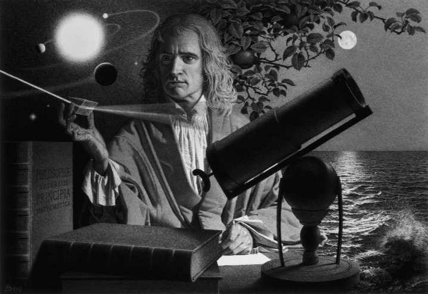

🟩第18章 文化背景：启蒙与牛顿时代

18世纪的历史学家很容易就找到了这个时代的恰当称呼。这个时代的思想家自己决定了如何命名他们自己的时代。18世纪的作家称他们自己的时代是启蒙时代。他们认为，他们的时代是特别的，因为理性已经实现了对它自己的承诺。它业已指明科学、哲学、宗教、政治和艺术的进步之路。纯粹而灿烂的理性之光将一劳永逸地驱散黑暗，人类之前一直在这黑暗中劳作和生活。这黑暗是什么？它是激情、偏见、权威和教条。通过自诩的“启蒙”这一头衔所闪耀的骄傲揭示了这个时代的情绪。你所阅读的关于这个时代的任何记述都充满了“希望”“乐观主义”“自信”和“幸福”这些词。就像一个作家恰当地表述的，“18世纪或许是西欧历史上最后一个认为人类全知是可达成目标的时代”。[1]

当然，启蒙运动并非突然冒出来的。它是我们前面章节讨论过的许多文化和理智趋势的高潮。然而，就我们的目的而言，启蒙序曲开始于1687年艾萨克·牛顿（Isaac Newton）爵士的科学巨著《数学原理》的出版。＊

🔹＊全称是Philosophiae Naturalis Principia Mathematica，意思是“自然哲学的数学原理”。

第一幕是约翰·洛克的《人类理解论》（1690），最后一幕始于伊曼努尔·康德的《纯粹理性批判》于1781年第一次出版。到康德于1784年发表他的论文《什么是启蒙？》时，回答这个问题是多余的。没有人必须由康德来告知，“启蒙是人告别他自己导致的不成熟”。

牛顿科学的影响

不注意牛顿的科学对这个时代造成的巨大影响，就不可能评价18世纪哲学家的哲学。有趣的是，牛顿生于1642年，伽利略死的同一年。这简直就像前面的科学家在他离世时把科学探索的火炬传递给他的后继者。牛顿并没有忽视这诗意的巧合，因为他充分意识到他得益于前人。正如他在一封信中所说，“如果我（比其他科学家）看得更远，那是因为我站在巨人的肩膀上”。[2]

关于理智历史的进程，我们可以从牛顿的案例中学到很多东西。历史常常由恰当的环境和天才的幸运结合创造。牛顿的工作清楚地表明，若干世纪以来积累了肥沃的理智土壤，同时得到了之前思想家的耕耘和播种，直到最终由一个伟大的智者带来了收获。牛顿和莱布尼茨两人独立地发现了无穷小算法这一事实令人印象深刻地展示了这一点。牛顿在物理学上的成就在于，他发展了一种单一、完备的理论，从中他可以推出伽利略描述落体的定律和开普勒的行星运动定律。这就像之前的科学家各自拼拼图的一部分，有人拼出了一片野花，有人拼出了一些云彩，他们都希望他们是在拼同一幅画。牛顿走来，他表明，之前科学家的贡献的确可以整合进一幅单一融贯并且美丽的自然图画中。想象你自己身处17世纪，站在月空下的沙滩上，在潮水涌来时向波浪扔卵石。你会否想过天空中月亮和行星的运动，你的卵石落向大地时造成的轨迹，和逼近的潮水的运动，可以全部用相同的基本定律来解释？牛顿的成就如此惊人，因而它为两百多年的科学提供了框架，直到20世纪的阿尔伯特·爱因斯坦为宇宙提供了新的模型。

牛顿的发现给了苟延残喘的中世纪亚里士多德科学的残余最后一击。亚里士多德认为，尘世的事情和天上的事务之间有一个巨大鸿沟。这两个领域根据完全不同的规律运行。对于中世纪的人，他们的宗教在天地之间的区分强化了这一点。但牛顿之后，物理王国中没有特殊的神圣空间这一点昭然若揭。天与地由相同的物质构成，遵循相同的规律。宇宙的神秘越来越少，越来越多地被人类理解、预测，甚至控制。更早的时候，罗伯特·波义耳，伟大的化学家，曾经思忖宇宙像一个大钟。现在，牛顿赋予这一图像以数学内容。

到牛顿出版他的《数学原理》时，数学的、实验的科学已经明显不再是一个初来乍到的年轻

National Geographic Image Collection/Alamy Limited

_艾萨克·牛顿爵士用一块棱镜研究阳光，表明彩虹是如果产生的。这样的实验摧毁了附加给光的神秘意义。浪漫主义诗人约翰·济慈后来埋怨科学的哲学试图“拆散彩虹”。尽管牛顿的科学使传统主义者沮丧，但它对哲学有特别的影响。_

人——它现在是“山大王”。从此以后，所有的哲学（和宗教）必须以这样或那样的方式与它达成妥协。对于启蒙运动，牛顿不只是一个伟大的物理学家，也是一个文化英雄。当亚历山大·蒲伯这样说时，他说出了这个时代的精神：

自然和自然的法则隐没在黑夜中；

上帝说，让牛顿降生吧！于是一切都光明起来。

在论近代科学兴起的书中，E.A.伯特做出了讽刺性的评论：“牛顿具有不同寻常的特点，即他在一个彻头彻尾以反权威为特点的时代，成为了只有亚里士多德可以比肩的权威”。[3]理性主义和经验主义者都宣称牛顿是自己人。实际上，牛顿那具有伟大综合能力的心灵既认识到受伽利略·伽利雷和勒内·笛卡尔这样的科学家和哲学家青睐的演绎、数学进路的重要性，也认识到诸如弗朗西斯·培根和罗伯特·波义耳这样的哲学家和科学家所青睐的归纳、经验进路的重要性。然而，左右平衡之后，牛顿方法的最终结果是让天平更多偏向经验主义者。尽管他的评论与他的实践不完全一致，牛顿还是在《数学原理》的结尾抨击了没有牢牢扎根于经验材料的一切思辨理论（他称为“假设”）。正如我们在后面三章将看到的，这种把我们所有肯定的东西都回溯到经验基础上的考虑在英国哲学家的认识论中扮演着重要角色。

因而，牛顿想要科学在认识上严格地节食。这意味着，我们必须避免油腻而丰富的思辨的形而上学食品，坚持食用无脂肪、纯粹的经验材料。例如，他的万有引力定律说，当G是一个常数时，相距R的两个物体（M₁和M₂）之间的引力（F）是：

F=GM₁M₂/R²

这个万有引力定律描述了物体的可观察行为并让我们能计算未来的观察。然而，它不试图解释引力是什么或什么造成了物体间的引力。正如牛顿对它的表达：

迄今为止，我不能从现象中发现万有引力的那些属性的原因，而且我不做假设；因为凡是不是从现象演绎出的东西就叫假设；而假设，不论是形而上学的还是物理学的，不论是具有玄妙性质的，还是机械的，在实验科学中都没有地位。[4]

这代表了思想史上的一个重大转折点，因为牛顿在告诫科学家放弃研究本质和事物背后的实在的一切企图。因此，科学家只需描述现象的模式。存在于现象之后、之下或之外的实在不能被科学地理解。这一方法论原则的意蕴，当我们在接下来四章中一步步穿越约翰·洛克、乔治·贝克莱、大卫·休谟和最后伊曼努尔·康德的思想时，将变得更加清晰。从早期希腊开始，哲学就试图区分显象和实在。然而，牛顿之后，这一点变得显而易见，即，越是认为科学和经验是知识的唯一基础，我们对不同于其显现方式的实在自身就知道得越少。

牛顿风格的哲学活动

这个时代的哲学家认为，正因为牛顿解决了关于物体的所有秘密，因而现在的任务是把相同的实验观察方法用于人类存在自身。人类心灵、伦理和政治的活动被认为是可以用描述性法则来解释的现象的集合。因此，这个时代的哲学家都企图做人的科学领域的“牛顿”。这个时期主要著作的标题，似乎是同一组关于认识论的可以互换的词的置换。例如，有洛克的《人类理解论》，贝克莱的《人类知识原理》，以及休谟的《人类理解研究》《人性论》。这一人类本性的科学进路最极端的表达出现在朱利安·拉美特利（1709-1751）的著作中。在他的许多有争议的书中，有一本是《人是机器》（1747）。拉美特利说，真正的哲学家是分析人类心灵机构的工程师。虽然他的理论是粗糙的，但它领先于它的时代，因为它指向了20世纪的大脑是有机计算机的理论。然而，与拉美特利不同，这个时代的许多哲学家没有充分理解他们自己针对人类科学的科学和机械论进路的还原论和机械论意蕴。相反（稍微夸张一点），看起来他们像是把科学认识论看作一种更有效的方法去做诗人一直企图做的事情——给我们提供一种丰盈的自我理解。

牛顿物理学的模型时时浮现在这个时代的认识论中。牛顿解释了物理粒子的运动规律，与之相对应，观念被认为是精神粒子，可以被分析为更基本的原子式单位。因此，所有柏拉图的对话、莎士比亚的词句，甚至牛顿的公式包含的观念，如果它们有任何意义的话，就是被认为是从经验中得出的简单观念构成的复合体。与天文学家的外部空间相对应的，是心灵的“内部空间”，它是一个容器，观念在其中浮现和根据心理规律相互联结。虽然这个心灵模型向哲学家保证了认识论能复制物理学的成功，但是我们已经在笛卡尔那里看到，并且后面将在休谟那里看到，这个内在精神世界和外在物理世界的二分造成了问题。如果所有的精神意识都发生在心灵的容器之内，我们如何知道出现在内部的东西表象着外部世界发生的事情？正如我们已经看到的，莱布尼茨的唯心主义试图通过拒斥这个问题所依赖的心物二元论来规避它。类似地，贝克莱发展了一种形而上学唯心主义来战胜这个问题。在与他们时代的哲学家造成的认识论和形而上学难题的搏斗中，莱布尼茨和贝克莱属于最先质疑牛顿模型的思想家。他们所开创的替代性观点，在20世纪借助阿尔伯特·爱因斯坦的物理学和阿尔弗雷德·诺斯·怀特海的过程哲学结出了果实。

> 想一想
> 
> 18.1 想一想你经由对一个朋友的经验而形成的他的观念。现在，把你具有的关于这个人的观念和这个实在的人做个比较。你能跳出你的心灵比较你所形成的关于实在的观念和实在自身吗？你是否认识到这里产生了“内部-外部”问题？这是一个核心哲学问题，它引出了数量惊人的一大批解答。

对宗教造成的后果

除了对哲学的影响，牛顿的科学还在那个时代的宗教感受中掀起了波澜。首先，人们害怕新的物理学会瓦解宗教。毕竟，牛顿给一大批天文现象提供了自然解释，而这些现象曾经被认为是神意的直接结果。宇宙是一个钟表式机械的观念与那个时代仍然墨守许多中世纪假设的神学不大吻合。正如一个新科学的批评者所抱怨的，如果宇宙由几何学和机械学法则所统治，“我无论如何不能理解上帝如何能造成任何奇迹”。[5]许多人害怕唯物主义和无神论会接着机械论科学的势头获得对文化的控制。然而，牛顿本人是个非常虔诚的基督徒，甚至写过关于神学和《圣经》解释的书。对于他，科学揭示了一个设计得宏伟而奇妙的宇宙，显示了它的创造者的伟大。牛顿在给他朋友的一封信中表达了他的基于科学的虔敬：

当我写我的关于我们的体系的论文时，我留意到这样的原则有助于大多数人对神的信仰；没有比发现它对这样的目标有用更令我欣喜的了。[6]

牛顿对上帝的论证不仅基于设计上的证据，而且基于他自己的物理学中的问题。首先，牛顿不能解释为什么星体之间的万有引力不会导致它们撞到一起。其次，他观察到宇宙中的某种不规则性，这最终会导致宇宙停止运动。因为他不能科学地解释这些问题，他假设上帝主动进行干预来保持宇宙机器的运转。然而，这造成了所谓“填补缝隙的上帝”。用我们知识中的缝隙作为上帝之必然性的证据是危险的。当随着科学的扩展，这些缝隙最终被填补时，信仰上帝的需要似乎就降低了。这正是牛顿的事例中发生的事。18世纪的科学家表明，牛顿物理学的进一步发展可以解释所有成问题的现象并且行星轨道并不像牛顿假定的那样不规则。因而，人们听到这样的故事，当法国天文学家拉普拉斯把他1796年的著作进献给拿破仑时，这位将军问起上帝在解释行星运动中的角色。据说，拉普拉斯回答说，“阁下，我不需要那个假设”。

从近代科学出现一直到20世纪，即使不是大多数，至少是许多顶尖科学家和哲学家，是某种有神论者。然而，基于自然原因解释物理事件的能力使得世俗世界观比以往任何历史时期更可行。历史上，无信仰的出现在近代经历了几个相互重叠的阶段。（1）最初，大多数科学家和哲学家，例如牛顿，认为科学和宗教在寻求真理上是相互平等的伙伴。（2）逐渐出现了这样的观点，即天启宗教的主张应该被接受，但只有在它们被调整得符合科学观点之后。虽然约翰·洛克可以被认定与前一立场一致，但他在这里也适合，因为他引入了这样的观念，即，必须先由理性颁给启示信任状，我们才相信它。（3）随着科学获得更大的权威，自然神论（deism）的立场出现了。自然神论者主张，世界机器是秩序完善的机械系统，依靠它自己就能被理解。因此，尽管他们相信上帝创造了世界，但他们认为，设想他需要干预自然进程是不合理的。而且，他们相信，自主的理性自己足以不依靠启示发现所有关于自然、宗教和道德的真理。许多美国革命的关键人物，如托马斯·潘恩、托马斯·杰斐逊和本杰明·富兰克林都是自然神论者。（4）在休谟这类思想家的著作中开始出现不可知论或宗教怀疑论。不可知论者极力主张，我们必须悬置关于上帝存在的判断，因为理性没有给我们信仰神的任何根据，虽然它也不能证明神并不存在。伊曼努尔·康德赞同休谟的观点，认为我们不能拥有关于神的知识，因为关于何物存在的知识只能在科学中找到。然而，他用我们仍然发现有必要设定一个神的思想来缓和这一理论的不可知论。（5）最后，全面的自然主义或无神论出现了。然而，就哲学中的主要人物而言，一直到19世纪之前，它都不是一种很强的声音。它的拥护者主张，有成堆的哲学和科学证据可以反对上帝的假设。因而，理性的人将拒斥它，正如我们已经拒斥了扁平大地理论和灾难有超自然原因的理论。

> 想一想
> 
> 18.2 当牛顿的知识有他的物理学无法填补的缝隙时，他诉诸上帝来求得解释。然而，他解释中的缝隙被他后来的科学家所填补。在我们今天，某些人以何种方式提供了一个填补缝隙的上帝？你是否认为存在科学家永远不能回答的问题？要是科学家填补了这些缝隙，就像他们在牛顿物理学的案例中那样，那怎么办？这会必然是宗教信仰的致命问题吗？

法国启蒙运动

并没有花多长时间，启蒙精神就找到了通向法国的道路。这一精神体现在一群称为“哲人”（来自“哲学家”的法语词）的18世纪法国作家。尽管他们有这样的名称，但他们首先是文学知识分子，而不是专业哲学家。然而，他们用他们出色的文字技巧让启蒙运动在有教养的公众中流行开来。他们使用小说、诗歌、散文、历史研究、政治写作、科学论文、词典和百科全书来散布他们的哲学和政治观念，表现了多方面的才智。他们是法国沙龙受欢迎的客人，沙龙相当于高级鸡尾酒会，时尚的知识分子在这里与欧洲贵族交往，讨论当时流行的（通常是不体面的）观念。著名的哲人有孟德斯鸠、伏尔泰、拉美特利、卢梭、狄德罗、孔狄亚克、爱尔维修、达朗贝尔、霍尔巴赫和孔多塞等。他们的作品充满社会批评，抨击顽固、无知、宗教组织的伪善和压迫性的政治制度。在较为积极的方面，哲人们相信理性的力量、进步的理念和人性的完善。虽然他们不断冲撞现有的宗教，但许多哲人，诸如伏尔泰，是自然神论者，他们主张上帝信仰支撑着道德和社会秩序。然而，他们的同伴也包括唯物主义者和无神论者。例如，狄德罗说，自然神论者是年纪不够大——或不够智慧——因而还没有变成无神论者的人。

新观念最初是通过英吉利海峡流入的。孟德斯鸠（1689-1755）和伏尔泰（1694-1778）倾心于英国文化和思想。牛顿和洛克是他们的英雄，而英国的制度和它自由与宽容的理念，是他们的政治理想。孟德斯鸠有影响的著作包括他早期的讽刺攻击法国文化和宗教的《波斯人信札》（1721）以及关于政治科学的著作《论法的精神》（1748）。伏尔泰有影响的著作包括从赞美英国哲学和文化的《哲学通信》（1734）到他著名的讽刺小说《赣第德（老实人）》（1759）。

哲人们值得注意的成就之一是法国《百科全书》。许多作者投稿；然而，编辑它的重担最终落到了狄德罗头上，在编辑的过程中，他得到了达朗贝尔的一些帮助。除了科学、数学和技术学科外，它还包括了对正统宗教和现行社会制度的略加掩饰的抨击。它不只是一本工具书，而且是启蒙运动的宣言。它的一篇文章，在关于世俗信仰的精辟陈述中宣称，“理性对于哲人就像恩典对于基督徒”。虽然编辑之间有许多争吵，与审查机构之间也争斗不断，但30年里，这部著作增长到了35卷。认识到它的影响之后，惊慌的保守派攻击它助涨了自然神论、唯物主义和反宗教。的确，与今天工具书的客观中立相比，《百科全书》具有极大的主观色彩和报纸观点页的辩论腔调。狄德罗直率地承认，这个计划的目的不是简单地传递观念，而是“改变思考的一般方式”。尽管有人企图压制它，但这部著作被证明极受欢迎，并且成功地把启蒙运动的理念散播给读者大众。

启蒙运动的总结

虽然18世纪的哲学家在细节上各不相同，但启蒙运动的四个支柱是自然、理性、经验和进步。自然被看作是有序的，受规律支配，并且基本上是有益的。人类的自然本性也类似地被视为有序，受规则支配，并且基本上是有益的，至少一旦我们去除了激情和教条的干扰，让理性占上峰，它将是有益的。理性是像理性主义者认为的那样被理解为先天知识的源泉，还是像经验主义者主张的那样只是被理解为组织经验的工具，两种观点被认为在人们之间势均力敌。每个人都有做理性的人的基本能力，并且通过从经验中学习和借助教育的帮助，我们的理性能力将得到发挥。因此，所有的问题，包括理论问题和社会问题，都可以通过科学和协同的理性努力来解决。启蒙运动的乐观主义和对进步的信仰被总结在康德的著作中：

我们目前生活在已启蒙的时代吗？回答是：不，但生活在启蒙的时代。

康德已经宣称，正在发展的条件会使人们能够：

自由地工作并逐渐地减少妨碍普遍启蒙和妨碍脱离自身导致的不成熟的障碍。[7]

> 当代联系18：启蒙运动
> 
> 我们今天的思想和文化肯定仍然能感受到启蒙运动造成的余波的冲击。与我们18世纪的前辈相似，我们满怀希望地盼望科学和理性不仅在解决我们的技术问题上，而且在解决我们的许多社会问题上取得进步。同时，在进步的困难和科学的局限方面，我们比他们更“获得了启蒙”。启蒙思想家假设，科学会在牛顿确立的根基上越来越进步（甚至飞跃）。然而，量子物理学从20世纪到我们今天的发展已经改变了所有的规则，抛弃了许多指导牛顿的假设。更早些时候，在19世纪，诸如费奥多尔·陀思妥耶夫斯基、索伦·克尔凯郭尔和弗里德里希·尼采，以及社会哲学家马克思，指责启蒙运动宣告的进步的坦途只产生了异化。我们今天的思想家划分成两部分，一部分人仍然或多或少拥护启蒙运动的信仰，另一部分人把自己视为肇始于启蒙运动的现代传统的送葬者。因而，后一群体认同后现代主义（postmodernism）运动。无论如何，不涉及启蒙思想家，我们的时代就无法被理解。

理解题

1．牛顿物理学是如何给了亚里士多德科学和中世纪科学一击的？

2．牛顿的方法是怎样既影响了理性主义者又影响了经验主义者的？

3．牛顿物理学是怎样被用作认识论和心灵哲学的模型的？

4．为什么有人把牛顿物理学视为宗教的敌人？为什么牛顿相信他的物理学是对宗教观点的支持？

5．为什么牛顿觉得需要在他的科学中求助于一种“填补缝隙的上帝”的解释？

6．什么是自然神论以及它是如何受到科学发展的影响的？

7．哲人是什么人？

8．启蒙运动的四个支柱是什么？

思考题

1．启蒙思想家敬畏科学并对它抱有巨大希望。你认为我们的时代对科学比他们更乐观还是更不乐观？

2．在启蒙运动的基本假设中，你最同意哪一个？你认为哪一个最成问题？

注释

[1]以赛亚·伯林（Isaiah Berlin）编，《启蒙的时代》（TheAge of Enlightenment,New York: Mentor, The New American Library，1956），第14页。

[2]给罗伯特·胡克（Robert Hooke）的一封信，1675／6年2月5日，载于《牛顿书信》（The Correspondence of Isaac Newton），第1卷，H．W．特恩布尔（H．W．Turnbull） 编（Cambridge， England： Cambrige University Press， 1959），第416页。

[3]埃德温·A．伯特，《近代物理学的形而上学基础》（TheMetaphsical Foundations of Modern Physical Science）, 修订版（Garden City，NY：Doubleday，1932），第207页。

[4]《牛顿的原理，卷2：世界体系》（Newtons Principia，Vol．2： The System of the World），安德魯·莫特（Andrew Motte）译，弗洛里安·卡乔里（Florian Cajori）修订， （Berkeley：University of California Press，1962），第547页。

[5]亨利·斯图贝（Henry Stubbe），引自理查德·S．韦斯特福尔（Richard S．Westfall），《17世纪英国科学与宗教》（Science and Religion in Seventeenth-Century England, New Haven, CT:Yale University Press,1958）, 第24页。

[6]引自理查德·S．韦斯特福尔，《17世纪英国科学与宗教》，第193页。

[7]伊曼努尔·康德，《什么是启蒙？》（“What isEnlightenment？”），卡尔·J.弗里德里希（Carl J.Friedrich） 译，载于《康德哲学：伊曼努尔·康德的道德与政治著作集》（The Philosophy of Kant： Immanuel Kant＇s Moral and Political Writings），卡尔·J.弗里德里希编（New York：The Modern Library，1949），第138页。