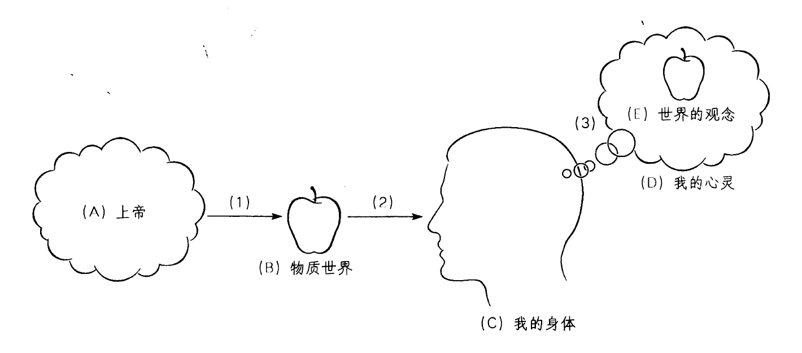
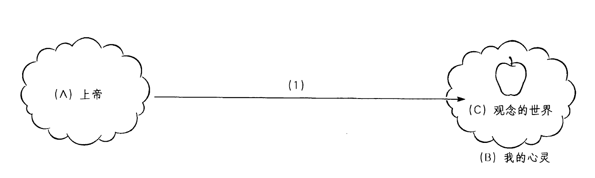

🟩第20章 乔治·贝克莱：沿经验主义之路前进

哲学家、教育家与主教

乔治·贝克莱（George Berkeley），爱尔兰最杰出的哲学家，1685年3月12日生于基尔肯尼市附近一个英格兰血统的家庭。15岁时，他进入都柏林三一学院，在那里，他受到哲学家笛卡尔、马勒伯朗士和洛克以及牛顿和其他著名科学家著作的影响。1710年，他被任命为圣公会的一名牧师。贝克莱的旅行使他相信，欧洲文化处于衰落状态，但一种清新的精神在美洲充满活力。受到这块新大陆的激发，他写了一首诗，诗的最后一节是：

帝国的航向取道向西；

前四幕已经过去，

第五幕将结束这一天的戏剧；

最后的一个是时间最高贵的子女。[1]

因而，贝克莱梦想在百慕大岛创建一所大学，在那里教育英国种植者和美洲土著（或印第安人）的孩子。他获得了国会的批准和公私两方面的资金承诺。1728年，他结了婚并与几个伙伴和新婚妻子启航去美洲。然而，他改变了他原来的计划，把他的方案改到了罗德岛纽波特。不幸的是，资金从来没有到位，三年之后，他返回伦敦。1734年，他被任命为克罗因主教。他把生命中的最后岁月用于提升焦油水的医药性能，这是一种他从美洲印第安人那里学到的治疗方法。1753年1月14日，他平静地死于牛津并被葬在基督教会墓地。

尽管他的教育计划失败了，但贝克莱对美国教育产生了影响。因为他的诗预言了这个新出现的国家向西的开拓，加利福尼亚州在一个城市建立了一所以贝克莱命名的大学。同样，康涅狄格州纽黑文的伯克利神学院，也是对他在美洲工作的赞颂。国王学院（后来成为哥伦比亚大学）的首任校长遵循贝克莱的个人建议建立了这所新学校。贝克莱给耶鲁大学（当时是一所培训牧师和教师的小型学院，正在艰难地发展）提供了那时美国最优良的图书馆。他还给了这所学校一笔学术基金。哈佛大学也从一批他赠予的书籍中受益。

贝克莱的任务：与怀疑论和无信仰战斗

1710年出版的一本主要著作的颇具描述性的标题，清楚地表明了贝克莱为自己制订的计划：“论人类知识原理，探索科学中的错误与困难的主要起因以及怀疑论、无神论与反宗教的根据”。在这本著作中，他说，科学中错误的原因是牛顿物理学的形而上学假设。怀疑论的基础，存在于洛克的认识论中。而他在这两个思想体系中看到的错误，是贝克莱哲学的首要目标。

贝克莱清楚地意识到，许多科学家，包括牛顿，是有伟大信仰的人，他们认为，新科学指向的是上帝的权威和力量。然而，贝克莱看到，在他那个时代受到颂扬的科学潜伏着不祥的意蕴。似乎正像牛顿世界观所提出的，上帝正被从事物的体系中排除出去。毕竟，在前科学时代，上帝被认为对世界中的所有事件负责：太阳的升起与落下，彩虹的壮丽，生命破土而出。但是，现在这些事件被用支配物质运动的非人格的机械原理来解释。如果真正的科学只是描述经验的规律性，贝克莱并不与之争执。然而在他心目中，那个时代实际的科学走出了经验这块坚实的陆地，而进入了黑暗的形而上学之水。因而，他的问题是，发现一条道路，让科学重获有效性，同时保留上帝在世界事件中的必要作用。

贝克莱认为，这里的罪魁祸首是对物质的信念。物质被认为是一种独立存在的实体，不需要借助上帝自身就可以被理解。从对这种物质世界的信念，到上帝不必要的结论只是一个很小的跳跃。为了免除对神学解释的需要，无神论和自然神论要求一个有序、自足的物质世界。如果贝克莱能表明物质观念不可理解甚至物质根本不存在，他就能对无神论釜底抽薪。我们会被迫退回精神实在对解释世界和经验必不可少的观点。

贝克莱的立场通常被称为是一种唯心主义。然而，他自己称之为“非物质主义”。这一立场主张，实在中只存在两种事物：（1）心灵（或精神）和（2）它们感知的观念。关于我们日常经验的对象，贝克莱著名的表述是“存在就是被感知（Esse estpercipi）”。因此，他的立场的核心论点是：

……一切天上的东西和地上的东西，简言之，所有那些构成整个世界的物体，除了心灵之外没有任何实体——它们的存在就是被感知或被认识。(P§6)[2]

贝克莱的动机是宗教的，但是他的论证完全是哲学的，不能当作只是一个过分虔诚的教士在大声说教而置之不理。用他自己的话说，“既然我的意图是用理性说服怀疑论者和无信仰者，所以我就必须严格遵守最严苛的推理法则”（D6-7）。除了他的哲学的神学目标之外，还有许多哲学后果。其中首要的是，他宣称防止了他相信是从洛克认识论中流出的破坏性的怀疑论。根据洛克的观点，我们所知的一切是我们心中的观念。但是，如果这是真的，那么我们的知识就根本不是关于实在的，因为我们不能触及我们观念之幕的背后。即便洛克主张我们的某些观念（第一性质）是实在世界的要素的复写，我们却不能把它们和实在世界相比较来知道这真是如此。因此，我们根本不能知道我们所谓的知识是否与实在的东西有任何关系。贝克莱主张，洛克以这种方式把哲学领进了怀疑论的泥淖。

在回应他那个时代的哲学家时，他把“永久地消除形而上学”和“唤起人的常识”作为他的使命（PC§751）。不管他的立场有多复杂和古怪，贝克莱都宣称，他的观点与未被哲学引入歧途的普通人的观点相同。常识告诉我们，我们所经验的就是实在的，我们经验到实在是什么样，实在就是什么样。

贝克莱对经验主义的改革

贝克莱从洛克开始的地方开始。贝克莱最大限度地尊崇他的前辈，称他是“我遇到的最清晰的作者”。然而，由于接受了后者的核心建议“用我自己的判断，用我自己的眼睛看而不是别人的”（PC§688），这位好主教致力于系统地批评洛克的哲学。贝克莱主张，如果我们采用洛克的朴素的历史方法，它将告诉我们洛克从未接受的结论。因此，贝克莱的目标是毫不妥协地做一个一致的经验主义者（由于洛克委身于常识而未能达到这个目标）。我们能想象贝克莱对洛克和牛顿式的科学家说，“那么，你们相信我们所有的知识都来自源于经验的观念？我同样如此！但是，让我们看看这个信念将把我们带向哪里。在你们的经验主义中，你们不够一致，因为你们相信人能知道我们经验范围之外的物质世界”。

贝克莱的观念理论

要理解贝克莱的哲学和它与洛克的哲学有什么不同，我们必须弄清贝克莱的“观念”这个概念。在他的哲学中，“观念”这个词项有些类似它在洛克著作前面的段落中的意思。观念是诸如彩虹的颜色、水的湿润、玫瑰花的芳香、柠檬的味道或钟的声音之类的东西。“观念”也可以指我们经验到的心灵的活动或状态，诸如意欲、怀疑和爱。因此，观念是心像或感觉材料，它们要么在生动的感觉经验中直接呈现于心灵，要么在记忆或想象中不那么生动地呈现。因此，当贝克莱说我们有火的观念，他的意思不是我们只是有火的概念或火的语言描述。他的意思是我们有炽热而明亮的黄红色光的经验或记忆。因而，阅读贝克莱的著作时，最好把“观念”这个词项与经验和感觉这些词联系起来，而不是概念和描述这些词。

对抽象观念的批判

贝克莱最初在这些观点上同意洛克的观点，但在《人类知识原理》的引论中极大地偏离了洛克。特别是，他试图反驳洛克关于抽象观念的理论。根据洛克的观点，我们能从我们关于许多特殊狗的经验中抽象出它们的所有共同属性。这样，我们就能达到“狗”的抽象观念。它是一个指称贵宾犬和圣伯纳犬、褐色狗和白色狗、浑身毛绒绒的狗和光滑的短毛狗的属概念。然而，对于贝克莱，观念总是一个特殊的心像。因此，在我们心中不可能有一个既不大也不小、既不黑也不白、既不老也不幼的狗的图像。我们更不可能有抽象的“动物”观念，在其中我们没有想到任何特殊的鸟、兽或鱼。我们只能思考、谈论和想象特殊的事物。

然而，贝克莱的确相信我们可以有“一般观念”。当我们用一个特殊观念代表所有其他类似的特殊事物时，我们就有一个一般观念。因此，狗这个词是指称斑点、菲多、莱西和所有其他特殊狗的简略方式。然而，它不像柏拉图和某些中世纪哲学家认为的那样代表一个抽象观念或普遍的相“狗性”。因此，贝克莱的立场是唯名论的一种形式，这一观点认为，共相不是实在的，而只是语词。

贝克莱对抽象观念的攻击是在攻击一种允许我们偏离岩石般坚固的经验基础的认识论。既然我经验不到“一般的狗”，也经验不到狗性这种本质，这样的概念就应该从一切纯粹经验主义中排除出去。贝克莱提醒说，如果我们不谨慎，语言就可能成为把我们和关于我们自己的“赤裸的、没有伪装的观念”的清晰观点分隔开的幕布（P，引论，§25）。我们可能陷入一个由各种空洞语词构成的世界，而不去质疑是否有任何具体经验与它们相联系。贝克莱的核心目标是，让我们相信没有任何抽象观念比“物质”更具迷惑性。他发现，“物质”只是一个空洞的语词，不指称我们能从经验中发现的任何东西。

> 想一想
> 
> 20.1 在他对抽象观念的攻击中，贝克莱主张，我们不能想到“狗”这个概念而不想象某只特殊的狗。他似乎相信有某个东西的概念和有一个它的心像是一样的。你在这一点上是否同意贝克莱的观点，或是否可能有一个事物的概念而没有它呈现于心中的心像？

出自观念的精神依赖性的论证

为了了解贝克莱的进路，我们将看看他的一个核心论证，在这个论证中，他分析了“可感对象”的本性（P§4）。他用这个词只是表示任何能被感官感知的对象，诸如马、山、河或苹果。这些是我们通常所称的“物理对象”。然而，这个术语给这个问题加上了先入之见，因为它假设了这些对象的物质性，而这正是贝克莱要质疑的。我们将称这个论证为“出自观念的精神依赖性的论证”。它的大致提纲如下：

（1）可感对象（马、山等）是在感觉经验中呈现给我们的东西。

（2）在感觉经验中呈现给我们的东西仅仅由我们的观念构成。

（3）观念仅仅存在于我们的心灵中。

（4）因而，可感对象仅仅存在于我们的心灵中。

通过看一个像苹果这样的可感对象的例子，可以使这个论证的步骤更具体一些。你用苹果这个词表示什么意思？如果你描述一个苹果，你可能会说它是圆的、红的、硬的、脆的和甜的。但是，所有这些性质都指各种经验或感觉（步骤1）。现在，似乎好像你的整个苹果概念是由观念的集合构成，这些观念是被经验到的，因而存在于你的心灵中（步骤2和3）。注意，在描述苹果时，你提到了所有在你经验中发现的苹果的性质，但你没有提到它的物质。当然，如果你只是用“物质”表示它的硬度，那么你在指称一个经验或你具有的“观念”。然而，如果你用“物质”（像洛克那样）表示某种基质，某种我不知道是什么的东西，它支撑着所有经验中的性质，但自身不被经验到，那么你就违背了经验主义的出发点。因而，由此可得，我们知道的唯一苹果是作为观念的集合存在于你心灵中的那个苹果（步骤4）。

剥夺了苹果被感知的性质，你剩下的是一个没有颜色、形状、气味、滋味或质地的东西——一种虚无的东西。而且，既然你不能描述它的物质（你只能描述呈现在经验中的观念），那么为什么你相信在你具有的经验之外还存在这种物质？根据贝克莱的观点，我们的苹果经验不是由“实在”的苹果引起的。而是，我们的苹果经验就是实在的苹果。

你很可能会认为贝克莱的立场离奇、古怪、滑稽或者（最严重的情况下）疯狂。不只你一个人这样认为。当《人类知识原理》出版时，他的很多同时代人有相同的反应。在他的同时代人中，一个物理学家宣称贝克莱疯了，一个主教悲叹他热衷于标新立异。然而，贝克莱的论证几个世纪以来一直萦绕在哲学中，今天仍然是当代哲学家讨论的一个主题。

由于他的《人类知识原理》受到了极其糟糕的对待，贝克莱用一本更为通俗的著作再次尝试，它名为“海拉斯和斐洛诺斯的对话三篇”，出版于1713年。在写这本著作时，他最大限度地利用了他的文学技巧。他的论证既繁多又复杂、微妙和迷人，我们在此只能考察某些最突出的部分。这个虚构的对话是两个英国大学生在校园里遇到后分享他们的思想。第一个是海拉斯，他的名字与希腊语中表示物质的词相似。他正好是一个唯物主义者并且在精神上非常接近约翰·洛克的哲学。第二个是斐洛诺斯，他的名字的字面意思是“爱心灵的人”。斐洛诺斯发表直击要害的评论，而海拉斯则充当救援投手。

在开场的一番唇枪舌剑之后，二者的分歧集中在，斐洛诺斯提出“可感事物的实在性就在于被感知”，而海拉斯坚持“存在是一回事，被感知是另一回事”（D14）。海拉斯从捍卫现在被称为朴素实在论（naive realism）的立场开始。它可以定义为，相信我们感知到的对象具有的属性是它们在外部世界中实际具有的属性。贝克莱不质疑这个表述的前半部分；而后半部分，假设一个与我们的观念相对应的外部物质世界，是他的非物质主义论证的焦点。

出自痛苦与快乐的论证

为了捍卫非物质主义，贝克莱让斐洛诺斯采用了一个可以称之为“出自痛苦与快乐的论证”的策略。洛克和休谟都顺带提到过这个论证，但贝克莱把它作为他的武器库里的主要武器。这个论证大致上这样进行：

（1）某个性质q（温度、味道或气味）要么作为痛苦要么作为快乐被经验到。

（2）痛苦和快乐不是外部对象的属性而是只在它们被经验到时才存在。

（3）因而，性质q不是外部对象的属性而只是在它被经验到时才存在。

斐洛诺斯把热作为第一个例子，因为大多数人相信它存在于外在于我们的对象中。然而，他说，当我们经验到极端的热（比如摸到火时），我们实际遭遇的是剧烈的疼痛（步骤1）。但是，没有人会想说疼痛存在于外部世界中，位于壁炉里。显然，痛苦是一种感觉，只在心灵感知它时才存在（步骤2）。

海拉斯试图通过坚持热存在于外部对象中，而痛苦只是它的后果，来逃避这个论证的力量。然而，斐洛诺斯论证说，我们不能这样把它们分开，因为当我们经验到火苗时只有一个独特的感觉。因此，我们对强烈的热的感觉与内在于感知着的心灵的疼痛感是一样的（步骤3）。相同的论证适用于所有其他程度的热，因为要么把它们经验为痛苦的感觉，要么经验为快乐的感觉。显然我们能把相同的观点用于冷。

出自感知者相对性的论证

在这一点上，斐洛诺斯引入了另一个贝克莱式论证。它经常被称为“出自感知者相对性的论证”。斐洛诺斯通过一个简单的例子来应用这个论证。想象你的一只手在热水中被加热，然后你把它放进一桶微温的水中。由于反差，你将感觉到这桶水是冷的。但是如果你的手是冷的，并被放进同一桶微温的水中，这桶水现在将好像是暖的。同样的水能同时既是冷的又是暖的吗？为避免这个矛盾，海拉斯让步说，“热和冷只是存在于我们心灵中的感觉”。

这个实验的细节可以概括到以下形式的论证中：

（1）性质q₁（冷）在条件c₁（温暖的手）下经验对象o（水）时被感知到。

（2）性质q₂（热）在条件c₂（冰冷的手）下经验对象o时被感知到。

（3）条件c₁和c₂是感知者的不同条件，它们不会改变对象o。

（4）假设对象o同时具有性质q₁和q₂是矛盾的。

（5）因而，性质q₁和q₂存在于感知者中而不是对象o中。

得到了海拉斯的让步（步骤5），斐洛诺斯又把同样的一组论证用于许多其他感觉性质。我们把糖的甜或药的苦分别经验为特殊种类的快乐和痛苦。既然物质对象不可能包含快乐或痛苦，那么这些通过品尝经验到的性质必定栖居于心灵中。同样的推理也会适用于气味。声音又怎么样？贝克莱在此使用了出自观念的精神依赖性的论证。如果“声音”就是意指，比如说，钟鸣时我们经验到的东西，那么如果没有人有这个经验，声音当然不可能存在。没有感知者，钟的鸣响可能是一种运动，但运动不可能像声音那样能喧闹、悦耳、刺耳或优美。运动只能被看到或触摸到，但不能被听到，所以它们不是声音。著名的谜题“如果一颗树在森林中倒下，它发出声音了吗？”就是从贝克莱的论证中引出的。

颜色用相对性论证来处理。一个对象的颜色会依赖光照、我们眼睛的状况和我们看它时所用的工具而变化。日落时的云看起来是红的和紫的，但我们知道水蒸气没有这样的颜色。通过显微镜看的对象会有裸眼看不到的颜色。那么，我们怎么能谈论事物的“真正”颜色？这种可变性表明，颜色是我们感知的一种样态，而不是对象自身的一种属性。

第一性质与第二性质不可分离

到目前为止，约翰·洛克与贝克莱的立场没有多少冲突。事实上，斐洛诺斯使用的许多论证，与那些洛克用来表明我们经验到的第二性质不在对象自身之中的论证相似。由于他的朴素实在论陷入混乱，海拉斯引入了洛克的第一性质与第二性质的区分，来避免被卷入斐洛诺斯的非物质主义漩涡中。

海拉斯让步说，像温度、味道、气味、声音和颜色这样的第二性质不能离开心灵而存在。但是，他坚持广延、形状、硬度、数量、运动和静止这些第一性质，主张这些性质的确存在于外部物质对象中。斐洛诺斯的回应方式是，通过表明他和洛克用以证明第二性质依赖心灵的相同论证，可以同样容易地用来反对第一性质。

为了达到这个目的，他使用了“不可分离性论证”。这个论证像下面这样：

（1）所谓第一性质和第二性质不能在心灵中分离，因为它们总是同时出现并以相同方式被感知。

（2）因此，如果一种性质依赖心灵，另一个也将如此。

（3）我们已经表明第二性质依赖心灵。

（4）因而，第一性质依赖心灵。

例如，你从未完全孤立地经验到红色。你经验到红色的番茄、红色的蜡笔、红色的郁金香或某个红色的东西。对象的颜色、气味和味道都是你在其中感知到它们的广延的同一经验的部分。因而，你怎么能说你经验的一个部分（颜色）是主观的，但你经验的另一个特征（形状和广延）是客观的？你如何知道番茄是圆的？你知道这一点是你看它们时看到了红色的圆形块。因此，广延的经验总是以这种或那种方式通过你的所谓第二性质经验为媒介。如果第二性质只相对于感知它们的心灵而存在，那么第一性质必定有相同的地位。

在讨论具体的第一性质时，斐洛诺斯使用了相对性论证。例如，他说，对于我们来说显得极为微小的对象对于一只小虫来说会是庞大的。因此，对大小的感觉是相对于感知者的。运动又怎样呢？它肯定是出现在外部世界中的。然而，如果运动只是一个人心灵中的观念的接续呢？为了清楚地看出这一点，请想象你在一辆快速运动的火车上。乡村的图像将非常迅速地闪过。同时，相邻铁轨上一辆和你的火车速度方向完全相同的火车将显得是不动的。因而，“运动”只是观念在一个感知着的心灵中一个接续着另一个时，我们给予它们的速度和变化的关系的名称。

在后来的讨论中，海拉斯和斐洛诺斯讨论了距离。因为距离感知是我们识别广延的一种方式，因而，它对于判断第一性质是否依赖心灵，是一个有趣的测试案例。斐洛诺斯首先指出，在梦中我们有对象在远处的显象。然而，显然，我们感知的距离只是心灵的一个显象，并不表明任何真正的广延。

这让即使我们醒时的经验也像这样的论点也显得合理。（当然，同样的论证可以用于任何第一性质。）而且，当一座房子显得遥远时，我们真的经验到某种称为“空间距离”的东西吗？不，似乎不是。我们实际经验到的是一座看起来很小的房子。当我们朝着它移动，我们将经验到这座房子的接续的观念，它在这些观念中显得越来越大。但是，我们所具有的是大大小小的房子影像的不同经验。因此，似乎当我们经验到一个相似的对象相对较小时，我们把这个经验与“距离”概念相联系。然而，既然大小的显象是相对于感知者的，那么距离也是如此。斐洛诺斯请海拉斯思考这样一种情况，一个天生盲人突然能够看得见了。一开始，他未受训练的眼睛不能把视觉图像解释为距离性质在他视野中的呈现。他必须学习如何把这些视觉线索与距离概念联系起来。

> 想一想
> 
> 20.2 你是否认为贝克莱已经成功地消解了洛克的第一性质和第二性质之间的区分？

出自想象的论证

即使海拉斯已经被这些论证弄糊涂了，但他仍然没有被说服。因而，在讨论第一性质的中间，斐洛诺斯还提供了另一个论证，来支持“存在就是被感知”这个主张。这个论证可以被称为“出自想象的论证”。它以挑战的形式出现。他向海拉斯承诺，如果后者能设想任何可感对象离开心灵而存在，他就将准备抛弃他的非物质主义。海拉斯接受了这个诱惑，并断言没有比“设想一棵树或一座房子自身存在着，独立于任何心灵，不被任何心灵感知”更容易的事了（D41）。例如，我们能想象一棵树位于某片人类从未涉足的遥远森林里。它似乎孤独地站在那里，没有呈现在任何人的心灵中。但是，斐洛诺斯指出，在这个思想实验中忽略了一件事。在设想这样一棵树时，它呈现在海拉斯心灵中。因此，设想的对象（这棵树）是一个观念，根据定义，它必定存在于心灵中。海拉斯未能满足这个检验的条件。他不能主张这棵树的概念呈现在他心灵中同时又不呈现于一个心灵中，而不自相矛盾。

> 想一想
> 
> 20.3 对于贝克莱的论证，你有什么想法?哪一个是最强的？哪一个是最弱的？面对他的论证，你如何捍卫物质世界独立于我们的心灵而存在？

批判感知的表象理论

在第一篇对话的最后，斐洛诺斯通过攻击感知的表象或复写理论，对洛克的认识论发出了最后一击。虽然海拉斯让步说，观念在心灵中，但他提出了它们中的一些是外在于我们的对象的副本或图像这一洛克式主张。以这种方式，我们能间接感知外部对象。借用艺术的例子，某人的画像（副本）允许我们以间接方式感知那个实在的人。

但斐洛诺斯反对这一主张。我们在画中看到的一切是一系列的颜色和形状。如果这些向我们提示那个真正的人的观念，那是因为我们之前有这二者相联系的某种经验。类似地，斐洛诺斯说，可以说我听到了马车，但实际听到的不过是声音。如果我把这些声音和马车联系起来，那是因为在以前的经验中，当我看到马车时我听到了同样的声音。因而，我们所具有的一切不过是一个观念（或一种经验）和另一个观念（经验）的关联。我们从来没有跳出观念的圈子。因此，我们不能说观念是一个外部“实在”对象的副本，因为，如果我们知道的都是观念，那么我们永远不能经验到这个关联。另外，如果第一性质和第二性质都作为观念呈现给我，那么，如果实在对象被剥夺了任何可感性质，它会像什么样子？它们肯定不会像我们的任何观念。“一个自身不可见的实在事物能像一种颜色吗？或者不可听的实在事物能像一种声音吗？总之，任何事物能像一种感觉或观念，而是另一种感觉或观念吗？”（D48）

形而上学：作为心灵与观念的实在

和所有古典经验主义者一样，贝克莱的认识论和他的形而上学之间不能做截然的划分。他对我们如何获得知识的解释，夹杂着他对知道的是何种实在的解释。已经非常清楚，在贝克莱的世界中，能够存在的东西唯有观念和认识它们的心灵。然而，在形而上学的名目下，我们将依次考察贝克莱关于我们的世界的存在、上帝的存在和自然法则的观点。

世界的存在

在刚开始试图理解贝克莱时，人们犯的一个通常错误是，以为他否定我们的世界和其中的事物存在。在某个地方，海拉斯问，“既然实在的事物和通过想象形成的怪兽或梦中的幻象都存在于心灵中，那它们有什么不同？”（D82）。斐洛诺斯回答说，梦中的幻象是“暗淡、无规律和混乱的”，而我们的实在事物的观念“更加生动和清晰”。我们通过把一种经验和另一种经验相比较来将梦与幻觉和头脑清楚的、清醒的经验相区分。它是两种经验之间的区分，而不是经验与某种外在于经验的独立实在之间的区分。在贝克莱的体系中，我们可以做同样的事。正如他所表达的，“根据作为前提的原则，我们没有从自然中褫夺任何一样东西。我们所见、所感、所闻的一切，或者以任何方式构想和理解的一切，一如既往地稳固无虞，一如既往地实实在在”（P§34）。

换言之，贝克莱无意否定我们世界的任何部分的存在。他只是分析“存在”这个词项的意思是什么。我们如何知道某个对象存在？当我们（或另外某个人）能感知这个对象的时候，我们说某个事物存在。“我说我正在其上写作的这张桌子存在，即是我看到它并感到它；如果我在我书房的外面，我会说它存在——意思是如果我在我的书房里，我会感知到它，或者另外某个精神实际地感知到它。”（P§3）

塞缪尔·约翰逊，一个著名的英国作家，贝克莱的同时代人，陷入了对贝克莱论证的典型误解。在贬低了贝克莱的体系后，约翰森踢了一块石头，把它踢飞到天上，并说：“这样我就驳倒了他。”但约翰森的“反驳”没有击中要害。踢石头证明了什么？他经验到石头的坚固性，并且有看到它飞过他的视野的经验。他所遇到的是一系列的观念。这与贝克莱的立场完全一致。踢石头不过是刚才所描述的一系列感觉，我们可以有这些感觉而不假定存在任何物体。

贝克莱敏锐地意识到似乎由他的存在观造成的表面的荒谬性。如果“苹果”只是一个名称，我们把它用于我们经验到的红、圆、含水、脆和甜的观念结合体，那么，当我们吃苹果时，我们只是在吃观念吗？贝克莱同意这样表达“非常刺耳”（P§38）。但他主张这只是因为我们习惯上不用观念这个词指称我们通常称为“物”的可感性质集合。然而，他让步说，一旦我们理解了苹果这样的项目完全由感觉性质构成，他就对我们称之为物没有异议。他对这些问题的建议是“像有学问的人一样思考，像普通人一样说话”（P§51）。就像虽然我们赞同哥白尼体系，但我们仍然说“日出”或“日落”，所以我们可以允许我们关于对象的谈论有某种不严格性，只要我们的哲学理解比我们的言论所显示的更精密。

上帝的存在

贝克莱主教深奥的哲学论证的主要目标之一是，在一个滑向怀疑论和无信仰的时代恢复宗教信仰的地位。因此，他试图把他关于观念的结论用于上帝存在的问题就不令人惊讶了。

贝克莱相信，如果我们追随他关于唯物主义在理智上破产的论证，我们将被一种排除的过程驱使，断言上帝存在。在他扩展了观念的讨论之后，问题自然产生了，什么是我们观念的原因？贝克莱考虑了所有可能的原因（P§25）。首先，我们可以假设一个观念是另一个观念的原因。然而，观念是被动和惰性的。它们似乎没有任何能力与活动。例如，柠檬的黄并不产生柠檬的酸的感觉。第二，我们可以假设柠檬的物质实体产生了我们心灵中的黄和酸的观念。但这是洛克的立场，贝克莱相信，它已经被决定性地驳倒了。因而，唯一剩下的回答这个问题的选项是，说“观念的原因是一个无形体的主动实体或精神”（P§26）。虽然这里有一些问题，但当贝克莱使用“精神实体”这个术语时，他的意思是它等同于“意志”“灵魂”“精神”“心灵”或“自我”这样的术语。在贝克莱的体系中，世界上唯一的因果性动因是精神实体。

但是，你的心灵或精神是否解释了你的观念的存在？显然，你的想象产生的心像是你造成的。然而，在感觉经验的世界上发现的观念闯入你的心灵而不受你的控制。当你咬一个柠檬时，它的酸的观念或感觉立即出现在你的意识经验中。如果你我不能通过意志的行为创造我们的观念世界，那么某个其他的意志或精神必须为这些观念的存在负责。因而，我们有了关于上帝的因果论证的一个种类。我们不能像托马斯·阿奎那试图做的那样，从物质世界的存在论证上帝，因为“物质”只是不指称任何东西的空洞声音。但是贝克莱认为，我们必须设定上帝存在来解释我们自己的感觉经验。正是上帝供给我们丰富的观念，包括彩虹、小山、蝴蝶、海洋和我们世界中的所有奇迹。上帝把这些观念直接给予我们的心灵而不要求物质这个多余的“中间人”。

贝克莱关于感知和实在的本性的观点，可以用把他的立场与笛卡尔和洛克相对照的图来说明（见图20-1和图20-2）。如图20-1所示，笛卡尔和洛克相信（A）上帝（一个精神实体）（1）创造了（B）物质世界（由一个苹果代表），这影响了（C）我的身体，在（D）我的心灵（一个精神实体）中（3）产生了（E）世界的观念（苹果的图像）。根据图20-2中的贝克莱的更简单的图画，（A）上帝（一个精神实体）在（B）我的心灵（一个精神实体）中（1）创造了（C）观念的世界。注意，对于笛卡尔和洛克，心灵包含着世界的观念，因为它们表象着外部实在。对于贝克莱，心灵包含着观念的世界，因为那是上帝创造的唯一世界。

贝克莱如何从某个与我们不同的精神产生了我们的观念这一结论，跳到这一精神等同于传统的上帝概念这一主张？和他那个时代的大多数有神论者一样，他似乎相信，自然的有序和恢宏是如此的伟大，除了一个无限的是者，没有任何东西能符合这样一个创造者的职位描述。

虽然贝克莱把他的论证称为“证明”，但它显然只是提供了上帝存在的部分证据。这个论证是启发

_图20-1 笛卡尔和洛克关于感知的观点_

_图20-2 贝克莱关于感知的观点_

性的和概然性的，而不是结论性的。与贝克莱相反，大卫·休谟后来论证，如果世界有限，它最多要求一个非常伟大但有限的原因。而且，说每个观念都有某个不同于我们的精神原因，并不证明有唯一一个活动着的精神是我们观念的原因。理论上可能有许多不同的精神是我们心中各种观念的原因。显然，贝克莱的因果论证自身并不向我们表明我们观念的原因是永恒的、完善的，有贝克莱如此迅速地偷运到其结论中的所有其他属性。

上帝存在方便地回答了贝克莱哲学中的一个烦人的问题。你坐在其中的这个房间存在是因为你感知着它，如果你闭上眼睛它会消失吗？当你走进或走出你的房间时，对象会一会儿存在一会儿不存在吗？贝克莱说不会。我们关于对象在这样的情况下持续存在的常识信念是正确的。上帝既在你的心灵中创造了这个房间的观念，又在他自己的心灵中感知它。因此，当你闭上你的眼睛不再感知这个房间，它仍然存在，因为上帝感知到它。这里仍然会出现问题。不过，在他的整个著作中，贝克莱勤勉地介绍每个他能想象到的对他哲学的反对意见，并寻求从他的体系中提供回答。

以这种方式确立了上帝和世界的关系后，贝克莱相信他已经确立了他的哲学的某些宗教目标，因此为他那个时代的自然神论和无信仰的腐蚀性后果提供了补救。他害怕机械论的牛顿宇宙观给他的文化留下一个遥远而贫乏的神，不能激发虔敬和道德。在他的一本著作《阿尔西弗伦》中，他说到了自然神论的立场：

某些哲学家，由于组织起来的物体和世界的有序体系的造就和发明，而相信那创造者的智慧和能力，相信他留下了这个系统，它的所有部分和内容都调试得很好并置于运动中，就像一个艺术家留下一个钟表，在那之后的一段时间里让它自己走。[3]

然而，他反驳了自然神论的立场，说他自己的证明确立了上帝：

不只是一个创造者，而且是一个深谋远虑的统治者，实际地和隐秘地在场，关注我们所有的兴趣和活动，他监督我们所有的举止，照管我们最细小的行为，设计我们的整个生活过程，以非常明显可感的方式不断地告知、训诫和指导。[4]

科学与自然法则

这些神学评论可能让贝克莱的立场显得与对世界的科学理解相敌对。然而，事实并非如此。贝克莱并不想抛弃他那个时代的科学的真正成果。他只是想让它从成问题的形而上学中解放出来。那么，没有供研究的物质世界，我们如何从事科学？贝克莱希望我们理解，他的体系绝不排除自然法则或描述这些法则的科学公式。他向我们保证，“没有一个在那个假设（物质存在）下被解释的现象没有它就不能很好地被解释”（P§50）。因此，为了他自己的目的，他利用了奥卡姆剃刀，一个导致科学事业兴起的原则（见第12章）。这是一种寻找最简单、最经济的解释，同时抛弃多余的实体和原则的策略。

什么是自然法则？贝克莱认为，它们不过是描述一些观念以可预测的方式有规律地随另一些观念发生。然而，他指出，在经验的观念之间并没有必然联系。水在温度达到0℃时结冰并非逻辑必然。想象它在10℃结冰并无矛盾。因而，在此必须采用像经验学习的经验方法。

因果性又怎么样？当我们触摸火焰时我们感到疼痛。但是既然没有物理的火焰触及物质的身体，火是痛的原因吗？与他自己的立场一致，贝克莱说不是。我们称为“原因”的东西只是一个符号。“结果”只是这个符号标记的东西。因此，当我们感觉到火的存在，这就警告我们我们将感到痛；它并不引起痛。用一个类比，当我的闹钟在早上6：30分发出响声，那是一个早晨到了的符号。然而，闹铃响并不是太阳升起的原因，反之亦然。贝克莱的观点是，如果科学家只是记录经验中观念的齐一秩序，而不假设他们在研究物理实体，他们将避免错误。贝克莱关于自然法则只是经验中规则性的描述的观点非常现代。某些20世纪的科学哲学家持有类似的观点，他们寻求避免所有形而上学假设——包括贝克莱的。＊

＊这样的哲学家的例子是实用主义者，将在第30章讨论，还有逻辑实证主义者，将在第31章讨论。

对于贝克莱，科学家发现的规则性是我们每个瞬间的经验都由上帝直接产生这一事实的结果。如果你经验到一个柠檬，你将（毫不令人惊奇地）发现它有黄色、质地粗糙的表面和酸酸的味道。出现这些现象是因为上帝在你的心灵中创造了黄、粗糙和酸的经验。上帝能提供给你柠檬的视像和质地，但给你泡泡糖的味觉，只要他选择这么做。当然，他没有玩这样的花招。自然是有序的。我们可以信赖它。我们可以期待面包是有营养的，雨是湿的，氰化物是致命的。这种有序性和一致性是上帝的一致性和善的证明。在贝克莱的解释中，科学不排斥宗教；相反，科学实际上要求上帝保证自然事件的齐一性。既然所有事件都是上帝直接行为的结果，记录在《圣经》中的奇迹根本不成问题。为了特定目的，上帝可以偏离正常的事件安排。他可以让一种液体在这一分钟里看起来和尝起来像水，而下一分钟看起来和尝起来像酒。但这样的奇迹并不比苹果落地更像是超自然事件。

在一个地方，海拉斯引入《圣经》对创造的解释来反驳斐洛诺斯。《圣经》上说，上帝创造了天、地以及海、植物和动物。它没有说他创造了观念，海拉斯坚持说。但斐洛诺斯说，《圣经》上也没有说上帝创造了物质。他的确创造了海。但他创造的海是什么？他创造了湿的观念，盐水的气味，深蓝的广阔区域上泛着白色泡沫的视像和波浪翻滚的图像。他创造了我们经验的每样东西，就像我们经验到的一样，但他没有创造物质。

在他的自然哲学中，贝克莱勇敢地挑战了他那个时代的牛顿物理学中的一些主要概念。牛顿主张，绝对空间和绝对时间作为宇宙物品的部分而存在，并且运动是绝对的。贝克莱论证说，这些是站不住脚的抽象，这些词项不指称任何自身存在的事物，而只是经验之间的关系。例如，“空间”这个词项指称我们的运动经验和我们的物体观念之间的关系。我们不可能形成没有物体和运动的纯粹空间的观念（P§116）。时间只是我们心灵中观念前后相继的经验（P§97，§98）。关于运动，贝克莱说，“在我看来，离开关系不可能有任何运动；所以，要设想运动，至少必须有两个物体，它们相对于彼此的距离或位置是变化的”（P§112）。这些评论使得贝克莱的体系成为20世纪物理学家阿尔伯特·爱因斯坦理论的先驱。后者理论化地阐述了时间、空间和运动都是相对的，从而让科学发生了革命。贝克莱做出了关于重力和力的类似评论，主张它们不是形而上学的实体或原因，而只是事件之间可预测关系的数学表达。虽然贝克莱的哲学与他的时代不一致，但他关于科学主题的许多讨论具有惊人的现代性。

> 想一想
> 
> 20.4 如果一个科学家皈依贝克莱的形而上学，他对科学的研究是否不得不与之前不同？

精神实体的问题

在《对话三篇》中，斐洛诺斯提出了贝克莱上帝观的一个大问题。显然上帝不是感觉性质。他不是圆的、蓝的或甜的。然而，根据贝克莱的观点，我们只能具有感觉性质的观念。因此，似乎由此可得，我们不能有上帝的观念。海拉斯颇有理由地抱怨道：

那么，既然你没有上帝心灵的观念，你怎么能设想事物可能存在于他的心灵中？或者，如果你能设想上帝的心灵而没有关于它的观念，为什么不可以允许我设想物质的存在，尽管我没有它的观念？(D 77-78)

约翰·洛克也指出了物质实体和精神实体之间的这种对等性。实际上，他论证说，既然物质显然存在，那么精神必定也如此。海拉斯反过来使用这个对等论证，来表明，既然斐洛诺斯认可不可感知的精神实体，他必须保持一致，承认不可感知的物质是可能的。

贝克莱通过让斐洛诺斯引入“观念（idea）”和“意念（notion）”之间的区分来补救这个问题。我不能以我有糖的甜味观念的方式有我的心灵的观念。然而，因为我直接意识到我自己的精神活动（诸如思考、意欲和爱），我能通过反思形成关于我的心灵的意念。因此，我能知道我的心灵，即使这个意念在感知颜色、声音或味道之类东西的意义上不是观念。我对我自己心灵的亲知允许我使用主张存在着其他有限心灵的类比论证和概然论证。类似地，我能拓展和扩大我自己的心灵这个意念，形成一个完善心灵的意念。前面讨论的因果论证，为人们断言这个意念具有实在性提供了基础。

这个论证路线始于一个借自笛卡尔的前提，即主张我有对我自己心灵或自我的直接亲知。然而，这个前提产生了很多问题。海拉斯附带地抱怨说：“尽管你说了这一切，对我而言，似乎根据你自己的思考方式，由于你自己的原则，应该得出你只是一个漂浮的观念系统，没有任何实体支撑它们。”（D 80）换言之，我可以亲知我自己的爱、意欲和思考等行为。但是，这些是短暂的心灵状态或活动。它们只是“漂浮的观念”，而不等同于一个在我的意识之流中保持相同本质的持存的精神实体。我真的对我自己的精神实体有任何亲知吗？尽管海拉斯过于轻率地放弃了这条攻击路线，但后来大卫·休谟接过了这个问题并加以研究。但是，这个问题的困难似乎没有对贝克莱造成影响。

> 想一想
> 20.5 当贝克莱引入上帝和心灵这样的非经验事物时，他是否抛弃了他的经验主义？

评价与意义

批评者在贝克莱的主要论点中发现了几个问题。有人主张，贝克莱的体系不稳定地在三个不可接受的立场边缘摇摆。首先是唯我论。唯我论主张的是，在我的心灵及其内容之外没有任何实在。虽然很少有哲学家认真地捍卫过这一立场，但它已经被用作警示信号，表明导致它的前提是有漏洞的。如果贝克莱打算主张我能知道甚至思考的唯一实在是由那些我所感知的对象构成，那么我理解的实在就还原为我心中的主观内容。当然，贝克莱会通过主张上帝也感知这些对象来拒斥这个立场。因此，它们具有独立于我的某种客观存在。

然而，这里产生了第二个问题。我的观念只是上帝关于对象的观念的表象或副本吗？贝克莱的某些评论暗示，我们的观念只是神圣原型的特殊样式。换言之，对上帝存在的实在并不等同于人类直接知道的东西。如果这个解读是正确的，那么他接近于堕入了某种形式的表象实在论，而他在洛克那里发现它非常成问题。在这种情况下，我们对实在的经验将不是直接的或无中介的，而这恰恰是贝克莱哲学的卖点之一。

第三，如果我们需求通过主张我们的观念与上帝的观念没有区别来避免前两个选项，那么似乎我们的心灵与神的心灵相重叠，或分有神的心灵。贝克莱会发现，这个结论在神学上不可接受。因此，贝克莱似乎被困在唯我论、表象实在论或我们的心灵与上帝的心灵的某种形式的泛神论重叠之间。

贝克莱关于我们不能设想对象存在但未被感知的主张也存在着问题。的确，当我正在设想某个东西，它必然与我的心灵相联系。然而，这不意味着“存在未被思考或未被感知的对象”没有意义。贝克莱的问题部分在于他倾向于瓦解感知和设想之间的区别，因为他相信我们只以图像的方式思考。因此，看一座房子和想一座房子是相似的，因为在两种情况下，我们都在心灵之前有一个图像。但贝克莱的观点是不正确的。正如笛卡尔指出的，我们可以思考一个千边形（chiliogon），但我们不能在我们心中形成它。[5]因此，我们能在语言和思想中指称对象并清楚地理解它们的属性，但既没有在感知它们，也没有在想象它们。

正如已经注意到的，贝克莱笨拙的“意念”概念产生了进一步的问题。人们猜疑，“意念”概念是他为了有一个认识论的格子来存放上帝和自我这样的非感觉概念，而用魔法召唤来的生造概念。实际上，直到贝克莱修订《人类知识原理》后来的版本和写《对话三篇》时，他才增加了意念学说。最初写《人类知识原理》时，他似乎没有想到这个困难。然而，一旦贝克莱允许我们思考和讨论诸如他人的心灵和上帝这样未感知的事物，他就在他的体系中创造了威胁其结构完整性的大裂缝。

最后，大多数人很难同意贝克莱所主张的，他站在常识一边，并且他抛弃了哲学家的所有“粗笨的悖论、困难和不一致”（P，引论，§1）。如果贝克莱的论证不像他认为的那样滴水不漏，那么，似乎对象独立于我们对它们的经验而存在的论点是更为简单和合理的解释。即使在他自己的神学语境中，似乎相信一个婴儿处于疼痛中是物理的尿片别针正在刺他，比相信一个假设的仁慈上帝在那个时刻正用疼痛感直接折磨这个婴儿更加融贯一致。

历史的裁决同意大卫·休谟对这位主教的论证的评价：“它们不允许任何回答，不产生任何确信。它们唯一的效果是造成……暂时的惊异、犹豫不决和混乱。”[6]贝克莱反对物质的论证和他的非物质主义替代物没有取得任何真正的和持久的胜利。即使有神论者也没有发现贝克莱的体系有助于瓦解“无神论者的所有古怪体系”。然而，贝克莱仍然因为他的哲学心灵的原创性和不受他那个时代流行假设影响的能力而让人钦佩。这些是有意义的哲学工作的两个本质要求。

> 当代联系20：贝克莱
> 
> 贝克莱从来没有吸引到很多对他思想的追随者。然而，他的确以若干方式为哲学做出了某些持久的贡献。首先，关于他的理性主义和经验主义先驱的形而上学假设，他提出了某些有助益的问题。
> 
> 其次，不论好坏，他的不令人舒服的结论表明一种彻底的、狭隘的经验主义会引向何处。作为回应，某些哲学家断定，经验主义必须被抛弃，或者最好被修订。另一些人拥护现在被称为现象主义（phenomenalism）的立场。这个学说主张，所有关于经验中发现的对象的陈述，都可以用关于感觉材料的陈述完全地分析而不用涉及任何外在于感觉的实在。因而，现象主义者“咬紧牙关”废除一切形而上学，包括贝克莱试图保留的自我和上帝观念。
> 
> 第三，他的哲学分析方法和他处理的问题，特别是他关于语言和感知的理论，对英国经验主义传统产生了重大影响。最后，就像前面提及的，他的反牛顿的科学哲学在20世纪被阿尔伯特·爱因斯坦重新确立。比20世纪物理学早很长时间，贝克莱和戈特弗里德·莱布尼茨就属于最早认识到空间、时间和运动不是绝对的而是事件间关系的人。

理解题

1．为什么贝克莱主张相信一个外部物质世界会导致自然神论和无神论？

2．为什么贝克莱主张洛克的认识论导致怀疑论？

3．当贝克莱说“存在就是被感知”时，他要表达什么意思？

4．贝克莱用“观念”表示什么？

5．为什么贝克莱主张不存在抽象观念这样的东西？

6．确切地表述贝克莱的以下论证：（a）出自观念的精神依赖性的论证，（b）出自痛苦和快乐的论证，（c）出自感知者相对性的论证，（d）出自想象的论证。

7．贝克莱和洛克关于第一性质和第二性质有怎样的分歧以及为什么有分歧？

8．为什么贝克莱拒斥洛克的表象实在论？

9．既然贝克莱相信物质的外部世界不存在，他如何区分梦和实在？

10．贝克莱如何论证上帝存在？

11．如果物质不存在，为什么贝克莱相信科学是可能的？

12．贝克莱关于空间和时间的观点与牛顿有何不同？

13．如果我们所知的一切都是我们的感觉，贝克莱如何让我们讨论像上帝和心灵这样的非感觉事物？

思考题

1．贝克莱的哲学与洛克的哲学有何相似之处？它们在什么方面有分歧？

2．从贝克莱的哲学来说，说“我的桌上有一本书”表达什么意思？

3．如果我们接受贝克莱的哲学，这对怀疑论提供了怎样的回答？他的哲学以何种方式.瓦解了无神论？

4．“根据贝克莱的观点，我正坐着的这把椅子并不存在，而只是幻觉。”这个陈述是如何误解贝克莱的？

5．贝克莱主张，他的唯心主义与常识一致，并且不剥夺我们经验的世界的任何部分。他会怎样捍卫他的主张？你是否认为他这样说是正确的？

注释

[1]乔治·贝克莱，《论美洲的种植技艺与学术之前景的作者的诗》（“Verses by the Author on the Prospect of Planting Arts and Learning in America”），载于《克罗因主教乔治·贝克莱著作集》（The Works of George Berkeley： Bishop of Cloyne），A.A.卢斯和T.E.杰索普编（London： Nelson,1950）,7.373。

[2]乔治·贝克莱著作的引文在文中的标注使用如下缩写：

D 《海拉斯和斐洛诺斯的对话三篇》（ThreeDialogues Between Hylas and Philonous），科林·M. 特贝恩（Colin M.Turbayne）编（Indianapolis： Library of Liberal Arts, Bobbs-Merrill,1954)。对这本著作的标注采用这个版本的页码。

P 《人类知识原理》（A Treatise Concerning the Principles of Human Knowledge），科林·M.特贝恩编（Indianapolis：Library of Liberal Arts， Bobbs-Merrill，1957）。对这本著作的标注采用贝克莱的编号。

PC 《哲学评论》，载于《克罗因主教乔治·贝克莱著作集》，卷1，A．A．卢斯和T．E．杰索普编（London：Nelson，1948）。对这本著作的标注采用节的编号。

[3]乔治·贝克莱，《阿尔西弗伦》（Alciphron），对话4，§14，载于《克罗因主教乔治·贝克莱著作集》，A．A．卢斯和T．E．杰索普编（London：Nelson，1950）， 3.160。

[4]同上。

[5]勒内·笛卡尔，《第一哲学沉思集》，约翰·科廷厄姆译（Cambridge，England： Cambridge University Press， 1986），第50页。这段话可以在标准法文版的沉思6，第72页上找到。

[6]大卫·休谟，《人类理解研究》（An Enquiry ConcerningHuman Understanding），§12，第1部分，载于《从培根到密尔的英国哲学家》，埃德温·A.伯特编（NewYork：The Modern Library，1939），第682页。

