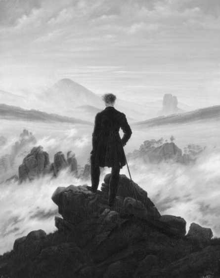

🟩第26章 索伦·克尔凯郭尔：宗教存在主义的奠基人

现在称为存在主义（existentialism）的20世纪哲学生根于19世纪的索伦·克尔凯郭尔（SørenKierkegaard）和弗里德里希·尼采（Friedrich Nietzsche） 的著作。克尔凯郭尔在本章讨论，尼采在下一章讨论，但是在一开始对二者进行初步比较是有帮助的。这两位思想家极为不同，又非常相似。他们的不同在于，克尔凯郭尔是一个充满激情的基督徒，而尼采是一个充满激情的无神论者。然而，尽管有这一极大的差别，他们共享着某些相同的哲学信念和某些对他们时代的相同批判。在发展后来是存在主义运动特征的主题时，他们都断定激情比理性更重要，主观性比客观性更重要，并且个体的人比抽象的普遍的大众或无个性的大众更重要。

比起20世纪发展起来的围绕他们思想的兴趣和追随，克尔凯郭尔和尼采对他们自己的时代都影响不大。因为这个原因，克尔凯郭尔被称为“丹麦的定时炸弹”，因为他的思想默默地嘀嗒响着，直到它们在几代人后爆发。为了表达他对他的时代还没有准备好理解他的信息的感觉，尼采有一个他虚构出的宣言：

我来得太早了，……还不是我的时代……闪电和雷声需要时间；星光需要时间；事迹虽然已经完成，但仍然需要时间被看到和听到。[1]

19世纪还没有准备好放弃这种思想，即，对人类本性的科学或理性的分析，能告诉我们关于我们自己我们需要知道的一切，包括如何指导我们的生活。然而，20世纪的人们发现，当他们试图应付两次世界大战的恐怖和不人道、大众文化的非个性化效果和即使被最奇妙最华丽的技术包围也感到异化和空虚时，这种乐观主义过于单薄。只有在这些幻灭的经验之后，人们才准备聆听克尔凯郭尔和尼采说明人类本性的黑暗面、深入内心的重要性和他们对近代文化的批判。

克尔凯郭尔和尼采的相似之处不仅在于他们对人类状况的诊断上，而且也在于他们的“疗法”上。因为他们感到真理不能直接通过命题传达，两位哲学家都采用了迷人的文学风格。他们利用了一切可设想的招数来引诱我们的想象，使得真理能从后门溜入我们心中。过去，保险箱盗贼会磨他的手指尖，以让它们在他扭动拨号盘时能在疼痛中敏锐地感觉到锁的内部运动。类似地，克尔凯郭尔和尼采用写作来刺激你，“摩擦你的痛处”，使得你对你自己存在的质地敏感。他们不是提供哲学论证，而是提供存在的可能性并把选择留给你。在他们的分析中发现缺陷很容易。但是，正当你认为你成功地对他们的写作做出判断时，他们的话语有办法激发你，直到你认识到他们的写作正在对你做出判断。通过嘲弄你使你对他们做出反应，克尔凯郭尔和尼采迫使你暴露你自己，以及你的恐惧、你的信念和你神圣的偶像。如果他们成功地唤起了这种自我诚实，他们不会在意你怎么看待他们的文字。

克尔凯郭尔的人生阶段：从充满激情的浪子到充满激情的基督徒索伦·克尔凯郭尔1813年5月5日生于哥本哈根。天生孱弱的身体、佝偻的脊柱和在说话时经常嘶声的沙哑嗓音让他痛苦。他说他的身体是沉重的负担，拖累着一个追求自由的健康灵魂。17岁时，他进入哥本哈根大学。最初，在他父亲坚持下，他主修神学，但是他后来改为哲学。虽然他的学院学习影响了他的思想，但他著作的精神来自他生命中的四个转折点。它们是两个关系（与他父亲的关系和他唯一的恋爱）和两场战斗（与新闻界和与丹麦教会）。

克尔凯郭尔的父亲是作为一个贫穷的清教徒成长起来的，但通过努力工作和好运，在商业上非常成功，以至能够在40岁退休。他是一个非常虔诚的清教徒，但是一种感到他在道德上完全失败的病态负罪感却折磨着他的生活。结果是他施加给他的儿子一种非常严苛的压迫性宗教养育。克尔凯郭尔后来把它描述为“疯狂”。

作为一个大学生，克尔凯郭尔反叛了他童年的宗教压力。他试图尽其所能挤出他生活中的所有快乐，并努力发展作为一个逍遥、有文化的花花公子的名声。然而，根据他的日记，他正被他无忧无虑面具背后的绝望所吞噬：

我刚从一个以我为生命和灵魂的聚会上回来；我口吐莲花，人人都对我嬉笑和钦佩——但我离开了——这破折号应该和地球轨道一样长——并且想开枪打死我自己。（KA7）[2]

就在他父亲死前，克尔凯郭尔和他和解了。儿子认识到他父亲严厉的宗教训练实际上是一种爱的努力，想让他免受他父亲经历的那种忧郁和负疚的伤害。带着对他父亲的爱的这种新认识，克尔凯郭尔开始理解上帝之爱并返回基督教。

他生命中冲击他的哲学的第二个有影响的事件是他与雷吉娜·奥尔森的订婚。这对克尔凯郭尔来说是一段曲折的经历。他热烈地爱上了她，然而觉得他忧郁的个性会像铅一样的重担让她被拖累。而且，他感到他生命中有一项独特的使命，会被婚姻的纠缠和循规蹈矩的中产阶级生活所破坏。在婚约破裂之前和之后，克尔凯郭尔都发现，他对她的爱让他最好的东西显现出来，并鼓舞他内心的文思涌现。然而，他发现，比起她具体地亲身在场，这种抽象的爱的鼓舞更让他陶醉。抽象与具体之间的张力这一主题一直贯穿着他的写作。

对克尔凯郭尔的第三个影响是他与新闻界的终生战争。他担心新闻界使得个体认为他们是被称为“公众”的匿名集体的一员。他与新闻界的紧张关系在他著名的与《海盗报》的争斗中达到白热化。这是一家流行的报纸，喜欢报道当时的流言蜚语以及提供诙谐讽刺的书评。这家报纸早先称赞了克尔凯郭尔用笔名写的两本著作。然而，在1845年12月，它做了关于他的《生命的阶段》的不利评论。克尔凯郭尔认为是时候把这张庸俗报纸打回原形了。在奉还早先的有利评论时，他宣称这家不名誉的报纸的赞扬损害了他的名誉。克尔凯郭尔以他典型的好辩风格，给这家刊物写了一封公开信，请求编辑与他断绝关系来恢复他的名誉。编辑同意了这个要求，并且发起了一系列社论攻击克尔凯郭尔和他的著作，还发表了令人难堪的嘲笑他的漫画。这场讨伐是成功的，因为它让许多哥本哈根人反对克尔凯郭尔，并使他成为嘲笑的对象。在这场争论之前，他本计划退出写作并在乡间教会安静地工作。然而，现在，他感到需要守住他的岗位，继续批判他的文化。

最后，克尔凯郭尔介入了与丹麦教会的争斗。他的控诉是，在丹麦做一个基督徒是理所当然的文化事件。在他看来，教会是一个安逸的机构，早就抛弃了真正的基督教。他讽刺丹麦经常去教堂做礼拜的人是臃肿的鹅，每个礼拜天聚在一起赞颂造物主给了他们翅膀，但是他们长得太胖了，飞不起来，反倒责骂那些真的使用他们翅膀的鹅。虽然他仍然与名义上是基督教的“基督教界”战斗，但他的健康开始恶化，并且死于1855年11月5日。在他的葬礼上，他的兄弟彼得，一个著名教士，为索伦·克尔凯郭尔反对教会道歉。然而，许多大学生，他们钦佩克尔凯郭尔破除偶像的著作，掀起了抗议。这引发了一场小规模骚乱。这非常合适，即使他被埋进坟墓，克尔凯郭尔仍然引起了争论，并迫使人们表明立场。这正是他想要的。

任务：让生活更艰难

通过他虚构的一个人物之口，克尔凯郭尔描述了一个下午坐在咖啡馆的人，思考他一生的使命应该是什么。＊当他环顾周遭的社会，似乎每个人都努力工作，试图用新的发明和新的技术让生活更容易。他断言，他必须做的，是给人们他们失去的但又是他们真正需要的东西。因此，他说：

出于对人类的爱，出于对我困窘境遇的绝望，看到我一事无成并且不能让已经弄得容易的事情变得更容易，并且被那些使得事事容易的人的真正利益所触动，我把到处制造困难当作我的任务。（CUP 166）

但是努力使生活艰难的意思是什么？克尔凯郭尔或许可能回答，生活最大的回报只给那些愿意经受困难甚至痛苦的人。母亲诞育新生命的阵痛，运动员产生自我克制和运动记录的坚定不移和努力，以及作家创作伟大小说的创造性奋争。对于克尔凯郭尔，生活最重要和最困难的目标是自我理解。我们喜欢采取超然的姿态，作为旁观者来看待生活。我们更安于理性和分析而不是激情和投入。我们有一种自以为是的自满，妨碍我们痛苦而完全地对我们自己诚实。

如果自知是他的全部关切，克尔凯郭尔会是当代自助心理学的19世纪先驱。然而，克尔凯郭尔心中有一个更大的目标。他相信，我们对自己越诚实，我们会经验到越多的绝望，直到我们最终认识到离开与上帝的关系我们不可能完全实现自我。正如他在整个《作为作者对我著作的看法》中所表露的，他的首要目的是理解做一个基督徒意味着什么，

🔹＊虽然假设克尔凯郭尔虚构角色的话反映了他自己的情感并不总是可靠，但在这个例子中，他们的确重复了克尔凯郭尔多次说过的关于他自己的话。

并且督促他自己和读者在实践中认识这一点。然而，为做到这点，他不得不让我们意识到，我们所有发现生活中心的其他努力都是不充分的。因而，当所有哲学家都寻求回答我们的问题时，克尔凯郭尔却寻求为我们感到舒服的回答提出问题。他的目标是一个一个地毁灭每一个我们珍视的解答，直到我们在绝望中认识到只剩一个解答。

> 想一想
> 
> 26.1 克尔凯郭尔为什么想要让生活对人们更艰难？在你的生活中，谁通过让你的生活更艰难来使你成为更好的人？

克尔凯郭尔的方法：间接传达

如果克尔凯郭尔要传达一个宗教信息，人们可能期待他的著作采取宗教论说的形式。然而，他大多数值得注意的作品在题材上看起来都不是宗教的。在考察克尔凯郭尔的著作时，需要注意他以一种苏格拉底的反讽概念来写他的主的论题。和苏格拉底一样，克尔凯郭尔不相信他能把真理传达给任何人。因此，他必须使用间接传达的方式，引诱他的读者发现他们自己的真理。他使用各种有效的文学设计，诸如反讽、幽默、讽刺、寓言，甚至实验。然而，他使用的最有趣的技巧是，把他的作品呈现为各种虚构人物的作品，而他自己只是他们中立的编者。例如，他的角色，有的是忠实的快乐主义者和勾引者，没有自我感，有的是道德主义者，没有发现道德上正直的生活并不导向自我发现，有的是一个基督教作家，他是一个同情的局外人，还有的是一个基督徒，他的信仰超出了克尔凯郭尔自己达到的范围。＊读者被引诱通过这些不同观点的透镜去观看生活并得出他自己的关于它们是否充分的结论。克尔凯郭尔的目标是引诱你相信并引领你走上一条道路，在那里，你会突然发现你凝视着一面镜子，在震惊中进入自我理解。罗杰·希恩很好地描绘了克尔凯郭尔的方法：

像一个文学拳击手，克尔凯郭尔直击、佯攻、格挡，让他的读者失去平衡。他把你逼进（因为他的著作总是针对你）墙角，连续击打你，给你一条出路逼你走。当他用他鞭子一样的风趣转向某人时让你发笑，然后反冲撞击你让你痛苦。他倾泻讽刺和谩骂，然后马上变为谦卑和虔诚的祈祷者。[3]

虽然克尔凯郭尔处理了很多标准的哲学问题，但他没有涉及知识、实在或道德的理论。他认为，哲学家对它们的着迷，就像当某人饿得要死并需要立即从真实的餐饭中得到营养时详细地分析菜谱一样荒谬。对于克尔凯郭尔，离开了我们是什么样的人，我们自我诚实的程度，我们如何与真理相联系，以及我们如何参与实在，没有任何理智问题能得到理解。＊＊他在理智抽象和真实需要之间感到的对比，在1835年的日记条目中得到了陈述：

我真正缺乏的是，在我心中弄清我要做什么，而不是我要知道什么，除了在每一行动之前必须理解的东西之外。问题是理解我自己，看到上帝真正

🔹＊这些角色分别存在于《非此即彼I》《非此即彼II》《非科学的结语》和《基督教的训练》中。

🔹＊＊就此而言，克尔凯郭尔非常类似奥古斯丁。奥古斯丁关于宗教植根于一切哲学思辨的思想，通过潜藏在克尔凯郭尔传统的路德神学中的奥古斯丁精神而被获得。

希望我做什么；问题是发现对我为真的真理，发现我能为之生为之死的观念。（KA4-5）

克尔凯郭尔论知识：真理与主观性

客观知识与主观知识

对于大多数近代哲学家，认识论的重要问题是如何超脱我们的主观性以获得客观真理。然而，克尔凯郭尔把这个问题颠倒过来。对于他，生活中最艰巨的任务是成为主观的。我们的自然倾向，他说，藏在客观性的掩护下，以逃避做出个人决定的痛苦和危机（CUP115）。当我们开始看到“真理是主观性”，我们将最为全面地理解我们作为认识者的境遇。

克尔凯郭尔大多数关于知识的讨论是试图得出两类知识之间的区分：客观真理和主观真理。为了理解克尔凯郭尔针对的是什么，要注意主观一词有两个意思，一个是贬义的，一个是中性的。坏的主观性出现于人的兴趣利益干扰了他正确地看待和判断事物的能力的时候。在这个意义上的主观一词与“任意的”“特异的”或“有偏见的”等词项相联系。如果一个教授给他的“宠儿”高分，而给其他人低分，并且学生的分数和他们的表现之间没有联系，那么他的给分在这个词坏的意义上是主观的。

主观也可以表示“必然与主体相联系”。在这种情况下（一种克尔凯郭尔关心的情况），说一个看法或决定是主观的，意思是它无可避免地与主体的需要、兴趣或价值相联系。你做出的关于追求什么职业、是否要结婚或者要选择什么伦理价值的决定，都必然涉及你是一个人。你可以寻求从其他人那里得到建议，并且考虑所有能得到的客观资料，但归根到底，它要由你来决定。在面对这些问题时，你要决定你作为人在这个时刻的全部发展并且对你现在选择要成为什么样的人表态。当我们谈到逻辑、数学、科学或任何对人的主观存在并非必不可少的知识领域时，克尔凯郭尔对客观真理并不质疑。你拥有还是缺乏这种真理对于你成为一个全面的人并无影响。考虑一下“2+2=4”这个陈述。这个陈述是谁说的，在什么环境下说的，都无关紧要。因为它是非个人的客观信息。赞同它是真的，对于作为一个人你是谁的问题，并无影响。但是，把这个数学陈述和“我爱你”相比较。现在，这是谁说的，在什么环境下说的，的确关系重大。当你对一个人说“我爱你”，你正把自己卷入一个承诺，并且你被它影响和改变。如果你不是真诚的，你就把自己卷入一场欺骗。不管怎样，你的肯定涉及自我，并影响你作为一个人的发展。

> 想一想
> 
> 26.2 是否有某个时候，你凭理智知道某件事是真的，但它对你的生活没有影响？是否有可能在理智上知道某件事但主观上并不知道？每种认识方式有什么长处和缺点？

知道真理与在真理中

这最后一个例子引出了克尔凯郭尔在知道真理与在真理中之间做的一个重要区分。我们使用“对你自己要真”或“对你的朋友要真”这样的短语。显然，我们在这里不是在谈论具有真信念或言说真命题。相反，我们在谈论的是处于某种关系中。这是克尔凯郭尔在谈论“在真理中”时所针对的。他的“知道”与“是”的区分表达了与苏格拉底伦理学的强烈分歧。在他的伦理观点中，苏格拉底浓墨重彩地强调知道善。然而，在克尔凯郭尔的分析中，一个人可以在理智上赞同非常高尚的道德理论，但在现实实践中是一个恶棍。这样一个人会客观地知道真理，但主观上不生活在这个真理中。相反，一个人可能支持一种落后的道德理论，并且仍然在实践上比他的理论允许的更有道德敏感。

在克尔凯郭尔最著名的段落中，他比较了宗教知识的两种进路：

如果一个生活在基督徒中的人，走向上帝的居所，真上帝的居所，在他的知识中具有上帝的真概念，但他以一种虚假的精神祈祷；而一个生活在偶像崇拜社群中的人带着完全的无限激情祈祷，虽然他的眼睛停留在偶像的形象上：最大的真理在哪里？一个人在真理中向上帝祈祷，虽然他崇拜偶像；另一个人虚假地向真上帝祈祷，因而事实上崇拜偶像。（CUP 179-180）

第一个人知道真理，因为他有关于上帝的正确的客观知识。然而，他并未本真地与这一知识相联系。第二个人与真上帝有正确的主观关系，即使他关于上帝的观念是虚假的。根据克尔凯郭尔，唯有第二个人才能被说成在真理中。

结果与过程

客观地知道真理与主观地在真理中之间的区分与克尔凯郭尔做出的另一个结果与过程之间的区分相联系。在某些情况下，我可以依靠他人的努力获得某种结果，而不必自己经历获得它的过程。例如，我能从书上查到从地球到月球的距离。我不需要自己计算，因为某位天文学家已经为我做好了这个工作。然而，在另外的情况下，一个人不经历特定的过程就不能有结果。

例如，我不能让你身体结实。这是只能你自己经历获得它的过程才能得到的事情。对于克尔凯郭尔，这类关系重大的真理（自我知识、一个人应该的生活方式或者宗教理解）更类似于身体结实而不是数学信息。离开通向结果的道路，个体不能获得该结果。你知道什么与你如何知道它联结在一起。自我理解之旅是唯有你才能进行的曲折之旅。因为这个理由，克尔凯郭尔觉得试图直接传达这种理解是无用的。他代之以使用他的间接传达方法，容许读者通过不同角色的眼睛体验生活，以看到每条路径通向哪里。

> 想一想
> 
> 26.3 提供这种情况的其他例子，即你可以从旁人那里获得结果，而不用自己经历获得的过程。提供这种情况的例子，即你自己不经历特定过程，你就不能获得结果。

宗教信念

假如事情像目前所说的这样，你会正确地猜到克尔凯郭尔认为理性与做出宗教选择没有多大关系。事实上，宗教哲学家让基督教合乎思辨理性口味的努力让他沮丧。“因为，如果上帝不存在，就不可能证明它；如果他真的存在，尝试证明是愚蠢的。”(PF 49)

既然克尔凯郭尔相信上帝的确存在，他为什么认为企图向理性证明这一点是愚蠢的？他的第一个抱怨是，有神论的证明在逻辑上是荒谬的。与休谟和康德一样，克尔凯郭尔相信，在数学和逻辑中运转良好的先天类型的推理不能用于证明存在。他的第二个关切是，宗教证明有害于人类自由。例如，一旦我理解毕达哥拉斯定理的证明，除了接受它我就没有合理选择。因为这个理由，说我相信它或信仰它毫无意义。然而，信仰上帝必须被自由选择，它必须来自意志的决定行为。

信念不是一种知识而是自由的行为，意志的表达……信念的结论不是一个作为决定的结论。(PF 103-104)

克尔凯郭尔的第三个观点是，客观知识不能为信仰要求的承诺提供根据。客观的进路最多可以给我们一个假设，通过连续的计算和权衡证据，或者克尔凯郭尔所称的“近似过程”，被暂时肯定。我们发现的肯定证据的每个片段让我们对假设越来越有信心。但总是有可能引入否定证据降低它的概然性。我们按证据比例提升或降低对一个科学或历史的假设的承认是适宜的。然而，信仰必须是某种我可以毫无保留地安身立命的东西。克尔凯郭尔滑稽地描述了一个认为他可以通过客观途径获得信仰的人。然而，它只能允许他接近他打算信仰的对象，但不让他达到它：

任何几乎可能、很可能或非常和肯定可能的事，是某种他几乎能知道、差不多知道或非常和肯定地几乎知道的事——但不可能相信它。（CUP189）

因为这个理由，克尔凯郭尔把主观真理和信仰都定义为“在最充满激情的灵性的占有过程中被持有的客观不确定性是真理，存在的个体能获得的最高真理”（CUP 182）。信仰包含着冒险，包含着跳跃——在没有明确无疑的保证、客观的证据的情况下把自己交付出去：

没有别的信仰之路；如果一个人想要逃避风险，它就像一个人想在下水之前确定地知道自己会游泳。(PF 103n)

第四点是，宗教选择用整个人格来做出，而不仅是用理智。对于克尔凯郭尔，基督教不是一套要被理解的学说，而是一个要遭遇的神圣位格。“上帝是一个主体，因而只对灵性中的主观性存在”（CUP 178）。因此，哲学家对上帝存在的证明不会引向信仰。它只会留给一个人逻辑三段论和枯燥的理智灰尘，它不会平息任何人的精神渴望。存在着一个人为什么决定相信的理由，但这些理由不会在客观论证中找到。克尔凯郭尔引用了一个古老的说法，“不论知道什么，都是以知道者的方式被知道的”。换言之，要经验某事，你必须在适当的特殊环境（或方式）中。如果你想在树林中经验一头鹿，你必须静静等待。如果你想经验酒的细微滋味，你不能先品尝某种过于浓烈之物。

类似地，只有你在“特殊环境”中——即，如果你感受到没有任何有限事物能平息的精神渴望，并且如果你愿意继续朝着其终极目标的孤独的自我理解之旅，宗教真理才能被发现。

根据他关于主观性所说的一切，很容易获得这样的印象（很多评论者已经有这样的印象），克尔凯郭尔在主张，只要热情地坚持它，任何“真理”都行。如果这就是他的意思，那么相信绿野仙踪就会和献身基督教的上帝一样有效。然而，显然他相信基督教客观上是真的，同时他强调它的真必须被主观地占有。当他说“真理是主观性”，他的意思不是你我绝不能与相同的真理相联系。可以主观地知道某事但它并不是主观的。在信仰中，认识的模式与个人相关，但知识的对象并非如此。“理解的特性恰恰在于，每个个体为他自己而达到理解”（CUP 71）。在前面提到的段落中，当他比较了（1）一个具有上帝的真概念，却以虚假的精神崇拜他的人和（2）一个用他全部的激情崇拜偶像的人，需要注意克尔凯郭尔的确区分了“真的上帝”和偶像。这显示他相信存在着一个客观的绝对的上帝。然而，他也暗示一个有热情的信仰和虚假概念的人，比有正统概念但不真诚地持有它并且没有激情的人，拥有更多的真理。

> 想一想
> 
> 26.4 克尔凯郭尔相信，努力证明上帝是（1）不虔诚的，（2）无意义的和（3）不可能的。对其中的每一个观点，你同意还是不同意？为什么？一个支持上帝存在的理性论证的人可以如何回应克尔凯郭尔？

反形而上学者克尔凯郭尔：存在、时间与永恒

克尔凯郭尔经常被描述为一个反形而上学者，因为他和康德一样不相信我们能有关于实在的逻辑思辨知识。虽然他总是表达对黑格尔伟大心灵的尊敬，但克尔凯郭尔断言（带着极大的反讽），黑格尔宏伟的形而上学体系不仅是理智上的错误，而且是谬误的喜剧：

如果黑格尔曾写过他的整个逻辑学并在序言中写道，它只是一个思想实验……他无疑会是曾经存在过的最伟大的思想家。就实际情况来看，他是一个喜剧演员。[4]

换言之，黑格尔的体系可以因为它的宏伟和复杂而受钦佩，就像我们会钦佩一个非常聪明的科幻作品，即使它与实在没有关系。克尔凯郭尔从不厌倦对黑格尔这样的思辨形而上学进行攻击。＊

克尔凯郭尔对任何形而上学体系的第一个批评，例如黑格尔，是它过于抽象，其中完全不谈个体在生活中面对的具体问题：

大多数体系哲学家和他们的体系的关系就像一个建起了巨大城堡的人，他自己却住在它旁边的棚屋里。但是，在心灵和精神的领域，这种外在分离是并且依旧是一个决定性的反对意见。要从精神上被理解，一个人的思想必须是他居住之所——否则整件事是错乱的。[5]

克尔凯郭尔用另一个隐喻说，从这样的哲学寻找指导就像：

在一幅欧洲小地图的指引下旅游丹麦，在这幅地图上显示的丹麦还不如钢笔尖大——是的，它甚至更不可能。（CUP275）

换言之，尽管黑格尔谈论“人类精神”和“人类”，但他不是对作为个体的我谈话，并且不注意我存在的具体特征。我不可能在形而上学的一般性中发现我的独特境遇，就像我不能用高度精简的地图来指导我穿行丹麦的路一样。

🔹＊记住，同情黑格尔的哲学家抱怨克尔凯郭尔经常把黑格尔的立场滑稽化。然而，即使这是真的，也很难不同意克尔凯郭尔的主张，即黑格尔使个体从属于历史和文化的力量。

克尔凯郭尔的第二个抱怨是，我们可以有一个无时间的完备的和已完成的逻辑体系，但不可能有一个存在体系，因为我们的存在仍然在进行中。黑格尔认为他的体系能把握和包含根本不能被有限的人类所拥抱的实在，这是荒谬的。既然上帝能看到整体，对于他，存在是一个体系是可能的。然而，对于我们，我们永远达不到终局，而是不断面临新的选择。我们深陷在生活中，不可能让我们自己远离它来抽象地看待它，就像我们看待一个数学体系一样。

对于克尔凯郭尔，存在这个词有特殊意义。它是一个通过个人选择来认识作为自我意味着什么的过程。它是当代的存在主义者所称的“本真存在”。对于黑格尔（至少按克尔凯郭尔对他的诠释），人类生活的目标是超出人的特殊性，朝向更大的普遍性。做到这一点的方式是，把一个人的兴趣和群体精神合并，并最终达到抽象知识的水平，在这种水平上，所有的特殊都被吸收到一个统一普遍的观点中。但是，对于克尔凯郭尔，某个东西越普遍，它就越抽象和空洞。你越接近对人类之一般的描述，你就越失去你独特存在的特色。

克尔凯郭尔相信，深藏于我们心中的是对永恒和无限的渴望，而这永恒和无限与我们尘世的、受限于时间的沉重生命处于张力之中。如果我们体验到这种张力，我们将知道充满激情地存在意味着什么。

不可能没有激情地存在，除非我们在一种所谓存在的不严格意义上理解“存在”这个词……如果一个人要意识到存在，存在恰恰就是这个意思。永恒是飞马，无比迅捷，时间则是筋疲力尽的老马；存在的个体是驭手。这即是说，当他的存在模式不是不严格的所谓存在时，他就是这样一个驭手；否则，那样他就不是一个驭手，而是一个躺在车厢里睡觉，让马自行其是的喝醉的农民。当然，他也在驾驭，并且是一个驭手，而且有很多人也是这样——也存在着。（CUP276）

睡觉的驭手代表对他的存在无动于衷的人，要么因为他把他自己的存在隐藏到共同体的心灵集合，即黑格尔的普遍历史流程和哲学抽象中，要么因为他毫无反思地被自己的冲动所牵引。只有那些紧握缰绳，为他自己生命中的决定性选择而奋斗的人，

Interfoto/Alamy

_卡斯帕·大卫·弗里德里希，《雾海上的旅人》。根据克尔凯郭尔，生命中最重要的任务是达到本真的个体存在。作为一个年轻人，他在日记中写道：“问题是理解我自己，看到上帝真正希望我做什么；问题是发现对我为真的真理，发现我能为之生为之死的观念。”_

才能说在这个词的完全的意义上“存在”着。

克尔凯郭尔的自我概念与哲学史上的两个主要立场相冲突。对于一群哲学家，如笛卡尔，自我是一个完全存在的自明实体。它是世间物品的一部分，就像身体那样。对于另一群哲学家，如休谟，没有超出流逝着的经验流之外的自我。克尔凯郭尔的立场是，笛卡尔和休谟各自部分正确。当我们没有积极地为做自我而奋斗，我们的生命就像休谟描述的那样，只是流逝的经验之流，没有统一，没有中心。然而，这不是故事的全部，因为成为自我是可能的。在另一面，与笛卡尔相反，做自我不是既定的，因为成为自我是我们生活的主要事业。“一个存在着的个体自身是一个生成过程……存在的口号是永远向前。”（CUP368）成就存在是一个要完成的任务，伴随着大量焦虑、恐惧和战栗。我周围的一切（和我之中的一切）都是牵引我脱离本真并使我对我自己的存在麻木的力量。就像上面段落中睡觉的旅人，我一生被动地赶着车而没有有意识地选择我旅行的方向。在克尔凯郭尔对生命阶段的讨论中，将展示成为自我的道路。

生命之路的阶段

根据克尔凯郭尔对人类经验的分析，每个个体都面临三种基本承诺之间的选择：审美的、伦理的和宗教的。在不同的地方，他称它们为“生活观点”“存在范畴”“存在境界”“存在模式”和“生命之路的阶段”。克尔凯郭尔的“存在模式”类似黑格尔《精神现象学》里的“意识形式”，因为它们代表了感知和体验生活的不同方式。对于黑格尔，从一个观点向另一个观点的运动是历史模式的逻辑展开。

文化和历史时代经历不同意识形式的过程展示了背后的理性。对立的生活概念和模式不断在更高的水平上达到和解，就像历史汇聚在一个无所不包的普遍观点上。对于克尔凯郭尔则相反，穿越不同存在境界的运动根本不发生在文化或历史的层面上。它是通过个体的激情选择（或“跳跃”）战胜一个存在境界中的张力而走向另一个可选择的生活形式的个体之旅。这里的目标不是认知上充分的概念，而是当行动者通过成为完整、本真的自我来寻求逃避绝望时，在存在上充分的生活。

根据克尔凯郭尔，从存在的一个阶段向另一个阶段运动不能以逻辑理由为基础，而是以根植于一个人的个人生活的存在理由为基础。选择不再生活于一个存在境界是一种价值选择，因为这个选择是基于回答这样的问题，诸如“我要成为什么？我能让这条生活道路成为我自己的道路吗？”不可能诉诸非个人的理性法庭来评估任何这样的选择，因为所有价值都植根于这个域或那个域，因为它们都是关于生活中哪一个价值重要的竞争性观点。同时，这不意味着选择像抛硬币一样是任意的。一个存在阶段的不充分使得它自身在绝望的经验中被感受到，这驱使我们走上下一个阶段。

克尔凯郭尔相信，当我们通过每个阶段前进时，我们将沿着成为全面发展的自我的方向运动，这是一个只能在宗教阶段发现的目标。然而，因为这些阶段中的选择都是主观的，就不能抽掉一个人能做出错误决定这一事实（可能因为对逃避自知的欲求）。因此，一个为什么不可以留在绝望中，避免选择被迫向一个新的、更严苛的生活方式跳跃，对此没有逻辑理由。克尔凯郭尔关于存在境界的大部分讨论都在他的两卷本著作《非此即彼》中进行。

标题暗示生活就是在两个互相排斥的选项之间进行决定性选择，而不能像黑格尔假设的那样，在一个“亦此亦彼”的综合中解决。＊

审美阶段

第一个存在境界是审美阶段。＊＊审美的人生活在感觉、冲动和情绪的层面上，带着一种孩子般的直接性。生活就是不断地寻求满足的瞬间。审美范畴囊括了范围广大的个性类型，包括原始的快乐主义者，他们沉湎于低级的性快乐，以及浪漫主义者，他们陶醉于艺术和文学，甚至包括那些知识分子，他们把观念当美酒一般享受，但却不把自己的生命交托给任何观念。

对于审美的人，唯一重要的两个范畴是无聊和有趣。生活就是疯狂地努力品尝新鲜的经验来避免无聊。笛卡尔说“我思故我在”，而审美主义者说“我有有趣的瞬间，所以我存在”。对于这种类型的人，“无聊是万恶之源”（EO 1.281）。然而，无聊的武库里有两件武器。第一，无聊是一种威胁，因为一切经验的本性都是过渡性的。正当审美主义者认为他的生活充满快乐的时候，花谢香消，曲终人散，

🔹＊克尔凯郭尔通过把他的文学技巧发挥到极致，把这本书呈现为好像是某个叫维克多·埃里米塔编的一系列文章。每个部分都是由另一个匿名角色写的第一人称说明。第一部是介绍生活在审美层次上的生活，而第二部是一系列由一个推荐伦理生活道路的人写给第一个作者的信。

🔹＊＊审美（aesthetic）这个词已经与艺术和美相联系了。这是克尔凯郭尔用法的一部分。然而，克尔凯郭尔的用法还包括了原初的古希腊意义，即“感觉或感知”（我们仍然用“anaesthetic”来指任何感觉上迟钝的东西）。该希腊动词还与理论和剧场这些词有相同的词根。因此，对于克尔凯郭尔，审美的人是以疏离感来对待生活，是一个无牵挂的旁观者。

瞬间的激情逝去，他又一次陷入内心的空虚。无聊的第二件武器是重复。任何快乐太多，最终都会成为乏味、陈腐和不满。要战胜这个问题，一个人不得不疯狂地寻求新的经验。

为了让我们从内部体验审美生活，克尔凯郭尔创作了一系列据说由一个称为“A”的匿名的年轻人写的文章。这些文章的虚构作者是审美主义者最纯正的例子，因为他试图把追求有趣的瞬间变成一种精致的艺术。在名为“轮作方法”的文章中，A这个人物推荐说，我们用与农夫轮作庄稼相同的方式来变动我们的快乐：

一个人厌倦了乡村生活，就搬到城市；一个人厌倦了他的故乡，就到国外旅行；一个人厌倦欧洲，就去美洲，如此等等。最后，一个人沉迷于对不断开始的无尽旅行的浪漫希望中。（EO1.287）

根据A，生活的关键是控制和避免承诺。警惕友谊，只维持各种社交关系。婚姻是危险的，因为你将失去审美生活所必须的自由和超然。然而，用多种多样的艳遇给你的生活调味是非常好的（但是要把它们限制在一个小时之内，最多一个月）。但是，当你开始坠入爱河，要有勇气中断它，因为你将失去一切而一无所获。一般来说，避免负责。把随心所欲变成一种艺术，他说，因为这将导致无穷的娱乐。

虚构人物A的文章充斥着《非此即彼》的第一卷，从对虚构人物唐·胡安（他的爱情故事是一个传奇）的赞颂到一篇称为“勾引者日记”的文章。在所有这些文章中，A快活地把他的生活计划变成对快乐的追求，不论它们是性的、音乐的、文学的还是理智的（一个人必须总是保持快乐的轮换来避免停滞）。然而，当我们注意他的内心生活时，它似乎弥漫着空虚感。当他陶醉于一个快乐的瞬间，他似乎迷失在它全部的纯粹直接性中。当他致力于安排和计划他的下一个有趣瞬间，他变得超脱和疏离了他自己的生活。无忧无虑的审美主义者，对于他们，每个瞬间的价值都是相同的，但他们只是一切对他们都无价值的愤世嫉俗者的另一面。对快乐的追求所驱动的生活，即使这些快乐是最高级的理智型和文化型快乐，是这样一种生活，它唯一的中心是一堆碎裂的、反复无常的瞬间。审美人格的问题在于，他没有自我，因为他的选择是由他的环境、心情和冲动决定的。因此，存在着一种自然的辩证趋势，去寻求更多，去寻求某种统一的价值核心，去寻求一个人的自我，一种发现稳定的东西以托付自身的躁动的渴望。如果一个人符合了这一切，他将做出向存在的伦理阶段的跳跃。

伦理阶段

只有在伦理阶段个体才做出选择。存在于这个阶段不意味着人一下子做出了所有的正确选择。让这个阶段成为一个新阶段的是，一个人选择的道德性得到了考虑。在伦理阶段，世界被划分为善恶二分。虽然决定生活在伦理境界中不是一个基于理性的决定，但一旦一个人决定有道德，他就能理性地得出道德原则，就像康德宣称我们能够做的那样。然而，这不只是关于伦理学的理论构建，因为一个人可以像玩钱币收藏一样玩伦理哲学，却仍然过着审美的生活。相反，达到伦理境界意味着一个人的存在受伦理考虑的支配。

《非此即彼》的第二部是在虚构人物贾奇·威廉（有时称为“B”以与他的审美对应者相对照）的名下写的。这部书的大部分是一系列写给A的信，在信中，贾奇向他推荐伦理生活。如果唐·胡安和“勾引者日记”是审美阶段的隐喻，那么伦理阶段的典范要在苏格拉底那里和婚姻制度中找到。婚姻不是被动地被吸入爱的激情中，而是做出重大的承诺。然而，做出承诺要求在我心中有某种从一个瞬间到另一个瞬间的连续性。因此，在做出重大选择时，我正走在成为自我的道路上，自我是持续的，而不是即刻的瞬间。我第一次选择我将成为什么，而不只是构成我们审美生活的零碎冲动的集合。正如克尔凯郭尔在另一地方所说的，在伦理生活中，我达到了“获得历史的可能性”（CUP227）。伦理人格是由激情（一个对克尔凯郭尔很重要的品质）刻画的。然而，这不是指审美人格的心血来潮的冲动。具有激情是用一个人的全部所是去关心某个事物，是拥抱一个人有意识地用于指导他生活的激发性价值。深深地关心某事物、自我反思和有原则的选择对于审美人格来说是不可能的。

即使伦理人格沿着成为自我之路大大推进，但目标并没有完全达到。我服务于普遍的道德原则并且参与到理性的道德行动者的共同体中，但我还不是一个充分地具有自我意识的个体。克尔凯郭尔这样描述一个生活在伦理境界中的人：

表面上他完全是一个“真正的人”。他是一个完整的人，丈夫和父亲，一个非常能胜任民事功能的，甚至是可敬的父亲，对他的妻子很和善，对他的孩子关怀备至。一个基督徒？嗯，是的，他还差得很远。（SD 197）

虽然这样一个人显然远远超出审美阶段，但还是欠缺某种东西。他的身份是一系列他身上的普遍原则之和。他只是一个社会规则的集合：丈夫、父亲、文明的仆人。问题是，前述描述可以符合任何人。问题是，所有这些描述背后的独特的本真自我在哪里？

因为这些理由，伦理人格还没有达到自我实现，这只有在宗教阶段才可能，虽然贾奇·威廉这样的人可能是一个真诚的教堂礼拜者。然而，这样一种宗教姿态仍然在康德《单纯理性限度内的宗教》的层面上，在此层面上，宗教看法是从对道德法则的理性理解中得出的。根据克尔凯郭尔，除了良好的道德行为外，伦理人格和上帝没有任何关系。在这个阶段，罪或道德缺失只是人类的弱点，可以通过加强意志和理智上对道德善更清楚的理解来战胜它。伦理人格，例如苏格拉底，具有道德自足的态度。但是，认识到一个人自己的罪和道德不足，是伦理阶段的反题。安于伦理境界的人努力做道德上要求的事情，但是满足于做得和一般人一样好。让我自己符合普通人的平和、普遍的规范，就是做一个和其他好人一样的人，但这不是通向个体本真性之路。然而，发展得最充分的伦理人格将是清楚地感知到道德理想的人，并且，吊诡地，将是最痛苦地意识到他未能成为完成了伦理发展的人。这种对人的不足的认识撕去了伦理阶段的自足态度，并产生了绝望。因此，追求最大限度的伦理产生了引导我超越它的辩证张力。唯一逃避的方法是向另一个存在阶段跳跃。

宗教阶段

在宗教阶段，一个人发现了做一个自我意味着什么。这个阶段的特征不是采用一套宗教学说，而恰恰是遭遇活生生的上帝。在审美和伦理境界中，我试图凭借我能控制的东西来找到满足。然而，在宗教境界中，我放弃了我对自治和控制的需要，我的姿态只是向我不能控制的东西开放，那就是上帝的主动权。伦理境界的自我感总是由其他有限人格的标准来度量的，它给一个人对自我的有限理解。只有当一个个体站在无限的上帝面前，他才获得对他本真自我的真实感觉：

但是，在自我直视上帝这一事实中，这个自我获得了新的性质或资质……在上帝面前，这个自我获得了多么无限的实在！（SD210）

因为这个理由，克尔凯郭尔说，“越有对上帝的概念，就越有自我；越有自我，就越有对上帝的概念”（SD211）。这里的一个重要因素是，只有用最大限度的自我诚实，我的个体性才能被充分认识，而只有面对我自己的不充分性时，这才是可能的。“基督教始于原罪说，因而始于个体”（SD 251）。当我遭遇活生生的上帝，我赤裸裸地站着，没有了我的任何社会定义的角色和我的面具。被剥夺了自欺的任何可能性，我第一次能够认识我自己。

在他的书《恐惧与战栗》中，克尔凯郭尔通过重述旧约中亚伯拉罕的故事，强调伦理境界和宗教境界之间的对比。在这个故事中，亚伯拉罕听到上帝的声音，要求他牺牲他的儿子以撒。在决定怎么做时，亚伯拉罕不能依靠普遍的伦理规范，因为一般人被认为会爱和保护他的孩子。因此，他被夹在服从伦理要求和侍奉上帝之间。他必须认识到的是，克尔凯郭尔所谓“对伦理的目的论悬置”（FT 64-77）。那就是，他与普遍者的关系必须为了更高的目标，即他与上帝的个体关系，而被悬置。通常，伦理和宗教不相冲突。然而，克尔凯郭尔不想让我们认为这二者能像康德假设的那样合而为一。通过给我们二者处于张力之中的例子，他正在指出个体与上帝的关系比以理性为基础的普遍伦理有更高的优先性。

亚伯拉罕生命中的危机显示，“信仰的骑士”（按克尔凯郭尔对他的称呼）和伦理上正直的人之间的差异是，信仰之人不是以道德的方式与上帝相联系，而是他对道德的承诺源自他和上帝的关系（因此能被上帝所取代）。在不那么戏剧化的环境下，处于伦理阶段的人和处于宗教阶段的人从外部表现的观点看是无法区分的。如果我们跟随着一个信仰的骑士，却像伦理上正直的人一样参与他日常生活中的平凡事件和快乐，我们不会发现他的外在生活有什么额外的东西。但是在内部，世界是完全不同的。差别是，他与任何有限和相对的事物的关系，总是由他对绝对的上帝的绝对承诺所支配的相对承诺。克尔凯郭尔把这比作成年人全心全意地和孩子游戏，但他仍然保留着超越孩子的理解和承诺(CUP 370)。

对于克尔凯郭尔，三个存在境界不同于三个没有共同之处的分离的圆。相反，它们像三个同心圆，宗教阶段和本真自我处于中心。当我从生活的外围向内（从审美阶段向伦理阶段）运动，我并没有把生活的快乐抛诸脑后，而是认识到它们不是绝对的而是相对的，并从属于伦理阶段的更高原则。例如，贾奇·威廉从伦理境界捍卫了“婚姻的审美有效性”。当我意识到宗教阶段，当我活在与上帝的关系中时，我可以将生活的快乐瞬间以及伦理原则置于背景之中。以这种方式来看问题，克尔凯郭尔实际上在重述黑格尔的洞见，即辩证法的每一次前进都保留了前一阶段有价值的东西，但把它提升到更高的层次上。

> 想一想
> 
> 26.5 根据克尔凯郭尔的三个阶段，你会把你自己定位在哪里？对于他对每个阶段的优势和劣势的分析，你如何认为？你是否认为他这三个范畴是充分的？它们是否完备地描述了对待一个人生活的可能态度的范围？

作为悖论与谬论的基督教

在前面关于主观性的讨论中，我指出，根据克尔凯郭尔，选择成为基督徒不是一个可以以理性为基础的选择。然而，基督教并不比任何其他承诺更主观。通过近似休谟精神的论证，克尔凯郭尔坚持，有理性根据的资料的总和，是一个过于零散和有限的集合，不能告诉我们要做出什么承诺。因此，所有终极选择都在我们完全个人的价值承诺基础上，要求一种跳跃。实际上，即使选择做有理性的人也不是一个理性可以要求的选择，而是以关于我们想要做什么人的决定为基础。

但是，克尔凯郭尔的兴趣不是让这对于我们来说很轻松，因为他从来不满足于停留在理性是有限的这一温和的主张上。相反，他坚持用可能的最极端措辞来陈述他的立场。因此，他不断谈到基督教不仅超越理性，而且是极端的悖论甚至是谬论。考虑以下典型的段落：

1．“因为荒谬是信仰的对象，并且是唯一能相信的对象”（CUP189）。

2．“基督教已经宣布它自己是降临到时间中的永恒的本质真理。它已经宣称他自己是悖论，并且它要求个体在与自我践踏的、对理解来说犹如谬论的东西的联系中意识到信仰”（CUP191）。

3．克尔凯郭尔要求一个人“取消他的理解和思维，以保持他的灵魂固定在荒谬上”（CUP495）并说我们必须达到“把理解钉死在十字架上”（CUP496）。

诠释克尔凯郭尔在这点上的困难说法有两种方式。首先和最明显的解读是，克尔凯郭尔相信，信仰的人必须蔑视理性并且宗教承诺要求理智自杀。根据这个诠释，他的批评者把克尔凯郭尔的主张作为不可理解的东西加以拒绝，并给他贴上了“荒谬使徒”和“非理性主义者”的标签。某些克尔凯郭尔的钦慕者也同意这种诠释，因为他们相信理性和信仰相互敌对。

第二种对克尔凯郭尔更为微妙的诠释使他显得不像最初那样好像完全是个非理性主义者。基本上，这一传统把克尔凯郭尔看作在主张基督教高于理性，但并不与逻辑法则相对立。这个观点强调至少两点。第一，在称基督教是“悖论”时，克尔凯郭尔正在指出理性的限度，就像康德做的那样（而没有人会称康德非理性主义者）。他主张，无限就是不能包含在我们有限理性的范畴中。克尔凯郭尔频繁地将基督教的悖论本性和直截了当的逻辑矛盾相对比。[6]第二，克尔凯郭尔在主张，对于一个人生活中的终极问题，不存在纯粹的、未诠释的客观中立事实。任何事都是从这一套或那一套背景信念来看的。我们经验到这样的概念，如什么很有可能或不大可能，什么有道理或没有道理，什么有价值或没有价值。这些部分是历史条件的结果，部分是我们的态度、承诺和我们对生活的个人姿态的结果。从一个立场看来似乎“合适”和有道理的东西，从另一个立场看来似乎是吊诡和荒谬的。

用一个来自科学的类比，在牛顿物理学范式中工作的20世纪早期的科学家发现，爱因斯坦的革命性观念是疯狂的。作为一个事实，根据牛顿对时空的理解，爱因斯坦的说法没法讲得通。逐渐地，科学家不得不放弃他们先前的假设，并且以新的方式看待宇宙。有人主张，类似地，克尔凯郭尔不是在要求我们完全放弃理性，而是放弃我们当前对事物的理解方式的某些特征，这样的理解方式让我们不可能选择信仰。＊当我们这样做时，事情看起来完全不同。“当信仰者有信仰，荒谬就不再荒谬——信仰改变了它。”[7]不论按哪种诠释，克尔凯郭尔显然都不认为基督教的内容能像黑格尔认为的那样翻译为思辨哲学的命题，理性知识也不是有意义的人类生活的充分根据。

评价与意义

克尔凯郭尔的立场总是似乎被引向极端，使他很容易成为哲学批评的靶子。然而，克尔凯郭尔认为，实际上应该指责的是他所处的文化的失衡。因此，有必要把他的重点放在远离中心的另一端来对

🔹＊几乎每次克尔凯郭尔称基督教“荒谬”时，都是通过虚构人物之口，他通常自己不是基督徒，而是从外部来看基督教。当克尔凯郭尔把文本呈现为自己的著作时，极少这样说话。电脑对克尔凯郭尔的文本分析与此相符合。见阿拉斯泰尔·麦金农（Alastair MacKinnon），《克尔凯郭尔索引》（The Kierkegaard Indices，Leiden：Brill，1970-1975），特别是第3卷和第4卷。

此进行补偿。他的思想不是打算作为一切时代的标准，而是他的时代所需的标准。那个时代的黑格尔思想专注于客观的、命题性的、抽象的和普遍的东西。作为回应，克尔凯郭尔强调主观的、体验的、具体的和个别的东西。他说，如果饭菜味道太淡，就需要加点调料：

就像一位技艺高超的厨师针对混合了许多配料的菜肴说，“它还需要加点桂皮”……

一点调料！那就是说：这里有一个人必须做出牺牲，需要他给其他人某种特殊的味道。

这些是正确的。如果一个被用来应用正确东西的人变得不耐烦并会为别人制定正确规范，这是一个可悲的错误。那是混淆一切的诱惑。[8]

然而，做了这些限制之后，在他的讨论中仍然有某些问题。第一，克尔凯郭尔想要区分超越我们概念化理解能力的基督教悖论和其他的纯粹胡说。然而，既然悖论和胡说都违反理性，我们怎么知道哪个是哪个？在接受我们认为是悖论的东西时，我怎么知道我不是在接受胡说？第二，他倾向于认为真理的客观维度（我相信什么）没有主观维度（我如何与真理相联系）重要。然而，基督教显然依赖关于历史事件和宇宙本性的某些主张。任何终极的承诺必定不只是理智上同意一个命题。然而，只有在我的客观信念差不多是正确的这一范围内，终极承诺才有价值。例如，你与你的生活伴侣的关系要求无条件的信任和忠诚，但是他或她是假冒的，这份对另一个人的忠诚就放错了地方。克尔凯郭尔研究者路易斯·P.波伊曼提出，克尔凯郭尔的主观-客观二分可能被夸大了。“它假定了不可能同时既公正又充满激情，并且它假设客观性和中立性以某种方式紧密相联甚至是近义词。”相反，波伊曼论证说，“理性可以非常有激情”并且“一个人可以通过充满激情的探究寻求最客观的证据”。[9]

> 当代联系26：克尔凯郭尔
> 
> 归根到底，克尔凯郭尔并没有根除分析和思辨思想的潮流，因为这些进路继续刻画着整个剩下的19世纪和20世纪。然而，他的确让人们暂停了一下，并继续在我们的时代喋喋不休地鞭策我们。他影响了那些认为不能用我们用来研究石头和老鼠的相同实验方法来研究人类的心理学家。人是自我创造者的观念、与一个人的自我相疏离是最大的悲剧的观念和人格的本真性是通向精神完整之路的观念，是得以被某些心理学的后来者所接受的克尔凯郭尔的主题。
> 
> 或许克尔凯郭尔对神学的影响最大。在20世纪初期，主流神学被自由的、理智化的、说教的基督教所充斥，具有关于人类道德进步的毫无限制的乐观主义并且太容易把黑格尔主义化的上帝和流行的社会秩序相等同。当这个世纪暴露了自己的残酷、疯狂和异化，许多神学家抛弃了他们的黑格尔式理性主义而支持克尔凯郭尔的看法。
> 
> 最后，当然，克尔凯郭尔是存在主义的奠基人之一。在这位热情的基督徒的著作中，即使是像让-保罗·萨特、马丁·海德格尔和阿尔伯特·加缪这样的世俗作家，也发现了与他们自己相呼应的观念。克尔凯郭尔直接和间接地影响了20世纪的小说家、艺术家和诗人，并在我们的世纪中仍然如此。

理解题

1．克尔凯郭尔把什么作为他一生的使命？他为什么认为它是重要的？

2．克尔凯郭尔的间接传达方法是什么意思？他为什么使用这样的方法？

3．“主观”这个词的两种意义是什么？这个词的哪个含义是克尔凯郭尔关注的焦点？他在主观真理和客观真理之间做的区分是什么？

4．解释克尔凯郭尔对知道真理和在真理中的区分。

5．根据克尔凯郭尔，哪种结果只能通过经历特定过程得到？在何种情况下我可以拥有结果而不用我亲自获取它们？为什么克尔凯郭尔关注我们知道什么和我们如何知道之间的关系？

6．关于理性地证明上帝存在的努力，克尔凯郭尔会说什么？

7．克尔凯郭尔对黑格尔体系这样的形而上学体系的批评是什么？

8．克尔凯郭尔关于自我的观点与笛卡尔和休谟有什么不同？

9．描述克尔凯郭尔的人生三阶段。什么使得一个人从一个阶段走向下一个阶段？他为什么认为只有在宗教阶段一个人才能完全成为自我？

10．当克尔凯郭尔把基督教称为“悖论”和“谬论”时，他的意思是什么？为什么对于他来说这些是积极评价而不是消极评价？

思考题

1．你如何看待克尔凯郭尔关于客观地知道某事和主观地知道某事的区分？在你的生活中是否有某个场合你有客观知识却缺乏主观知识？每个进路的强项和局限是什么？

2．从虚构（小说、电视、电影）中提供生活在人生的审美阶段、伦理阶段和宗教阶段的人的例子。

3．你是否同意克尔凯郭尔研究者路易斯·P．波伊曼的观点，即克尔凯郭尔没有认识到“理性可以非常有激情”和“一个人可以通过充满激情的探究寻求最客观的证据”？在这些问题上支持波伊曼的观点或捍卫克尔凯郭尔的观点。

注释

[1]弗里德里希·尼采，《快乐的科学》（The Gay Science），沃尔特·考夫曼（Walter Kaufmann）译（New York： Vintage Books，1974），第182页。

[2] 克尔凯郭尔著作的标注缩写如下：

CUP 《非科学的结语》（Conchuding Unscientific Pastscript）， 戴维·F.斯温森（David F.Swenson）和沃尔特·劳里（Walter Lowrie）译（Princeton， NJ： Princeton University Press, 1941）。

EO 《非此即彼》（Either／Or），第1卷，戴维·F．斯温森、莉莲·马文·斯温森（Liliian MarvinSwenson）和霍华德·A.约翰逊（Howard A. Johnson）译（Princeton， NJ：Princeton University Press,1971）。

FT 《恐惧与战栗》（Fear and Trembling），载于《恐惧与战栗和致死的疾病》（Fear and Tremblingand The Sickness unto Death），沃尔特·劳里译（Princeton，NJ：Princeton University Press，[1968]）。

KA 《克尔凯郭尔文集》（A Kierkegaard Anthology）， 罗伯特·布雷托（Robert Bretall）编（New York:Mordern Library,1946）。

PF 《哲学片段》（Philosophical Fragments or a Fragment of Philosophy），戴维·F.斯温森和霍华德·V.洪（Howard V.Hong）译（Princeton，NJ：Princeton University Press, 1962）。

SD 《致死的疾病》（The Sickness unto Death），载于《恐惧与战栗和致死的疾病》，沃尔特·劳里译（Princeton，NJ：Princeton University Press， 1968）。

[3]罗杰·希恩（Roger Shinn），《存在主义态度》（TheExistentialist Posture），修订版（New York：Association Press，1970），第44页。

[4]《索伦·克尔凯郭尔的日记和文章》（Søren Kierkegaard＇sJournals and Papers），第2卷，1605号，霍华德·V． 洪和埃德娜·洪（Edna Hong）翻译和编辑（Bloomington：Indiana University Press，1967），第217页。

[5]《索伦·克尔凯郭尔的日记和文章》，第3卷，3308号，霍华德·V.洪和埃德娜·洪翻译和编辑（Bloomington：Indiana University Press，1975），第519页。

[6]这点是由C．史蒂芬·埃文斯（C．Stephen Evans）在《克尔凯郭尔的“片段”和“结语”：约翰尼斯·克利马科斯的宗教哲学》（Kierkegaard＇s＂Fragment”and "Postscript": The Religious Philosophy of Johannes Climacus, Atlantic Highlands, NJ: Humanities Press, 1983），第212-219页论证的。

[7]《索伦·克尔凯郭尔的日记和文章》，第1卷，10号，霍华德·V.洪和埃德娜·洪翻译和编辑（Bloomington：Indiana University Press，1967），第7页。

[8]来自1852年日记条目，引自沃尔特·劳里，《克尔凯郭尔短暂的一生》（A Short Life of Kierkegaard， Princeton， NJ：Princeton University Press，1970），第259-260页。

[9]路易斯·P．波伊曼（Louis P．Pojman），《主观性的逻辑：克尔凯郭尔的宗教哲学》（The Logic of Subjectivity：Kierkegaard's Philosophy of Religion, Tuscaloosa: University of Alabama Press，1984），第143页。