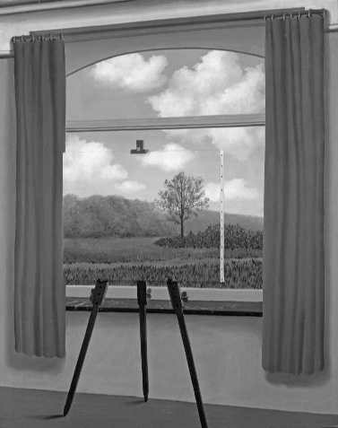

第四部分 现代时期

_《波罗的海的帆船》，莱昂内尔·法宁格（Lyonel Feininger，1871-1956）作于1924年。这幅画简洁的几何线条暗示了当代分析哲学的逻辑-科学属性。同时，艺术家强调作品的个体性、主观性也是与这一时期大陆哲学一致的。_

🟩第29章 20世纪文化背景：科学、语言与经验

20世纪被用各种方式加以描述。它被称为“分析的时代”“技术时代”和“信息时代”。这些头衔反映了科学和技术对我们的情感和生活方式造成的全球性冲击。然而，这些发展所发出的快乐音符必须由这些刺耳的曲调来平衡：两次世界大战、持续的核威胁、经济危机、环境问题、社会动荡、个人的疏离感以及……这张名单还在继续。因此，20世纪的另一个受关注的头衔是“焦虑的时代”。

虽然这些标签和其他类似的标签都有它们的道理，但或许在哲学史方面做出的最保险的概括是，这个世纪是“多元的时代”。（毫无疑问，这个概念也适用于21世纪。）同时，我们的信息技术已将我们的世界变成了一个地球村，观点的暴增已经使我们的文化像一条有多个舵手和导航员的船，每一个都试图驶向不同的航程。这在哲学上的后果由埃德蒙德·胡塞尔在1931年进行了表达：

哲学不再是单一的，取而代之的是，哲学文献无限增长，而互不相容。不再有冲突理论之间的严肃讨论，这种讨论展示了它们有密切的共同归属、共同的底层信念，以及始终不渝地相信有一个真正的哲学；取而代之的是，我们……只是貌似在相互进行哲学讨论……确实，我们还有哲学大会。哲学家相聚在一起，但不幸的是，哲学并没有相聚在一起。[1]

一个时代处于危机和转变状态的一个征兆是，反复纠结哲学的方法和争论哲学自身的本性。在古希腊，我们在智者和他们的文化之间的冲突中看到过这一点，这导致苏格拉底和柏拉图试图更新哲学。在中世纪哲学衰落期间，关于信仰与理性作用的争论成为了文化转型的力量。类似地，在近代的开端，理性主义和经验主义的冲突显示了一种文化正试图发现它的核心。

每当文化和思想的根基存在危机，就会有一种共同努力去发现让我们走上正轨的哲学方法。因而，这个世纪的所有哲学家的特征不仅在于他们的特殊学说，而且在于这样的事实，即，每个人都有一种要采用的恰当哲学方法的独特观念。

生活在康德的阴影中

要开启20世纪的舞台，一件重要的事情是，要提醒我们自己这是哲学上的后康德时代。康德引入的主题和问题继续有意无意地为哲学设置议程。回顾一下，康德寻求划出知识的界限。他的结论是，我们知道的只是现象，或者出现于我们以时空方式构造的经验之中并且能科学地加以理解的东西。这一点的推论是，实在自身，本体，不能被理解。然而，康德认为我们无法避免根据“宏大图景”思考。因此，他认为“调节性观念”指引思维，即使它们不可能是知识的对象。这些观念是自我、作为全体的宇宙和上帝的观念。

从这些康德的素材中，我们可以发现三个主题重现并贯穿了20世纪哲学。第一，存在着哲学应该专注于对现象的详细分析还是努力获取对自我、宇宙和上帝的全面见解的争论。这包括了我们构造的宏大图景是与实在自身的本性相符合还是只不过描绘了人类境遇的轮廓。第二，存在着关于哲学研究中科学的角色的问题。第三，存在着关于语言和经验在哲学研究中各自扮演的角色的争论。我们将简要讨论这些争议并预览各种哲学立场如何处理它。

哲学：零散分析还是把握宏大图景？

从一个类比开始，一个人有两种方式研究一个地理区域的特殊地带。一个人可以像一个化学家一样接近它，搜集土壤样本，在实验室中分析它，得出这个地带包含的基本化学物质的详细列表。或者一个人可以登上飞机，高高地飞到它的上空，获得整体的感觉，了解这个地带如何组合在一起，其中不同的山丘与平地之间的关系。哲学家应该仿效谁？化学家还是航空勘测员？我们应该搜寻诸部分的详细知识还是全面地理解整体？这显然是反映现

The Bridgeman Art Library

_《人类状况1》（1933），勒内·马格里特。_
_比利时画家马格里特在一系列画作中描绘了从笛卡尔时代到20世纪的哲学家力图解决的关于心灵与实在之间关系的认识论问题。在上面的作品中，我们看到的外面的世界被窗前的画布所隐藏。然而，画布上的图像（象征心灵和它的内容）似乎表现着外部世界中的东西。根据马格里特，这就是我们看待世界的方式：“我们把它看作外在于我们，即使它不过是我们在我们自己内部经验到的世界的精神表象。”_

代哲学中主要分歧的一个粗略类比：谁对这个地带有更好的理解，是拥有对各部分的知识的人还是拥有整体知识的人？在化学家和航空勘测员的例子中，我们会说，你应该使用哪种方法取决于你的目标。例如，你是想知道要在土壤中种哪种庄稼，还是希望绘制该地带的地图？然而，就哲学而言，关于合适方法的问题不能通过诉诸我们的目标来回答，因为这个问题会在更基本的层次上重申自己：什么是哲学的目标？不幸的是，在这个问题上没有共识。哲学是这样一个学科，它把它自己包含在它的问题域中，使得“什么是哲学”是哲学的核心问题。

那些青睐分析的人想象着，如果我们正确地获得细节，我们就可以从它们构建出更大的概括。因为缺乏更好的术语，我们可以说对立的一方寻求综合。他们论证说细节没有意义，除非它们在更大的框架中得到解释。试想一下人们玩拼图的两种方式。有些人试图找到相互适合的个别的块，并连续构成分离的块的集合。希望它们最终全部连接在一起。另一些人从边缘开始，遵循这样的理论，即，如果他们能获得图形的主要轮廓，那么他们将知道个别的块属于哪个位置。

对宏大图景感兴趣的20世纪哲学家试图复活思辨形而上学的传统。他们相信，经验的细节需要放在对实在的完备理解中来看。20世纪的形而上学家试图把科学发现结合到他们的形而上学体系中，这或许更甚于以往的时代。这种情况的一个原因是，物理学自身变得更加思辨，比以往更加远离直接观察的层次。因此，在我们关于宇宙知识的前沿，很难保持科学与形而上学理论的严格边界。某些20世纪形而上学家试图更新一个或更多过去的形而上学体系。另一些则采取了全新的进路。出现在20世纪的思辨形而上学进路的一个很好的例子是过程哲学。这种哲学强调实在是动态的，是由一系列过程和事件构成。它还包括这样的主张，即创造性对事物的本性来说是根本的，真正的新事物在过程中突现。这个运动中的两个突出名字是亨利·柏格森（1859-1941）和阿尔弗雷德·诺斯·怀特海（1861-1947）。柏格森关于终极实在的理论许多都诉诸生物学，而怀特海则既诉诸生物学，也诉诸物理学。对于柏格森，形而上学的方法是直觉。对于怀特海，形而上学家就需要运用经验、想象和理性的结合。虽然我们不能拿出一章来讨论他们的理论，但他们都提供了哲学的“宏大图景”进路的有趣例子。

实用主义代表了折衷的立场。因为它的个体成员涵盖的范围从分析的一极一直到综合的一极。我们将研究的三个实用主义者是C.S.皮尔士、威廉·詹姆士和约翰·杜威。C.S.皮尔士是受过科学训练的哲学家，他寻求我们观念的分析的清晰性。虽然威廉·詹姆士也受过科学训练，但他总是寻找能给予细节最合理说明的宏大图景。詹姆士不认为积累科学事实会向我们提供我们所需要的生活指导。约翰·杜威一直密切注意科学的方法和详细成果，但总是想描绘出它们对我们生活中的宏大问题的意蕴。因为实用主义者相信理性是有限的并且世界是持续变化的，所以他们相信任何关于整体的图像必定总是试验性的，并且像我们关于世界的变化的经验一样恒常变化。

分析哲学家，像他们的名字暗示的那样，他们说，哲学家应该放弃认识终极实在的宏伟希望，应该安全地留在经验的边界内。然而，他们分析的题材不是通过经验发现的事实，因为只有科学能够进行这种尝试。相反，他们相信哲学家的首要角色是分析语言。通过弄清语言的逻辑结构或它的运作方式，我们能避免形而上学家一直为之忙碌的许多混乱。分析哲学家把处理事物终极意义的工作委派给艺术家、诗人和小说家。当然，分析哲学家还相信，艺术家给我们提供的景象只是由激发性的情感表达构成，我们的认知完全无从置喙。伯特兰·罗素一直是分析哲学家最好的发言人。他说，他渴望在哲学中达到伽利略引入物理学的那种进步，它“用零散、详细和可证实的成果代替了未经检验的宏大通则，这些通则受到青睐只是由于对想象有某种吸引力”。[2]

在20世纪前三分之二的时间里，现象学和存在主义是大陆哲学中的主导运动。现象学的创始人埃德蒙德·胡塞尔无疑对分析有兴趣。他提出，现象学作为一个新学科要实行详细的分析，不过不是对科学事实或语言，而是对意识结构及其对象。就像登山者只有安全地找到自己的支撑点并检查了立足点的牢靠性之后才会前进，胡塞尔的方法是一种慢得令人难以忍受的对意识领域的详细分析。然而，他所激发的存在主义者却没有那么有耐心。与胡塞尔相比，他们非常迅速地走向了人类生活中的大问题。然而，他们的“宏大图景”比古典形而上学家的宏大图景适度得多。或许他们与分析哲学家一致的一点是，我们必须接受关于理性界限的康德式观点。与所有其他20世纪哲学家形成对照的是，他们专注于人类生存的结构，并认为人类生存是主观经验的对象。

科学在哲学中的角色

20世纪哲学家之间的一条基本分界线涉及，就显象-实在的区分而言，科学应该如何定位。实用主义者把科学看作我们关于世界的所有知识的基础。然而，他们对科学方法有一个极为宽泛和人文主义的看法，认为它不仅可以告诉我们（例如）氦原子的重量，而且可以告诉我们价值。因此，他们认为，科学与我们最深刻的人类关怀完美地相契合。在20世纪的前半期，分析哲学家（大部分）认为，科学给予我们关于实在的最终定论，我们看待世界的前科学的日常方式必须按照物理学的最新发现加以彻底修订。然而，对于这些哲学家，科学并不像实用主义者认为的那样慷慨。科学不能给我们关于价值的指导。一般而言，分析哲学家相信，伦理判定缺乏事实基础，因为按他们的观点，它们仅仅是情感性言说。相反，过程哲学家（如柏格森和怀特海）和现象学家与存在主义者（如胡塞尔和海德格尔）坚持，科学产生于我们经验世界的日常方式，但他们主张，它给予我们的只是通过我们量化方法的抽象栅格后看到的世界。

语言与经验在哲学中的角色

20世纪哲学家也可以通过他们给予语言和经验在哲学事业中的相对权重来划分。虽然很多人关于哲学的性质存在分歧，但很少有人否认语言对这项事业是至关重要的，因为哲学试图确切和融贯地言说我们最深刻的关切。然而，20世纪降临时，很多人开始确信语言并非全无问题。哲学家和小说家艾丽丝·默多克很好地表达了这一点：

我们不能再理所当然地把语言作为交流媒介。它不再是透明的。我们就像长期透过窗外向外看却没有注意到玻璃的人——之后有一天开始注意到这一点。[3]

对于那些受分析哲学吸引的人，它的方法似乎提供了一种富有成效的方式，让我们通过查看我们谈论最抽象概念的具体方式来澄清这些概念。虽然他们是经验主义者，但他们相信，无声地沉浸在经验中不会告诉我们任何东西。只有当经验得到描述，我们才清楚呈现了什么。因此，我们用来做出关于经验的主张的命题是他们关心的焦点。因为这个原因，分析哲学也称为“语言分析哲学”。

考虑一下你会如何回答这个年代久远的哲学问题：什么是知识？这样的问题很可能激起一种无力感，并且让人不确定从何处着手寻找答案。现在考虑这些问题：

1．我们如何使用“知识”这个词？

2．在什么情况下我们会说某人有知识？

3．在什么时候我们会说某人没有知识？

通过这样的问题，我们知道从什么地方开始以及如何继续。有希望的回答可以得到例子的支持，不充分的回答可以通过从语言用法的日常积累中引用反例加以拒斥。并非所有分析哲学家都会严格按这种方式进行研究。然而，这个例子显示了这样的方式，即“什么是X”这种形式的问题可以通过问“当我们说“X＇的时候我们是什么意思”很有帮助地转变为语言问题。当罗素受挑战去解释一个不可知论者能过什么样的有意义的生活时，他展示了分析哲学家的进路。罗素回答：“我觉得想要回答另一个问题：什么是＇生活意义＇的意义？”[4]

一旦进入对经验陈述的分析，早期的分析哲学家如伯特兰·罗素和逻辑实证主义者会在大卫·休谟的传统中工作，把经验视为感觉材料的集合。因此，他们寻求一种无须解释的经验分析。然而，最终的结果是，可以确定地加以断言的唯一一种陈述是像“现在这里是红的”这样的陈述。说“我正经验到一本红色的书”，引入了成问题的实体如自我，以及成问题的关于外部世界的推论。分析哲学家方案的这个部分从来没有成功过，因为他们要么留下毫无用处的确凿信念，要么不得不违反他们的方法论原则。后来的分析哲学家通过发展语言和经验的更宽泛的观念矫正了这种情况。

虽然实用主义者不认为分析语言是哲学唯一的任务，但他们的确认为澄清我们的概念是第一步。他们发展了所谓“实用主义的意义理论”，它坚持一个词项或概念的意义的解释要凭借与那个概念的对象相联系的实践后果。大体来说，实用主义者期望经验而不是语言作为哲学洞见的源泉。然而，他们对经验的理解比早期分析哲学家宽泛得多。例如，约翰·杜威否认我们曾经验分离的感觉材料甚至单个的对象和事件。相反，我们经验的是他称为“境遇”的整体背景。经验不是由一片片轰击被动心灵的材料组成，而是我们面对实践问题，寻求解决并实现我们的计划和目的的行动舞台。

过程哲学家、现象学家和存在主义者对于语言能提供给我们的洞见最为悲观，并且他们把优先性赋予广义理解的经验。柏格森例示了过程哲学采取的进路。他论证说，概念和承载它们的语词是碎裂、扭曲的工具。通过对我们的概念范畴和语言范畴的过度信仰，我们试图将流动、统一的经验强塞到不能容纳它的预制容器中。类似地，怀特海抱怨语言只容纳那些过去被思索过的思想。新创的思想在我们的语言中还没有位置，所以我们的旧语言必须被拓展，或者创造新语言来容纳新颖的观念。他批评分析哲学家犯了“完美词典谬误”，他们假定可以通过分析现成的语言来获得哲学洞见。[5]

既然胡塞尔把他的现象学呈现为摆脱我们接近世界的日常方式的一种方式，故而他把他的哲学方法视为对事物存在方式的一种诚实的“看”。除了到达最后阶段要表述和分享哲学家的发现，语言在这个过程中不起任何作用。当胡塞尔考察我们前理论层次的经验时，他没有发现它是像分析哲学家所主张的由独立的感觉材料的集合构成。相反，他坚持，除了感觉性质的陈列之外，对经验的忠实研究还揭示了普遍性、意义、价值、道德责任和美学性质等内容。而且，根据胡塞尔，分析哲学家的离散的感觉材料是理论性抽象，遮蔽了活生生的经验的丰富、多层的维度。

存在主义者同意胡塞尔把焦点放在与科学解释的经验相对的“活生生的经验”。但是，当胡塞尔倾向于强调经验内容从认知上被理解的方面时，存在主义者却探索它的主观维度。像他们19世纪的先驱克尔凯郭尔和尼采一样，对20世纪的存在主义者真正重要的经验是那些与人类境遇相关的经验。这些经验包括我们自己的无限自由的经验，一切存在所具有的偶然性的经验，和关于责任、焦虑、内疚以及我们面对我们死亡的可能性的深刻的生存经验。

而且，在描写语言在我们与世界的交往中所起的作用时，存在主义者走得比胡塞尔更远。例如，马丁·海德格尔把日常语言与诗歌的语言相对照。当我们沉浸在我们的日常生活中时（他称之为“日常”模式），我们倾向于允许本真的对话退化为“闲谈”。闲谈是松散、不思考的“叽叽喳喳”，它刻画了我们在非本真状态下过的生活。人云亦云的平庸观点固化在闲谈中并从一个人传到另一个人，像一枚被磨去棱角的敝旧硬币。然而，诗的语言却让我们面向实在，揭开被我们世俗安逸的眼光掩盖的东西。

对于让-保罗·萨特，另一个存在主义者，世界自身没有内在的意义。它仅仅是存在在那里。我们在世界里面发现的任何意义都是我们创造并投射给它的。因此，语言只是一种我们把世界分解成可理解的单位并按我们自己的意象塑造它的方式。然而，这能造成一种假象，即，当我们使用语言描述某物时，我们抓住了它的本质。在他的小说《恶心》中，他描写的一个人物洛根丁，在乘坐有轨电车时令人惊恐地认识到语词与实在是分离的。语词被他强加给世界的意义定形，而世界自身不过是存在而已，只是一块静默的画布，他在上面描画他自己的主观解释：

我坐在上面用手扶着的这个东西叫作座椅……我咕哝着：“它是一把座椅。”有点像一个魔咒。但语词留在我的唇上：它拒绝离开并把自己附在这个东西上……事物和它们的名称是分离的。它们在那里，奇形怪状，冥顽不灵，硕大无比，称它们是座椅或说关于它们的任何话都是荒谬的：我在事物中间，无名的事物。孤独，无语，无助，它们包围着我，在我之下，在我之后，在我之上。它们一无所求，它们不把自己强加于人：它们在那里。[6]

> 当代联系29：20世纪
> 
> 谈论20世纪思想与当代的相关性来结束本章对20世纪哲学的概览没有意义，因为它们构成了我们在21世纪的思考方式生长的直接土壤。然而，请你为余下的章做准备，决定在刚才讨论的三个问题上何种立场最有道理。三个问题如下：（1）哲学应该通过零散分析来进行还是应该给我们宏大图景？（2）对于发展我们的哲学理论，科学应扮演怎样的角色？（3）在哲学研究中，语言分析扮演什么角色？

理解题

1．康德哲学以何种方式影响20世纪哲学的议程？20世纪的三大哲学主题是什么？

2．什么是20世纪哲学中的分析与综合之争？哪些哲学家或运动代表了这一争议的各方立场？

3．对于科学在哲学中的角色，各种哲学运动的立场是什么？

4．关于语言和经验在20世纪哲学中的各自的角色，有哪些各式各样的立场？代表每种立场的哲学家和运动是什么？

思考题

1．考虑本章讨论的三个争议，为以下两个论点之一进行论证：（a）三个争议不是独立的。你就这些争议中的任何一个做的选择都会令你在另外两个争议上采取特定立场。

（b）三个争议是独立的。你可以在一个争议上与比如分析哲学家结盟，而在另外的争议上与比如存在主义者站在一边。

2．从前三个历史时期（古代、中世纪、近代）

的每一个时期中挑出一位哲学家。努力想象每位哲学家在本章讨论的三个争议上会采取的立场。

注释

[1]埃德蒙德·胡塞尔，《笛卡尔式的沉思：现象学引论》(Cartesian Meditations: An Introduction to Phenomenology), 多里昂·凯恩斯（Dorion Cairns）译（The Hague： Nijhoff， 1960），第5页。

[2]伯特兰·罗素，《我们关于外部世界的知识》（OurKnowledge of the External World, New York: New American Library，1956），第12页。

[3]艾丽丝·默多克，《萨特》（Sartre，New Haven，CT：Yale University Press，1953），第27页。

[4]伯特兰·罗素，《什么是不可知论者？》（“What is anAgnostic？”），《看》（Look Magazine）（1953），重印于《罗素文集》（The Basic Writings of Bertrand Russell），R.E.恩格尔（R.E.Enger）和I.E.德农（I.E.Dennon） 编（New York：Simon ＆ Schuster，1961），第582页。

[5]阿尔弗雷德·诺斯·怀特海，《思维方式》（Modes ofThought，New York：The Free Press，1966），第173页。

[6]让-保罗·萨特，《恶心》（Nausea），劳埃德·亚历山大（Lloyd Alexander）译（New York：New Directions， 1964），第168-169页。

